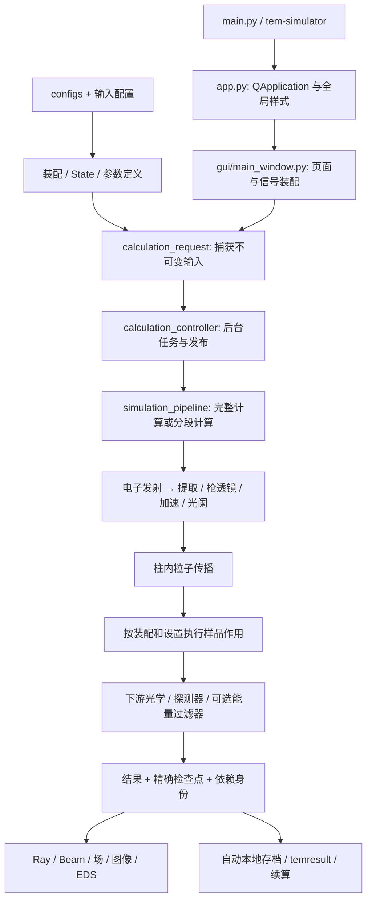
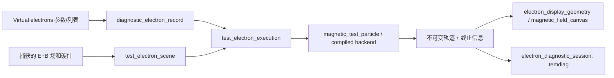

# TEM Simulator 项目地图

更新日期：2026-09-28。代码基准：`19ff33edc294e1ad316eed19086eb9e92dca12b7`。

2026-09-29 局部更新：第 8.1 节记录当前去重结果，详见 [代码清理验证记录](CODE_CLEANUP_AUDIT_ZH.md)。其余文件数量和行数仍是上述基准的导航快照。

2026-10-03 局部更新：用户已于 2026-10-02 明确恢复相干开发。独立 Coherent beam 页面由 `gui/coherent_beam.py` 和 `physics/tip_wave_pipeline.py` 负责针尖起源、共享电磁场及所选 Z 的开发观察，经典粒子流程仍为默认。当前注册八个验收范围，新增 `coherent-development`；有限算子和离屏 CPU 软件验证不等于完整 TEM/STEM、真实 GPU、原生桌面或实验资格。输入与支持边界见 [相干计算说明](COHERENT_BEAM.md)。其余文件统计仍保持上述历史基准。

2026-10-04 多初态观察：`gui/coherent_state_list.py` 负责初态列表、名称、权重和显隐；`gui/coherent_state_controller.py` 负责已应用针尖初态的捕获、当前光学配置中的逐项计算、缓存与取消；`physics/coherent_state_set.py` 负责几何身份约束及同 Z、共同物理网格上的非相干强度叠加。它们复用现有传播引擎，保留各成员复场，不产生下游独立源或混合态的总相位。三个对应测试文件纳入 `field-ui/FU-10` 和 `coherent-development/CW-03`。操作方法和支持范围见相干计算说明；原文件统计未重算。

2026-10-04 Tip 参数入口：界面统一使用 Tip / Tip parameters，几何、发射及相位参数归属于同一个 Tip。`physics/coherent_inputs.py` 的 `TipEmissionSettings` 仅表示待应用的发射参数编辑，`candidate_tip_emission` 验证编辑，计算读取已应用的 Tip；多初态列表记录该 Tip 的不同发射初态。`gui/gun_source_dialog.py` 始终提供已有 Gaussian-Schell 发射模型入口，未启用时也可在 Tip 编辑器中选择。历史配置标识未改，未扩展传播模型适用范围。

这份地图用于定位功能、界面、模型、测试和可重构位置。初版仅整理静态导航，不是物理验收；后续局部修改及其验证记录在上面的更新说明中。

2026-10-03 所选平面轮廓：`gui/plane_hardware_geometry.py` 提取孔径、柱壁/枪体通道及探测器几何，保留真实 Z；向上游看的轴向投影仅显示孔径和已插入的探测器/相机，不显示枪体或柱壁通道；`gui/plane_cutoff_events.py` 缓存已记录的真实截断位置，移动 Z 不重复插值路径；`gui/plane_hardware_overlay.py` 负责位置/强度图叠加、名称/Z 标注、独立显隐、显示重置以及并排 Fit beam / Fit cutoff。探测器敏感区域半透明填色，环形内孔透明且内外边界同色；隐藏外边界同时隐藏填色，独立隐藏内边界不会填平物理内孔。编辑硬件预览明确区别于已计算的 beam/stops，隐藏面板重新打开也保留最新预览。这些模块不重新计算电子；相关几何、截断、界面及延迟发布测试均纳入 `field-ui/FU-11`。异平面轮廓不是当前 Z 的有效接收掩模；截断点不是当前平面的到达点，也不是电子数量读出。

## 1. 使用方式与范围

- 想改某个页面：先看第 4 节的界面定位表，再沿第 3 节找到数据和计算所有者。
- 想提速或减少重复：先看第 8、9 节；区分绘图简化、缓存复用和物理算法变更。
- 想删文件：先看第 2、6、7 节；文件没有被普通 `import` 引用，不代表没有配置、命令行、打包或动态调用依赖。
- 想查任意文件：第 11 节逐项列出基准提交的 **1,208 个受版本管理文件**，按目录折叠。本地图本身不计入这个基准统计。

统计口径：`git ls-files`，读取源码和配置，使用 Python AST 提取定义及静态导入。行数包含注释与空行；测试函数定义数不是 pytest 参数化后的用例数，也不是通过数量。导入关系不是完整运行时调用图。没有重新执行完整测试、GUI、GPU 或相干波计算。

## 2. 目录地图

| 位置 | 文件数 | 包含什么 | 普通启动是否需要 |
| --- | ---: | --- | --- |
| `main.py`、`setup_env.py`、`pyproject.toml` | 3 | 启动入口、环境安装、依赖与打包规则 | 分别用于启动、安装、构建 |
| `src/temsim/` | 498 | 488 个 Python 文件、9 个 SVG、1 个采集接口目录 JSON | 应用主体；具体模块按功能使用 |
| `configs/` | 40 | 设备结构、源、工作模式、材料、EDS、样品和参考输入 | 默认配置及相应功能需要，不能整目录删除 |
| `tests/` | 531 | 521 个 `test_*.py`、7 个辅助 Python、3 个历史说明 | 启动不需要；修改后的验证需要 |
| `scripts/` | 86 | 验收、性能测量、校准、诊断和部分暂停波动研究工具 | 不随普通 GUI 启动；部分由 CI/测试使用 |
| `tools/` | 1 | 采集接口目录构建工具 | 开发维护使用 |
| `docs/` | 34 | 用户/模型说明、当前验证摘要、引用图像与必要历史夹具 | 多数不参与启动；部分被测试或工具读取 |
| `profiles/` | 4 | 参考操作配置和保存的工作点 | 按需加载，不能当作权威校准 |
| `requirements/` | 2 | CPU 验证环境锁定和约束 | 验证/CI 环境使用 |
| `.github/` | 1 | Windows CPU 分域验收流程 | GitHub CI 使用 |
| `instrument_records/` | 1 | 原始采集目录说明；实际记录不属于计算缓存 | 采集/证据保留范围 |
| `wheels/` | 1 | 本地依赖目录说明 | 环境安装工具依赖该目录约定 |
| 根目录其他文件 | 6 | README、AGENTS、功能验收规范、许可证、Git 规则 | 文档、法律及开发约束 |

### 应用包内部

| 位置 | Python 文件数 | 责任 |
| --- | ---: | --- |
| `src/temsim/` 直接子文件 | 107 | 应用协调、输入/状态、缓存、任务、存档、参数定义和诊断 |
| `gui/` | 97 | Qt 页面、面板、控制器、绘图、交互与布局 |
| `column/` | 5 | 从配置构建和解析柱体组件与布局 |
| `optics/` 直接子文件 | 68 | 透镜、多极场、偏转器、校正器、对准、能量过滤器 |
| `optics/electron_gun/` | 23 | tip、电子发射、提取/加速、枪透镜、光阑及枪追迹 |
| `physics/` | 141 | 粒子/场/扫描与相干波数值计算；文件数量是基准快照，当前开发范围见上述局部更新 |
| `specimen/` | 22 | 样品、CIF、支撑、散射、材料内及下游传播 |
| `detector/` | 18 | 电子计数、STEM、相机、EDS/EELS 响应和读出 |
| `recorder/` | 7 | 独立的实验设备记录工具，不是模拟器求解器 |

### 本地存在，但不属于源码地图的目录

`.venv/` 是环境；`build/`、`*.egg-info/` 是构建产物；`outputs/`、`tmp/`、`environment/`、`.temsim-wave-cache/` 和各类 `__pycache__/`、测试缓存属于本地产物。`tmp/repository-cleanup-20260928/archive/` 是上一轮清理的本地留档。它们不进入全量源码附录，也不能据此认定其中用户保存的结果可以删除。

## 3. 功能与数据流



上图是责任关系，**不是所有电子必须经过每个探测器/能量过滤器的固定顺序**。实际路径依装配、轴向位置和停止条件决定。显示开关不应改变已经建模的物理作用。

| 用户功能 | 界面/调度入口 | 主要实现 | 修改时的边界 |
| --- | --- | --- | --- |
| 整机选择、Optical/Mechanical/Assembly 导航 | `gui/assembly_panel.py`、`instrument_configuration_dialog.py`、`instrument_tree.py` | `instrument_configuration.py`、`assembly_catalog.py`、`column/module_assembly.py`、`module_manifest.py` | 视图分类不是多套硬件状态 |
| tip、提取、加速与枪传播 | `gui/gun_source_dialog.py`、`tip_geometry_preview.py` | `optics/electron_gun/source.py`、`field_emission.py`、`emitter.py`、`tracing.py`；`physics/*gun_field.py` | 主束源输入只在物理 tip；下游缓存不是新源 |
| Preview / High accuracy | `gui/calculation_request.py`、`calculation_controller.py` | `simulation_pipeline.calculate()`、`physics/simulation.run()`、`core.py`、`ray_integrator.py` | 精度设置、物理模型选择和显示抽样是不同维度 |
| 选截止面、分段、续算 | `gui/interactive_calculation.py`、`calculation_controller.py` | `simulation_pipeline.calculate_particle_section()`、`physics/particle_sections.py`、`completed_particle_section.py` | 只能复用依赖匹配的已执行上游精确状态 |
| Live tuning | `gui/interactive_calculation.py`、`interactive_controller.py` | `interactive_calculation.py` | 选择参与参数、范围、截止面与复用，含工作点子页 |
| Hardware tuning | `gui/hardware_tuning_panel.py` | `hardware_tuning.py`、`hardware_tuning_feedback.py` | 手动任务到硬件参数绑定；观测不等于自动调参 |
| Direct Alignment | `gui/direct_alignment_panel.py`、`direct_alignment_controller.py` | `optics/direct_alignment.py`、`alignment_transaction.py`、`beam_alignment.py`、`stigmator_alignment.py` | 自动求解、取消/过期检测、通过提交门后应用 |
| Ray / transverse beam / TOF | `gui/visualization.py`、`diagnostic_tabs.py`、`beam_analysis.py` | `beam_plane_data.py`、`emission_source_data.py`、`beam_tracking_modes.py`、各颜色与轨迹绘制模块 | 光线显示几何不能写回计算数组；TOF 不是相干相位 |
| 磁场二维/三维与磁力线 | `gui/magnetic_field_canvas.py`、`magnetic_field_3d.py` | `magnetic_field_scene.py`、`magnetic_field_lines.py`、`physics/lens_field_provider.py` | 场计算与磁力线显示采样分开 |
| 独立虚拟电子，多条路径叠加 | `gui/virtual_electron_panel.py`、`magnetic_test_electron.py` | `test_electron_scene.py`、`test_electron_execution.py`、`magnetic_test_particle.py`、`test_electron_compiled*.py` | 诊断 E+B 路径，不是主束/样品完整模拟的替代品 |
| 样品/CIF、局部环境、散射 | `gui/sample_panel.py`、`sample_interactions_3d.py`、`cell_environment_editor.py` | `specimen/source.py`、`scene.py`、`interaction_engine.py`、`rutherford.py`、`inelastic.py`、`vacuum.py` | 物理样品状态、显示区域、作用区域需区分 |
| 扫描与探测器计数/图像 | `gui/scan_panel.py`、`diagnostic_tabs.py` | `physics/scan_geometry.py`、`scan_calibration.py`、`detector/stem_signal.py`、`particle_readout.py` | 扫描图像与单位置计数是不同读出，不可重复计算主传播 |
| CIF 非波原子投影 STEM | `gui/scan_panel.py` 中 Particle model / Calculate STEM | `specimen/projected_scattering.py`、`detector/projected_response.py`、`detector/projected_stem.py` | 使用已执行探针协方差；薄样品独立原子近似，不含 Bragg 干涉/通道效应，不替换精确材料续算状态；测试 `test_projected_scattering.py`、`test_projected_response.py`、`test_projected_stem_integration.py` |
| EDS | `gui/eds_panel.py` | `detector/eds_signal.py`、`eds_photon_transport.py`、`eds_response.py`、`specimen/overlap_sampling.py` | 到达数、材料内路径、几何和谱响应的依赖不同 |
| 能量过滤器 | `gui/diagnostic_tabs.py` 中 Energy Filter 页 | `optics/energy_filter*.py`、`simulation_pipeline.py` | 装配与路径到达决定是否参与，不能跳过应穿越的过滤器 |
| 实体布局、3D 零件、材料编辑 | `gui/assembly_model_page.py`、`part_model_editor.py`、`part_geometry_editor.py` | `part_model_3d.py`、`part_model_features.py`、`part_model_document.py`、`component_persistence.py` | 渲染网格不是自动有效的电磁场模型 |
| Design Explorer、参数扫描/比较 | `gui/design_explorer.py`、`design_sweep_controller.py` | `design_experiments.py`、`design_sweep_execution.py`、`geometry_experiments.py` | 对分离状态执行，验证后显式采用；不冒充实验完成 |
| 数值证据/模型检查 | `gui/model_inspector.py`、`qualification_dialog.py`、`magnetic_validation.py` | `acceptance.py`、`sampling_qualification.py`、`magnetic_validation.py`、`topology_evidence.py` | 局部数值通过不能外推完整仪器物理合格 |
| 实验记录 | `gui/instrument_recorder.py`；`tem-instrument-recorder` | `recorder/backend.py`、`snapshot.py`、`records.py` | 原始采集与模拟结果分开；接口目录不证明连接过真实设备 |

### 独立虚拟电子的数据链



`diagnostic_field_identity.py` 标识捕获的场；`diagnostic_execution_identity.py` 标识路径执行条件；`electron_execution_protocol.py` 校验进程间数据；`electron_execution_diagnostics.py` 记录故障；`electron_execution_performance.py` 记录时间。这些是不同责任，不是五套积分器。

## 4. 界面设计在哪里修改

界面主要由 **Python + PySide6 布局代码**构建；项目没有 Qt Designer `.ui` 文件。二维绘图使用 pyqtgraph，部分三维视图使用 OpenGL。不要在 `main.py` 寻找页面布局。

| 需求 | 首要文件 | 配套文件/注意点 |
| --- | --- | --- |
| 全局颜色、字体控件外观 | [app.py](../src/temsim/app.py) 的 `APPLICATION_STYLE` | `gui/assets/` 复选框图标；局部样式还存在于具体面板 |
| 主窗口、顶部工具、Dock 注册 | [main_window.py](../src/temsim/gui/main_window.py) 的 `MainWindow` | 工作区装配与信号连接；中央标签页注册在 `VisualizationWorkspace` |
| 布局保存、恢复、窗口停靠 | [workspace_layouts.py](../src/temsim/gui/workspace_layouts.py) | 与科学参数/计算结果保存分开 |
| 左侧 Instrument setup and parameters | [assembly_panel.py](../src/temsim/gui/assembly_panel.py)、[parameter_panel.py](../src/temsim/gui/parameter_panel.py) | `instrument_tree.py`、`assembly_structure_tree.py`、`aligned_control_table.py` |
| 参数含义、单位、影响提示 | `parameter_semantics.py`、`parameter_registry.py`、`parameter_impact.py` | 非 GUI 定义；`gui/input_policy.py` 处理滚轮/输入行为 |
| 中央标签页装配、Ray Diagram 主布局、工具条、投影联动 | [visualization.py](../src/temsim/gui/visualization.py) 的 `VisualizationWorkspace` | `ray_scene.py` 管绘制状态，`ray_curve_item.py` 管高效曲线 |
| 轨迹显示简化、拖动和缩放性能 | `gui/ray_curve_simplification.py`、`ray_curve_item.py`、`electron_display_geometry.py` | 只压缩显示几何，精确路径仍由结果持有 |
| 横截面和发射源两张图 | `gui/beam_analysis.py`、`emission_source_plot.py` | `transverse_plot_layout.py` 管尺寸；`beam_analysis.py` 管 Plot 预设，`beam_tracking_modes.py` 管相互作用类别的显示标签 |
| 位置/角度/TOF 颜色 | `gui/beam_colours.py`、`flight_time_colours.py`、`ray_flight_time_colours.py`、`ray_scalar_colours.py` | 源属性沿 ray 固定，TOF 随传播变化，不能混用同一种着色契约 |
| 计算截止位置的窄进度条 | `gui/ray_calculation_extent.py`、`ray_extent_data.py` | 标记真实计算范围，不用当前视口宽度冒充已算范围 |
| 磁场画布与 3D 控件 | `gui/magnetic_field_canvas.py`、`magnetic_field_3d.py` | `visualization.py` 发起投影联动；`diagnostic_tabs.py` 的 `MagneticFieldView` 负责轴范围/像素边缘同步（`_sync_plot_pixel_edges`） |
| Virtual electrons Dock 与连续编辑 | `gui/virtual_electron_panel.py`、`magnetic_test_electron.py` | `electron_session_actions.py` 保存/加载；区分编辑值和已完成结果 |
| 三套调节入口 | `gui/hardware_tuning_panel.py`、`direct_alignment_panel.py`、`interactive_calculation.py` | 见第 8 节，职责不同 |
| 样品 / 扫描 / EDS | `gui/sample_panel.py`、`scan_panel.py`、`eds_panel.py` | 数值实现在 `specimen/`、`physics/`、`detector/` |
| Physical Layout / Energy Filter / Transverse Beam / Optical Transfer / Magnetic Field | [diagnostic_tabs.py](../src/temsim/gui/diagnostic_tabs.py) | 最大界面文件，后续拆页优先候选 |
| Optical Transfer 图形概览 | [optical_transfer_overview.py](../src/temsim/gui/optical_transfer_overview.py) | 读取已计算的 J_img/J_diff；展示位置圆和 canonical 动量角锥的响应、矩阵判定的共轭类型。相对参考轨迹、独立坐标尺度，不是束强度或衍射斑；原始矩阵及模式比较仍在 `OpticalTransferView` 子页 |
| 任意所选 Z 的共轭面查找 | `physics/conjugate_planes.py`、`gui/conjugate_plane_panel.py`、`gui/conjugate_plane_overlay.py`、`gui/conjugate_plane_context.py` | 捕获光学状态的一阶传输缓存；固定参考 Z 后查找前后实共轭面、近似面及单方向焦面。完整二维 B 判据、排除自身、坐标和插值误差检查；列表点击仅移动观察光标，不改变参考面，并读取已记录路径及截断部件的实际 Z。后台取消及旧结果隔离，不重新传播完整粒子束或电子波，不宣称透过率或衍射强度合格。`tests/test_conjugate_planes.py`、`test_conjugate_plane_gui.py`、`test_conjugate_plane_workspace.py` 注册于 `field-ui/FU-09`。 |
| Illuminating Image 与成像/衍射结果显示 | `gui/visualization.py` 的 `WaveImagingView` | `aberration_view.py` 为像差展示；历史波数据可读不代表恢复相干计算 |
| 结果打开/导出和摘要 | `gui/result_files.py`、`result_readout.py` | 存档底层见下一节 |

`Optical` 显示参与光学运行的组件；`Mechanical` 显示没有独立光学运行对象的机械部件；`Assembly` 提供完整装配层级。三者应共享同一装配身份，而不是为每个视图维护一套设备。

中央的 13 个标签统一在 `VisualizationWorkspace`（`visualization.py`）装配：Ray Diagram、Electron beam、Hardware tuning、Physical Layout、Energy Filter、Sample、Vacuum map、EDS、Scanning Image、Illuminating Image、Optical Transfer、Model Inspector、Design Explorer。EDS 下的 Spectrum、Interactions 3D、Parameters 子页分别承载能谱、局部相互作用诊断及唯一一套 EDS/局部输运参数；切换子页不启动计算。四个 Dock 在 `MainWindow` 装配：Instrument setup and parameters、Live tuning、Virtual electrons、Status and calculation log。Working points 是 Live tuning 的子页，不是另一个独立顶层标签。

平面类型的公共入口是 `optics/direct_alignment.py` 的 `diffraction_transfer(s)`：以样品中心的位置和 canonical 动量为输入，输出柱坐标 X/Y；`physics/scan_geometry.py` 的分类器统一判据并拒绝 mechanical 输入矩阵。Optical Transfer、Selected Z、扫描/Descan 和 Camera 波动结果标签共同使用它。真实粒子输运及扫描位移仍用 mechanical 方向，不能直接替换其传播矩阵；`TransverseTransfer.input_basis` 明确记录区别。旧的无坐标标记缓存需重新求取诊断，不能继承旧分类。

`gui/plane_equations.py` 统一提供符号方程的悬停提示，供 Selected Z 状态与光标、共轭候选列表与标记、Optical Transfer 类型标签使用。提示分别说明所选平面分类器和共轭搜索的现有判据、参考面、canonical 坐标与高阶像差限制；它只展示文字，不执行分类或传播，不代入当前数值。

需要注意两处实际布局所有权：`diagnostic_tabs.py` 的 `TransverseBeamView` 持有右侧两张图的容器；`magnetic_test_electron.py` 持有虚拟电子完整表单与控制器，`virtual_electron_panel.py` 目前主要负责 Dock 内容的排版。修改大小/布局时先确认真正的控件所有者。

## 5. 配置、缓存和保存格式

| 层次 | 文件/目录 | 负责什么 |
| --- | --- | --- |
| 权威结构输入 | `configs/instruments/`、`configs/subassemblies/`、`module_manifest.py` | 装配、几何、材料和组件结构；不能让 UI 默认值变成第二权威来源 |
| 源与工作方式 | `configs/sources/`、`configs/operating_modes/`、`shared_tip.py`、`operating_modes.py` | tip 定义、操作模式及模式相关设置 |
| 单一运行模型 | `optics/model.py`、`configuration.py`、`runtime_parameters.py` | 运行参数、可编辑目标；`state.py` 是保存/加载入口之一，并不承载所有模型 |
| 请求输入与来源 | `instrument_snapshot.py`、`input_assets.py`、`input_io.py`、`calculation_manifest.py` | 捕获输入、只读数组、依赖与实现身份 |
| 内存缓存 | `calculation_cache.py`、`cache_memory.py`、`cache_preferences.py` | 有依赖身份的复用与内存预算 |
| 原子数据/样品/EDS 专用缓存 | `physics/prepared_specimen_cache.py`、`specimen/display_cache.py`、`detector/eds_signal.py`、`eds_photon_transport.py`、`eds_response.py` | 各自消费不同输入；应共享管理原则，不应混成单一物理缓存键 |
| 精确粒子截面 | `physics/particle_sections.py`、`completed_particle_section.py`、`particle_section_io.py` | 检查点、截止范围、质量与续算有效性 |
| 磁盘数值对象 | `artifact_store.py` | 校验、大小限制、持久化数值资产，不等于用户界面结果索引 |
| 工作点与证据 | `working_point.py`、`working_point_archive.py`、`working_point_export.py`、`working_point_evidence.py` | 精确状态、索引、导出范围、验收证据核对 |
| 用户结果库 | `result_library.py`、`gui/result_files.py` | 导出结果的小型导航索引与 UI 动作 |
| 虚拟电子历史 | `electron_diagnostic_session.py` | 独立 `.temdiag` 档案，保持来源与当前场状态区别 |
| 资源与任务 | `cpu_resources.py`、`gui/job_coordinator.py`、`job_events.py` | 数值线程预算、避免并发工作互相叠加、生命周期记录 |

主要格式：操作参数 TOML 与精确已执行结果不是一回事；`.temresult` 面向用户导出，`.temsection` 用于自动粒子截面存档，二者复用 `particle_section_io.py` 的基础格式；`.temwp` 表达工作点包，`.temdiag` 保存独立诊断电子会话。不能因为都可以“保存/加载”就相互替代。具体可恢复能力以包内质量、依赖和实际检查点为准。

**完整分段的入口**是 `simulation_pipeline.calculate_particle_section()`：它把光学段与样品/材料、EDS、下游、扫描及过滤器按实际截止位置接起来。`physics/particle_sections.run_particle_section()` 是其中的低层光学 helper；单独调用它不能宣称完成带样品的全物理分段。

## 6. 测试、验收与开发工具

`pyproject.toml` 指定 pytest 从 `tests/` 收集；`tests/conftest.py` 提供 offscreen Qt、字体与控件释放支持。

**名称容易误读：**`src/temsim/test_electron_*.py`、`gui/test_electron_types.py` 和 `magnetic_test_particle.py` 是应用内的诊断电子功能，不能作为“测试文件”移除。`tests/test_test_electron_*.py` 才是其中一部分自动测试。

基准共有 521 个 `test_*.py` 文件；AST 找到 `tests/` 中 4,380 个 `test_*` 函数定义。这个数字包括不同状态的测试定义，**不表示本轮执行了 4,380 项测试，更不表示全部通过**。

### 当前分域验收

| Scope | 主要责任与代表测试 |
|---|---|
| `classical` | 源准入、完整仪器捕获、事务式调整、vacuum opt-in、当前结果归属、计算后台任务与 GPU 不可用策略；`test_source_admission.py`、`test_working_point_contract.py`、`test_job_lifecycle.py`、`test_background_preview_gui.py`、`test_backend_failure_semantics.py` |
| `gun-fields` | tip 几何、导体边界、电场缓存/身份、曲率与场域比较；`test_closed_gun_field.py`、`test_axisymmetric_cut_field.py`、`test_continuous_tip_curvature.py`、`test_diagnostic_field_identity.py`、`test_diagnostic_gun_domains.py` |
| `electron-execution` | 独立 E+B 参考、编译/参考执行一致性、真实隔离子进程、停止/取消/故障恢复、会话文件；`test_magnetic_test_particle.py`、`test_test_electron_execution.py`、`test_electron_execution_faults.py`、`test_electron_diagnostic_session.py` |
| `field-ui` | 叠加磁场、磁力线、显示缓存、Ray Diagram 联动、电子连续编辑、Dock、硬件控件、历史会话；`test_magnetic_field_3d.py`、`test_magnetic_navigation_link.py`、`test_continuous_electron_gui.py`、`test_hardware_tuning_feedback.py`、`test_electron_session_gui.py` |
| `particle-continuation` | 已执行截面、材料段续算、EDS 复用、无损紧凑存档、文件请求归属；`test_particle_sections.py`、`test_material_section_resume.py`、`test_particle_section_eds_reuse.py`、`test_particle_archive_compression.py`、`test_result_files_gui.py` |
| `performance-observation` | 计时证据与测量路径的正确性，不直接宣告性能合格；`test_electron_execution_performance.py`、`test_electron_response_benchmark.py`、`test_continuous_electron_response_benchmark.py`、`test_particle_benchmark.py` |
| `acceptance-policy` | 集合完整性、缺失/空收集/超时/失败不得记作 PASS、子进程清理；`test_acceptance_scopes.py`、`test_acceptance_runner.py`、`test_validation_process.py` |
| `full-report` | 仅报告尚未覆盖和已暂停项目；不会启动 pytest 或完整相干计算，结果保持 `NOT_RUN` / `UNQUALIFIED` |

### 按功能查找测试

下列是导航示例，不是完整文件清单，也不是新的执行范围。

| 功能 | 主要文件族 / 示例 |
|---|---|
| tip 与电子枪 | `test_tip_*`、`test_gun_*`、`test_closed_gun_*`、`test_planar_gun_*`、`test_accelerator_*`、`test_surface_direction_sampling.py`；区分粒子、几何、电场和历史相干数学 |
| 柱镜、透镜、校正器与对中 | `test_canonical_ray_integration.py`、`test_first_order_transfer.py`、`test_direct_alignment*.py`、`test_probe_corrector_calibration.py`、`test_stigmator_tensor.py`、`test_qualitative_control_trends.py` |
| 机械装配与可编辑配置 | `test_toml_authority.py`、`test_subassemblies.py`、`test_assembly_*.py`、`test_manifest_*.py`、`test_part_model_*.py`、`test_part_geometry*.py`、`test_instrument_configuration.py` |
| 场计算与独立电子 | `test_magnetic_field_*.py`、`test_test_electron_*.py`、`test_vector_field_transport.py`、`test_static_energy_lorentz.py`、`test_diagnostic_*` |
| 样品与散射 | `test_specimen_*.py`、`test_sample_*.py`、`test_elastic_transport.py`、`test_rutherford_*.py`、`test_virtual_specimen.py` |
| EDS / EELS / 能量过滤 | `test_eds_*.py`、`test_eels_forward.py`、`test_energy_filter_*.py`、`test_filter_plane_analysis.py`；几何、概率账本、谱线、缓存和 UI 分层 |
| 扫描、探测与图像 | `test_stem_*.py`、`test_tem_*.py`、`test_fourdstem*.py`、`test_record_plane*.py`、`test_detector_*.py`；部分包含相干或独立 GPU 假设，不能全部自动并入经典粒子 Scope |
| 缓存、断点与保存加载 | `test_calculation_cache*.py`、`test_particle_section*.py`、`test_section_*.py`、`test_working_point_*.py`、`test_result_*.py`、`test_input_assets.py`、`test_portable_inputs.py` |
| 后台任务与资源 | `test_job_*.py`、`test_background_*.py`、`test_cpu_resources.py`、`test_backend_*.py`、`test_electron_execution_*.py`；`tests/electron_fault_worker.py` 是故障注入子进程，非普通测试模块 |
| 显示与交互 | `test_ray_*.py`、`test_transverse_*.py`、`test_live_*`、`test_workspace_layouts.py`、`test_hardware_tuning_*.py`、`test_virtual_electron_dock.py` |
| 安装、输入与记录器 | `test_setup_env.py`、`test_project_artifact_fallback.py`、`test_sample_sources.py`、`test_sample_source_*.py`、`test_instrument_recorder*.py` |
| 历史波动和数学证据 | `test_wave_*.py`、`test_radial_*.py`、`test_galerkin_*.py`、`test_covariant_*.py`、`test_modal_covariant_slab.py`、`test_multislice.py`；保留算法/源拒绝证据，不表示当前生产链已完成 |

### 开发工具分组

所有 `scripts/` 命令都不是普通 GUI 启动依赖，但部分是测试或 CI 必要依赖。不能把“非 GUI 运行文件”直接等同于“可删除”。

| 用途 | 入口与边界 |
|---|---|
| 当前验收与独立安装 | `validate_classical_scope.py`；`installation_diagnostic_smoke.py::installation_checks` 检查已安装 wheel、经典 tip-origin 柱传播、独立虚拟电子 fixture、会话往返和 offscreen 面板，不启动相干计算 |
| 连续交互与粒子性能 | `benchmark_particle_stages.py`、`benchmark_test_electron_responsiveness.py`、`validate_continuous_electron_response.py`；分别测生产阶段、隔离诊断执行、Qt 调节到实际绘制的响应；不是同一指标的重复脚本 |
| 显示与准备成本 | `benchmark_incremental_ray_scene.py`、`benchmark_ray_display_cache.py`、`benchmark_live_tuning_edits.py`、`benchmark_request_preparation.py`、`validate_test_electron_navigation.py`；明确区分发布/绘制/编辑/请求准备，常使用固定 fixture，不能作为整体物理运算速度 |
| 电子枪与加速诊断 | `audit_accelerator_envelope.py`、`analyze_accelerator_turns.py`、`diagnose_accelerator_mechanism.py`、`diagnose_planar_gun.py`、`audit_gun_*`、`check_gun_*`、`compare_diagnostic_gun_domains.py`、`validate_closed_gun_transport.py`、`validate_tip_particles.py` |
| 照明/柱传输/候选校准 | `calibrate_assembly_illumination.py`、`calibrate_nanoprobe_corrector.py`、`check_column_matching.py`、`check_crossover_chain.py`、`fit_gun_column_candidate.py`、`fit_matched_tip_preset.py`、`survey_*`、`validate_assembly_illumination.py`；输出候选与验证证据，并非自动覆盖默认配置 |
| 复用、样品与 EDS 计时 | `cache_high_accuracy.py`、`benchmark_eds_photon_cache.py`、`benchmark_specimen_transport.py`、`benchmark_prepared_specimen_cache.py`、`benchmark_report_workflows.py` |
| 已存在的相干研究工具 | `trace_tip_wave.py`、`gun_wave_cli.py`、`inspect_surface_column.py`、`benchmark_stem_wave.py`、`benchmark_carrier_slab.py`、`benchmark_mixed_slab.py`、`compare_gun_boundaries.py`、`inspect_basis_support.py`、`inspect_moving_radial_frame.py`；保留读取/数学证据，暂停期间不应当作日常验证入口自动执行 |
| 相干图像批处理 | `generate_si110_cif_stem_scan.py`、`run_stem_profile_scan.py`、`run_stem_profile_ensemble.py`、`verify_stem_profile_ensemble.py`；属于显式执行/核验工具，不能由 README 启动方式隐式运行 |
| 历史验收/专题证据 | `validate_development_spec.py`、`validate_tem_p0.py`、`validate_illumination.py`、`validate_aberrations.py`、`validate_review_p0.py`；范围不同。`validate_development_spec.py` 的 `CRITERIA` / `SOURCE_MIGRATION_BLOCKERS` 仍被当前报告入口读取 |
| 冻结数值输入证据 | `freeze_physics_run.py`、`reuse_frozen_physics.py`、`physics_driver_log.py`、`surface_mode_evidence.py`；前缀/场证据不是可配置的新电子源 |
| 记录器目录生成 | `tools/build_recorder_catalog.py::build` 静态读取用户提供的 SDK wheel AST，生成属性/类型/单位/排除列表 JSON；不导入/执行 SDK。生成结果 `src/temsim/recorder/autoscript_1_18.json` 是运行时包资源 |

历史/暂停边界：`tests/historical/` 内两个 Python 文件不采用默认 `test_*.py` 名称；但许多波动相关测试仍在 `tests/` 根目录，不能把“根目录测试”理解成“当前经典粒子范围”。不要为了整理地图运行全量 pytest、启用 coherent 模式或启动历史长计算。当前验证结果和未覆盖项见 [VALIDATION.md](VALIDATION.md)。

推荐按修改范围调用已注册的验收入口，例如：

```powershell
.venv\Scripts\python.exe scripts\validate_classical_scope.py --scope field-ui --output outputs\agent-validation\field-ui
```

这是未来修改后的验证示例，不是通过报告。可用范围以 `acceptance.py` 和实际命令行定义为准；CI 当前使用 `classical`、`acceptance-policy`、`gun-fields`、`electron-execution`、`field-ui`、`particle-continuation`、`performance-observation`、`coherent-development`。`full-report` 仅报告完整范围尚未覆盖项，不启动完整相干计算，也不授予物理资格。

## 7. 必须保留的非运行文件

- `docs/development/evidence/default-assembly-identity-map-v1.json`：装配身份回归夹具。
- `docs/development/tip_curvature_193_20260915.json`：现存验证工具的参考输入。
- `docs/references/`、`instrument_records/`：来源与原始证据，不是计算缓存。
- `requirements/`、`wheels/README.md`、`src/temsim/_build.py`：环境和干净安装所需的开发支持。
- 暂停的波动源码/测试/历史配置：保留可读性；不等于默认开启或完整物理合格。

## 8. 是否存在重复功能

### 8.1 已确认的实现重复

做了两类静态比较：所有受版本管理文件的 SHA-256；应用源码中跨文件、跨度至少 21 行的函数 AST 主体比较。后者忽略格式和注释，不自动证明所有调用条件都等价。

整文件完全相同只发现三个空的包初始化文件：`detector/__init__.py`、`optics/__init__.py`、`physics/__init__.py`。它们负责各自包边界，**不是重复功能，不应因此删除**。未发现其他逐字相同文件；这不等于不存在语义重复。

| 已合并的重复 | 当前共享实现 | 使用者 | 保留的差异 |
| --- | --- | --- | --- |
| 机械中心、光学参考面、安装切换与锚点重定位 | `optics/component_position.py`：`InstallationReferencedPosition` | Diffraction Lens、Diffraction Stigmator | 轴向场与四极场、几何类型、验证规则 |
| tip 参考坐标的位置联动 | `optics/component_position.py`：`TipReferencedPosition` | Round Lens、Adapter Lens、Hexapole、Quadrupole、Single Plane Deflector | 各元件的物理算法、初始化字段和恢复机制 |
| 圆透镜的励磁比例、焦距接口、场支持区和布局读出 | `optics/round_lens.py`：`TipReferencedRoundLensBehavior` | Round Lens、Adapter Lens | 峰值归一化、验证和 dataclass 字段集合 |

`gui/assembly_panel.py` 的三个隐藏装配下拉框已由经过目录验证的不可变 `AssemblySelection` 替代。`current_selection()`、`set_selection()`、`reload_catalog()` 共享这份状态；主窗口和工作点恢复不再依赖隐藏控件。无触发入口的 `_request_selection`、专用信号及主窗口连接已成组移除，Configure instrument 路径保留。

位置与装配回归分别见 `tests/test_component_position_contract.py`、`tests/test_assembly_selection_state.py`，以及已有工作点、目录重载、配置和持久化测试。共享位置类不定义持久化字段。

两项经调用阅读发现的算法/流程重叠，也值得单独优化：

- `physics/simulation.py:382` 起与 `physics/particle_sections.py:75` 的 `_events()` 都枚举 deflector/corrector 的 `kick_events`，处理时间参数和成对事件。可提取无副作用的公共事件枚举，再检查全程与分段、扫描与非扫描是否保持一致。这是重叠逻辑，未计入上面的三个完全相同函数体组。
- `gui/ray_curve_item.py`/`ray_curve_simplification.py` 与 `electron_display_geometry.py` 都使用 RDP 类屏幕曲线简化。后者额外保留工作预算、极值和返向保护；可以共享核心并保留不同策略，不能直接用其中一个替换另一个。

### 8.2 看似重复，但职责不同

| 看起来相似 | 当前分工 | 优化边界 |
| --- | --- | --- |
| Hardware tuning / Direct Alignment / Live tuning | 手动字段映射 / 自动求解与事务提交 / 选范围、截止面和复用 | 可共享参数描述与编辑器；不能抹平操作语义 |
| Optical / Mechanical / Assembly / Physical Layout | 光学导航 / 机械导航 / 完整层级 / 几何可视化与编辑入口 | 共享装配身份，避免每页私建模型 |
| `simulation_pipeline.calculate` / `calculate_particle_section` | 完整产物 / 用户截止面及续算产物 | 共用上游算法；分段入口必须保留有限样品等后续作用 |
| `physics/vector_field_transport.py` / `specimen/vector_field_transport.py` / `specimen/axial_field_transport.py` | 沿 Z 柱积分 / 材料局部 SI 坐标 Lorentz 飞行 / 独立均匀场解析参考 | 单位、积分变量和适用域不同，不可按同名直接合并 |
| `analytic_gun_field` / `planar_gun_field` / `closed_gun_field` / `grounded_tip_field` | 不同枪几何、电势边界、求解近似与验证用途 | 统一 provider 契约可以讨论；切换算法必须重新验证物理适用域 |
| `optics/objective_aperture.py` / `physics/objective_aperture.py` | 物理光阑元件 / 波动 pupil 与归属计划 | 后者可考虑更明确的 wave 命名；不是重复光阑 |
| `magnetic_test_particle.py` / `test_electron_compiled.py` | 通用参考执行 / 有明确场律准入的编译加速 | 保留独立参考及一致性测试，不能以去重为由删参考实现 |
| `eds_signal.py` / `eds_response.py` / `eds_photon_transport.py` | 激发源 / 光谱仪器响应 / 光子几何与吸收 | 分层缓存有助提速；方向、能量和路径不能一律忽略 |
| `working_point_archive` / `particle_section_io` / `electron_diagnostic_session` | 工作点容器 / 精确主粒子结果 / 独立诊断历史 | 可共享受限 ZIP/JSON/数组读取小工具；schema、身份和恢复能力分开 |
| `calculation_cache` / `diagnostic_field_identity` / `diagnostic_execution_identity` | 主产品依赖 / 场身份 / 执行身份 | 不使用笼统的一个 key 代替不同失效范围 |
| 多个颜色、源图、截面模块 | 固定发射属性、相互作用类别、时钟色标、沿路径渐变、投影各自独立 | 沿已有共享标量色板和 TOF 标尺维护，不能仅按文件数压缩 |
| `installation_smoke.py` / `installation_diagnostic_smoke.py` | 旧入口含独立 multislice kernel / 当前入口仅执行经典与诊断范围 | 当前 CI 用后者；前者仍被旧验收定义依赖 |
| `validate_classical_scope.py` / `validate_development_spec.py` / `validate_tem_p0.py` | 当前明确 allowlist / 保留的旧验收声明 / 早期专题批次 | 先迁移依赖与证据语义；不能直接删除仍被读取的声明 |
| `specimen/source.py` / `optics/electron_gun/source.py` | 样品结构来源 / 电子源统一调用 | 不是两个可配置电子源 |

### 8.3 仍需动态证据的疑点

多个界面页面自行创建表格、局部颜色和尺寸策略；多个脚本分别处理测试子进程、报告文件和资源限制。存在抽取公共实现的空间，但本轮没有证明它们执行重复计算，也没有确认任何一个可以无替代删除。未来应在实际用户操作上记录请求次数、缓存命中与阶段时间，再决定合并。

## 9. 优化定位与建议顺序

以下是重构候选，不是已测得的性能瓶颈。源码大、导入多只能说明维护范围大，不能证明运行慢。

| 文件 | 行数 | 被其他应用模块直接静态导入数 | 优化关注点 |
| --- | ---: | ---: | --- |
| [gui/diagnostic_tabs.py](../src/temsim/gui/diagnostic_tabs.py) | 5,994 | 2 | 多个独立页面、图形和数据适配集中；优先按页面拆分 |
| [gui/visualization.py](../src/temsim/gui/visualization.py) | 4,270 | 1 | 中央页面装配、Ray 控制和同步、图像展示集中 |
| [module_manifest.py](../src/temsim/module_manifest.py) | 4,088 | 43 | 几何/配置核心；高依赖，应先梳理 schema 与验证边界 |
| [column/layout.py](../src/temsim/column/layout.py) | 3,105 | 3 | 全柱布局解析；避免视图布局与物理布局混淆 |
| [gui/main_window.py](../src/temsim/gui/main_window.py) | 2,785 | 1 | 信号、编辑、结果发布与恢复集中；先分业务路由 |
| [gui/scan_panel.py](../src/temsim/gui/scan_panel.py) | 2,701 | 1 | 扫描参数、图像/4D-STEM、像差控件聚合 |
| [optics/model.py](../src/temsim/optics/model.py) | 2,684 | 22 | 共享运行模型；字段改名需同步配置、快照与缓存身份 |
| [optics/probe_corrector.py](../src/temsim/optics/probe_corrector.py) | 2,201 | 6 | 组件状态/几何/校正器行为聚合 |
| [optics/direct_alignment.py](../src/temsim/optics/direct_alignment.py) | 2,158 | 17 | 多种自动对准任务；维护事务与验收范围 |
| [gui/calculation_controller.py](../src/temsim/gui/calculation_controller.py) | 2,009 | 5 | 准备、执行、取消、发布和存档生命周期聚合 |
| [gui/sample_panel.py](../src/temsim/gui/sample_panel.py) | 1,985 | 1 | 样品编辑与结构场景展示聚合 |
| [column/module_assembly.py](../src/temsim/column/module_assembly.py) | 1,890 | 9 | 组件装配与验证；拆分需保持唯一硬件身份 |

导入统计仅计 `src/` 内不同导入文件，包含条件分支中的静态 import，排除测试和脚本，不测量运行频次。除此之外，`component_keys.py`（85 个导入者）、`immutable_json.py`（67）、`input_io.py`（48）、`instrument_snapshot.py`（45）也是高影响公共边界：改动虽可能很小，波及面不小。

| 顺序 | 工作包 | 建议改动 | 验收重点 |
| --- | --- | --- | --- |
| 1 | 清除隐藏 UI 兼容状态（2026-09-29 已实现） | 显式装配选择对象替代隐藏 ComboBox；恢复/应用仍走单一入口 | 配置选择、取消、工作点恢复、编辑后的值保留 |
| 2 | 公共位置契约（2026-09-29 已实现） | 第 8.1 节的位置重复与相同圆透镜辅助方法已收敛，各元件物理模型保留 | 机械移动、光学参考面、两类安装模式、序列化往返 |
| 3 | 拆分过大的界面文件 | 按页面拆 `diagnostic_tabs.py`；按场景/控制/布局拆 `visualization.py` | 页面切换、轴同步、颜色身份、尺寸持久化、无额外计算 |
| 4 | 梳理任务与结果发布 | 划清 request、worker、取消/过期判定、归档、UI 发布；复用已有协调器 | 快速连续编辑、旧任务取消、最后结果归属、自动存档身份 |
| 5 | 按实测优化缓存 | 围绕 gun、柱传播、样品、EDS、绘图分开统计命中和重算原因 | 同一输入精确复用；相关参数变化能使正确阶段失效 |
| 6 | 开发工具公共化 | 统一 CLI 结果目录、报告格式、资源限制；保留各实验独立物理问题 | 原脚本验收范围、退出码、失败证据、CI 和独立安装 |

每次只重构一个边界，先记录现有行为，再运行对应验收。不要为了精简跳过提取、加速、光阑、样品或探测器作用；不要把末端源、历史 PASS 标签、缓存标签当成已经执行的上游传播。独立相干开发仅按明确请求和已注册范围执行；数值工作继续遵守进程可用逻辑 CPU 的一半上限。

## 10. 为 AI for experiments 保留的结构

当前项目适合用作离线控制探索、趋势检查和实验流程开发的基础，从而帮助更有效地安排宝贵的 instrument time；本次文件审查没有量化实际节省时长。

未来的 AI 调参接口宜接在已有职责边界上：

| AI 所需能力 | 现有接入点 | 尚需明确的契约 |
| --- | --- | --- |
| 查询可调整参数、单位及范围 | `parameter_registry.py`、`runtime_parameters.py`、`hardware_tuning.py` | 允许动作、依赖、范围和失败语义 |
| 获取确定的观察值 | `checkpoint_observables.py`、`hardware_tuning_feedback.py`、`result_readout.py` | 观察截面、结果质量、时间与输入身份、是否过期 |
| 执行可复现的候选计算 | `calculation_request.py`、`simulation_pipeline.py`、`design_sweep_execution.py` | CPU/时间预算、取消、结果与输入一一对应 |
| 回看、比较、续算 | `instrument_snapshot.py`、`working_point.py`、`particle_section_io.py`、`experiment_records.py` | 精确检查点与仅显示历史的区别、有效缓存依赖 |
| 对接真实实验记录 | `recorder/` | 真实设备能力、连接、权限和实验验证；不能由模拟成功推断 |

项目当前不是已验证的自主显微镜控制系统。模拟参数和显示接口也不能直接作为真实设备控制权限。

## 11. 完整文件清单

下面是基准提交的完整清单。每个路径只出现一次；用途简述优先使用源码中的原始模块说明，便于与程序核对。无模块说明时列出顶层类/函数；测试旁列出的静态依赖是定位线索，**不是覆盖率证明**。折叠标题后的数量和各行行数均为本次快照。

<details>
<summary>根目录 · 7 个文件（已移除的旧文档不再列入）</summary>

| 文件 | 行数 | 用途 / 源码定位 |
| --- | ---: | --- |
| [.gitattributes](../.gitattributes) | 2 | Git 文件属性与科学数据字节约定 |
| [.gitignore](../.gitignore) | 28 | 本地环境、缓存与生成产物排除规则 |
| [LICENSE](../LICENSE) | 21 | MIT 许可证 |
| [README.md](../README.md) | 52 | 文档：TEM Simulator v2 |
| [main.py](../main.py) | 8 | PyCharm-friendly application entry point. |
| [pyproject.toml](../pyproject.toml) | 86 | 操作配置/依赖构建声明 |
| [setup_env.py](../setup_env.py) | 143 | Install the project using local wheels and, unless offline, the package index.；入口：venv_python, run, runtime_info |

</details>

<details>
<summary>.github/workflows · 1 个文件</summary>

| 文件 | 行数 | 用途 / 源码定位 |
| --- | ---: | --- |
| [tem-p0.yml](../.github/workflows/tem-p0.yml) | 79 | CI 工作流：Windows CPU 验收、干净安装、分域证据 |

</details>

<details>
<summary>src/temsim · 107 个文件</summary>

| 文件 | 行数 | 用途 / 源码定位 |
| --- | ---: | --- |
| [__init__.py](../src/temsim/__init__.py) | 7 | TEM Simulator v2 package. |
| [_build.py](../src/temsim/_build.py) | 31 | Wheel build isolation; imported by setuptools without the runtime package.；入口：FreshWheel |
| [acceptance.py](../src/temsim/acceptance.py) | 249 | Fail-closed, namespaced software evidence; never physical qualification.；入口：scope_test_files, merge_criteria, software_report |
| [acceptance_pytest.py](../src/temsim/acceptance_pytest.py) | 24 | Exact collection and three-phase outcomes for the bounded acceptance CLI.；入口：pytest_collection_finish, pytest_deselected, pytest_runtest_logreport |
| [alignment_constraints.py](../src/temsim/alignment_constraints.py) | 323 | Optional joint constraints on executed tip-origin condenser transport.；入口：BeamConstraint, ConstrainedAlignment, constraint_assessment |
| [alignment_transaction.py](../src/temsim/alignment_transaction.py) | 317 | One Direct Alignment transaction contract for desktop and synchronous APIs.；入口：AlignmentCancelled, check_alignment_cancelled, AlignmentRequest |
| [app.py](../src/temsim/app.py) | 131 | Qt application composition root.；入口：create_application, run |
| [artifact_store.py](../src/temsim/artifact_store.py) | 1069 | Checksum-verified persistent storage for numeric calculation artifacts.；入口：ArtifactStoreError, ArtifactIntegrityError, ArtifactTooLargeError |
| [assembly_catalog.py](../src/temsim/assembly_catalog.py) | 337 | Catalog-backed selection of complete TEM assemblies.；入口：AssemblyOption, AssemblySelection, AssemblyCatalog |
| [assembly_model_3d.py](../src/temsim/assembly_model_3d.py) | 242 | Renderer-neutral physical assembly surfaces in global column millimetres.；入口：AssemblyModel3D, assembly_model_fingerprint, assembly_model_from_assembly |
| [assembly_navigation.py](../src/temsim/assembly_navigation.py) | 77 | Named physical sections and anchor identities from the captured assembly.；入口：AssemblySection, component_anchor, assembly_sections |
| [assembly_structure.py](../src/temsim/assembly_structure.py) | 190 | Read-only assembly navigation and path-independent component identities.；入口：stable_id, ComponentIdentity, AssemblyStructure |
| [beam_alignment.py](../src/temsim/beam_alignment.py) | 221 | Direct Alignment of actual paired-deflector controls at specimen entrance.；入口：BeamAlignmentOptions, capability, allowed_state |
| [cache_memory.py](../src/temsim/cache_memory.py) | 115 | Retained-memory estimates for shared numeric calculation products.；入口：retained_memory_inventory, estimate_result_cache_bytes, RetainedMemoryLedger |
| [cache_preferences.py](../src/temsim/cache_preferences.py) | 160 | Bounded cache preferences, independent of physical state and workspace layouts.；入口：Settings, detect_total_memory_bytes, CachePreferences |
| [calculation_cache.py](../src/temsim/calculation_cache.py) | 968 | Stable cache identities for expensive simulator calculation products.；入口：live_lens_parameters, incident_field_dependencies, explain_product_reuse |
| [calculation_manifest.py](../src/temsim/calculation_manifest.py) | 867 | Immutable provenance for one scientific calculation request.；入口：solver_source_identity, WaveExecutionManifest, resolved_assembly_geometry_fingerprints |
| [calculation_performance.py](../src/temsim/calculation_performance.py) | 100 | Small, read-only performance summaries; never inspect numerical array data.；入口：calculation_performance_lines |
| [cell_geometry.py](../src/temsim/cell_geometry.py) | 90 | Read-only cell surfaces from the same applied layers used by particles.；入口：CellPhysicalContext |
| [checkpoint_observables.py](../src/temsim/checkpoint_observables.py) | 61 | Read-only diagnostics from retained, current-weighted incident rays.；入口：incident_checkpoint_observables |
| [component_keys.py](../src/temsim/component_keys.py) | 413 | Current component identifiers and explicit input validation.；入口：require_current_component_key, require_current_lens_key, require_current_aperture_key |
| [component_names.py](../src/temsim/component_names.py) | 207 | Canonical display names for physical column components.；入口：normalise_component_names |
| [component_operations.py](../src/temsim/component_operations.py) | 307 | Mechanical component drafts, independent of historical module categories.；入口：PartChangeSet, source_document, validate_component_graph |
| [component_persistence.py](../src/temsim/component_persistence.py) | 127 | Validate component drafts in an isolated catalog before replacing a file.；入口：save_component_changes |
| [configuration.py](../src/temsim/configuration.py) | 87 | 应用模块；入口：available_electron_gun_types, canonical_corrector_mode, corrector_mode_for_hardware |
| [cpu_resources.py](../src/temsim/cpu_resources.py) | 195 | Process-wide numerical CPU budget; this is not a CPU-utilisation target.；入口：retain_unreaped_numerical_process, available_cpu_count, numerical_thread_budget |
| [design_experiments.py](../src/temsim/design_experiments.py) | 830 | State recipes, undo history and bounded Design Explorer experiments.；入口：parameter_tokens, replace_parameter, parameter_value |
| [design_explorer.py](../src/temsim/design_explorer.py) | 1060 | Pure data models for comparing microscope designs and cached products.；入口：HighAccuracyRequest, DesignSnapshot, EmptyContainer |
| [design_sweep_execution.py](../src/temsim/design_sweep_execution.py) | 917 | Executable, detached parameter sweeps for the Design Explorer.；入口：SweepExecutionCancelled, SweepMetricDefinition, SweepProgress |
| [diagnostic_electron_record.py](../src/temsim/diagnostic_electron_record.py) | 102 | Independent virtual-electron records and executed-result ownership.；入口：ElectronRecord, record_request_key, request_matches_record |
| [diagnostic_execution_identity.py](../src/temsim/diagnostic_execution_identity.py) | 113 | Identity of a diagnostic path, distinct from field data and worker ownership.；入口：transport_context_identity, trajectory_execution_identity |
| [diagnostic_field_identity.py](../src/temsim/diagnostic_field_identity.py) | 276 | Expose identities of existing solved fields without creating another cache.；入口：identity_digest, field_array_digest, ElectricFieldIdentity |
| [diagnostic_gun_comparison.py](../src/temsim/diagnostic_gun_comparison.py) | 204 | Measurements for a bounded gun-domain comparison, never a transport model.；入口：emission_samples, field_difference, first_plane_crossing |
| [diagnostics.py](../src/temsim/diagnostics.py) | 840 | Shared mechanical, magnetic-field and ray-stop diagnostics.；入口：PhysicalLayoutRecord, LensFieldRecord, ImagePlaneRotationRecord |
| [dimension_audit.py](../src/temsim/dimension_audit.py) | 268 | Read-only dimensional meanings/evidence audit of saved module documents.；入口：DimensionRecord, DimensionIssue, DimensionAudit |
| [electron_diagnostic_session.py](../src/temsim/electron_diagnostic_session.py) | 589 | Bounded, dependency-based virtual-electron history archives (.temdiag).；入口：DiagnosticSessionLimits, DiagnosticDependency, DiagnosticDisplayState |
| [electron_execution_diagnostics.py](../src/temsim/electron_execution_diagnostics.py) | 460 | Bounded evidence for diagnostic electron workers; no physics or recovery.；入口：default_diagnostics_root, redact_local_paths, format_failure_report |
| [electron_execution_performance.py](../src/temsim/electron_execution_performance.py) | 221 | Opt-in, bounded observations of existing diagnostic execution boundaries.；入口：ExecutionPerformance, validate_performance_payload |
| [electron_execution_protocol.py](../src/temsim/electron_execution_protocol.py) | 152 | Validate detached diagnostic payloads without changing numerical results.；入口：ElectronProtocolValueError, validate_scene_metadata, validate_trajectory_payload |
| [excitation_calibration.py](../src/temsim/excitation_calibration.py) | 102 | Electrical control calibration, independent of the magnetic B(I) model.；入口：ExcitationCalibration, calibration_from_recipe, validate_excitation_recipe |
| [execution_evidence.py](../src/temsim/execution_evidence.py) | 57 | Build one structured result description from operations that actually ran.；入口：attach_execution_evidence |
| [experiment_records.py](../src/temsim/experiment_records.py) | 239 | Declared perturbations, resumable scalar receipts and experiment exports.；入口：Perturbation, plan_robustness, experiment_document |
| [geometry_effects.py](../src/temsim/geometry_effects.py) | 66 | Machine-queryable geometry participation and axisymmetric-model admission.；入口：geometry_effects, field_geometry_admission, admit_state_geometry |
| [geometry_experiments.py](../src/temsim/geometry_experiments.py) | 150 | Detached TOML candidates using the existing editor and assembly validation.；入口：plan_geometry_sweep, validate_optimization, candidate_state |
| [hardware_tuning.py](../src/temsim/hardware_tuning.py) | 254 | Manual tuning tasks bound to the existing, unique hardware state.；入口：TunableField, TuningBinding, TuningTask |
| [hardware_tuning_feedback.py](../src/temsim/hardware_tuning_feedback.py) | 129 | Read-only observations of retained particle histories for manual tuning.；入口：HardwareObservation, observe_retained_beam, captured_hardware_values |
| [illumination_apply.py](../src/temsim/illumination_apply.py) | 104 | Explicit illumination-control patches over complete captured instruments.；入口：IlluminationPatch, prepare_illumination_patch |
| [immutable_json.py](../src/temsim/immutable_json.py) | 102 | Small helpers for immutable, deterministic JSON-like records.；入口：freeze_json, thaw_json, canonical_json_bytes |
| [input_array_validation.py](../src/temsim/input_array_validation.py) | 46 | Validate embedded NPY/NPZ lengths before any array allocation.；入口：validate_input_arrays |
| [input_assets.py](../src/temsim/input_assets.py) | 138 | Content-addressed immutable input buffers with explicit request ownership.；入口：freeze_numeric_array, InputAssetStore, InputAssetLease |
| [input_design.py](../src/temsim/input_design.py) | 72 | Portable input-only designs; never authorizes reuse of historical results.；入口：restore_input_design |
| [input_io.py](../src/temsim/input_io.py) | 312 | Read-only, request-local resolution of explicitly captured model inputs.；入口：runtime_identity, InputArchive, archive_for |
| [instrument_configuration.py](../src/temsim/instrument_configuration.py) | 111 | Unit-level instrument choices resolved through the existing TOML assembler.；入口：InstrumentUnits, CheckedInstrumentAssembly, check_instrument_configuration |
| [instrument_snapshot.py](../src/temsim/instrument_snapshot.py) | 404 | Exact current working-point records, separate from operating profiles.；入口：encode_instrument, decode_instrument, InstrumentSnapshot |
| [interactive_calculation.py](../src/temsim/interactive_calculation.py) | 546 | Bounded, detached optical banks and independent physical signal readout.；入口：InteractiveCancelled, RangeControl, CalculationRange |
| [job_events.py](../src/temsim/job_events.py) | 55 | Bounded scalar lifecycle evidence, independent of widgets and physical state.；入口：JobEvents, traced_job, job_event |
| [magnetic_circuits.py](../src/temsim/magnetic_circuits.py) | 228 | Explicit magnetic circuits, independent of the number of optical controls.；入口：part_data, is_custom_mechanical_part, optical_owner |
| [magnetic_field_lines.py](../src/temsim/magnetic_field_lines.py) | 298 | Bounded display geometry for integral curves of a captured magnetic field.；入口：MagneticFieldScene, MagneticFieldLines, field_strength_fraction |
| [magnetic_field_scene.py](../src/temsim/magnetic_field_scene.py) | 925 | Finite, snapshot-owned vector fields for a display-only magnetic scene.；入口：MagneticSourceRegion, MagneticDiagnosticSamplingRegion, MagneticFieldSupport |
| [magnetic_geometry.py](../src/temsim/magnetic_geometry.py) | 16 | Shared physical material intervals, independent of display envelopes.；入口：objective_layer_intervals_mm |
| [magnetic_materials.py](../src/temsim/magnetic_materials.py) | 118 | Sourced, serializable SI material snapshots; no inferred OEM assignments.；入口：validate_bh_material, reference_materials, lens_material_defaults |
| [magnetic_test_particle.py](../src/temsim/magnetic_test_particle.py) | 777 | An isolated relativistic test electron in captured electromagnetic fields.；入口：TestElectronSettings, TestElectronTrajectory, electron_momentum_and_speed |
| [magnetic_validation.py](../src/temsim/magnetic_validation.py) | 464 | Detached, dependency-keyed magnetic mesh/domain studies.；入口：ValidationCancelled, ValidationOptions, FieldProblem |
| [manifest_editor.py](../src/temsim/manifest_editor.py) | 355 | Safe generic editing and anchor auditing for module TOMLs.；入口：ManifestField, ManifestTarget, AnchorRecord |
| [mechanical_axis.py](../src/temsim/mechanical_axis.py) | 222 | Canonical source-referenced mechanical-axis validation primitives.；入口：MechanicalNestingPermission, ResolvedMechanicalPlacement, ResolvedMechanicalClearance |
| [mechanical_profiles.py](../src/temsim/mechanical_profiles.py) | 40 | Canonical names for concentric electron-optical mechanical layers.；入口：pole_piece_keys, lens_mechanical_part_keys |
| [module_manifest.py](../src/temsim/module_manifest.py) | 4088 | Read mechanical component geometry from the TOML module manifests.；入口：PartGeometry, read_document, part_data |
| [numba_cache.py](../src/temsim/numba_cache.py) | 75 | Select native-code caches for the complete installed Python implementation.；入口：configure_numba_cache |
| [operating_modes.py](../src/temsim/operating_modes.py) | 575 | Load and apply assembly-aware condenser/projector operating modes.；入口：OperatingModeDefinition, CrossoverConstraint, DirectAlignmentDefinition |
| [parameter_impact.py](../src/temsim/parameter_impact.py) | 478 | Read-only explanations of existing parameter consumers, never a field solve.；入口：ParameterImpact, ComponentImpactSummary, describe_parameter_impact |
| [parameter_registry.py](../src/temsim/parameter_registry.py) | 381 | Small adapter-backed parameter registry; existing validators remain owners.；入口：unmapped_public_inputs, ParameterDefinition, parameter_definition |
| [parameter_semantics.py](../src/temsim/parameter_semantics.py) | 308 | Conservative parameter meanings and declared provenance, without a GUI.；入口：ParameterSemantics, parameter_unit, describe_parameter |
| [part_geometry.py](../src/temsim/part_geometry.py) | 154 | TOML-backed mechanical shapes, independent of any GUI or rendering engine.；入口：AnnularPartGeometry, geometry_from_part |
| [part_materials.py](../src/temsim/part_materials.py) | 184 | Persisted material responses for existing mechanical parts and regions.；入口：material_catalog, validated_material_regions, material_for_region |
| [part_model_3d.py](../src/temsim/part_model_3d.py) | 497 | Read-only, renderer-neutral meshes of existing module-local geometry.；入口：DimensionSpec, TriangleMesh, PartModel3D |
| [part_model_apertures.py](../src/temsim/part_model_apertures.py) | 141 | Thin aperture-plate previews, separate from their mechanism envelopes.；入口：is_strip_aperture, plate_thickness_field, dimension_semantics |
| [part_model_document.py](../src/temsim/part_model_document.py) | 457 | Transactional drafts of existing TOML dimensions and material regions.；入口：PartModelDocument |
| [part_model_features.py](../src/temsim/part_model_features.py) | 466 | Explicit 3-D solids and subtractive features, with Boolean provenance.；入口：default_model_3d, validate_model_3d, feature_dimension_specs |
| [particle_benchmark.py](../src/temsim/particle_benchmark.py) | 284 | Receipts for the existing bounded particle benchmark, without model changes.；入口：array_receipt, array_inventory, source_arrays |
| [particle_section_io.py](../src/temsim/particle_section_io.py) | 757 | Executed particle sections, stored as checked JSON and numeric arrays.；入口：normalise_section_request, section_result_quality, section_archive_identity |
| [paths.py](../src/temsim/paths.py) | 31 | Project and editable configuration paths.；入口：project_root |
| [profile_io.py](../src/temsim/profile_io.py) | 553 | TOML persistence for operating parameters.；入口：save_profile, read_profile, apply_profile_values |
| [result_library.py](../src/temsim/result_library.py) | 288 | Small navigation index for exported, executed classical calculation results.；入口：ResultLibrary |
| [runtime_parameters.py](../src/temsim/runtime_parameters.py) | 512 | Discover editable operating parameters without making them geometry owners.；入口：RuntimeTarget, RuntimeParameter, runtime_targets |
| [sampling_convergence.py](../src/temsim/sampling_convergence.py) | 359 | Bounded, detached classical convergence checks using the existing audit.；入口：SamplingCancelled, ConvergenceRequest, refine_state |
| [sampling_diagnostics.py](../src/temsim/sampling_diagnostics.py) | 126 | Scalar observations of an executed population, never a replacement source.；入口：sampling_summary, checkpoint_sampling_summary, working_point_description |
| [sampling_qualification.py](../src/temsim/sampling_qualification.py) | 313 | Resumable scalar evidence around the existing classical comparison engine.；入口：qualification_thresholds, validate_thresholds, design_identity |
| [shared_tip.py](../src/temsim/shared_tip.py) | 141 | One editable tip definition, consumed by every explicitly linked assembly.；入口：raw_document, definition_path, dependencies |
| [simulation_modes.py](../src/temsim/simulation_modes.py) | 192 | Explicit column-lens fidelity, independent of numerical accuracy and specimen physics.；入口：SimulationMode, validate_mode, mode_key |
| [simulation_pipeline.py](../src/temsim/simulation_pipeline.py) | 1386 | Application-facing simulation pipeline, independent of the GUI.；入口：CalculationResult, aperture_stop_records, calculate_stem_scan_frame |
| [state.py](../src/temsim/state.py) | 13 | 应用模块；入口：save, load |
| [stigmator_alignment.py](../src/temsim/stigmator_alignment.py) | 110 | Bounded geometric twofold beam-shape alignment with executed tip rays.；入口：StigmatorAlignmentOptions, component, capability |
| [subassemblies.py](../src/temsim/subassemblies.py) | 217 | Reusable physical part files and explicit module-local axial placements.；入口：sources, definitions, dependencies |
| [test_electron_compiled.py](../src/temsim/test_electron_compiled.py) | 435 | Optional compiled scalar E+B step for captured analytic particle scenes.；入口：prepare_compiled_fields, compiled_fields, compiled_step |
| [test_electron_compiled_laws.py](../src/temsim/test_electron_compiled_laws.py) | 105 | Explicit field laws admitted by the virtual-electron compiled backend.；入口：lens_family, multipole_is_supported, magnetic_provider_is_supported |
| [test_electron_execution.py](../src/temsim/test_electron_execution.py) | 849 | Persistent isolated execution of unchanged diagnostic electron physics.；入口：ElectronExecutionError, ElectronExecutionCancelled, ElectronExecutionPolicy |
| [test_electron_intercepts.py](../src/temsim/test_electron_intercepts.py) | 209 | Optional compiled chronological contacts for captured diagnostic hardware.；入口：prepare_compiled_intercepts, compiled_intercept |
| [test_electron_scene.py](../src/temsim/test_electron_scene.py) | 511 | Frozen full-field scene for one independent diagnostic electron.；入口：TestElectronScene, prepare_test_electron_scene |
| [tip_emission_view.py](../src/temsim/tip_emission_view.py) | 141 | Read-only view of the analytic tip's active launch geometry.；入口：emission_view_values, analytic_emission, emission_dimensions |
| [tip_model_3d.py](../src/temsim/tip_model_3d.py) | 100 | Physical tip surfaces with an explicitly bounded, selectable emitting cap.；入口：tip_dimension_overrides, tip_meshes |
| [topology_evidence.py](../src/temsim/topology_evidence.py) | 74 | Scoped topology targets and comparisons, never a passed model certificate.；入口：topology_reference, topology_run, compare_topology |
| [vacuum.py](../src/temsim/vacuum.py) | 463 | Editable beam-path environments, separate from mechanical vacuum bores.；入口：Medium, VacuumRegion, CellWindow |
| [validation_process.py](../src/temsim/validation_process.py) | 156 | Bounded owned validation processes, including Windows venv launchers.；入口：ValidationCleanupError, run_bounded |
| [working_point.py](../src/temsim/working_point.py) | 332 | Immutable, inspectable working points over the existing artifact store.；入口：ObservableRecord, CheckpointObservables, WorkingPointCheckpoint |
| [working_point_archive.py](../src/temsim/working_point_archive.py) | 197 | Manifest-only index and bounded readers for existing working-point archives.；入口：prepare_manifest, read_manifest, validate_numeric_entry |
| [working_point_evidence.py](../src/temsim/working_point_evidence.py) | 19 | Evidence identity checks; a saved PASS label is never qualification.；入口：assess_evidence |
| [working_point_export.py](../src/temsim/working_point_export.py) | 99 | Explicit export scope; removing assets never creates a restorable state.；入口：export_checkpoint, make_portable_inputs |

</details>

<details>
<summary>src/temsim/column · 5 个文件</summary>

| 文件 | 行数 | 用途 / 源码定位 |
| --- | ---: | --- |
| [__init__.py](../src/temsim/column/__init__.py) | 20 | Python 包边界/初始化 |
| [builder.py](../src/temsim/column/builder.py) | 1 | 应用模块 |
| [layout.py](../src/temsim/column/layout.py) | 3105 | Parameterized mechanical optical-column layouts.；入口：CorrectorAssembly, C3Hardware, Branch |
| [module_assembly.py](../src/temsim/column/module_assembly.py) | 1890 | 应用模块；入口：ModulePart, ModuleDefinition, AssemblyPart |
| [state_layout.py](../src/temsim/column/state_layout.py) | 828 | State adapters for the standalone mechanical column layout.；入口：resolve_selected_area_downstream_anchors, layout_configuration_from_state, apply_physical_layout_to_state |

</details>

<details>
<summary>src/temsim/detector · 18 个文件</summary>

| 文件 | 行数 | 用途 / 源码定位 |
| --- | ---: | --- |
| [__init__.py](../src/temsim/detector/__init__.py) | 1 | Python 包边界/初始化 |
| [camera.py](../src/temsim/detector/camera.py) | 300 | Canonical square Camera detector and recording stop.；入口：CameraDetectorDefinition, CameraDetectorComponent, create_camera_detector |
| [eds_atomic.py](../src/temsim/detector/eds_atomic.py) | 186 | Electron-impact inner-shell ionisation using Bote--Salvat fits.；入口：BoteElementData, load_bote_salvat_coefficients, bote_element_data |
| [eds_geometry.py](../src/temsim/detector/eds_geometry.py) | 338 | TOML-backed geometry for one sample-adjacent TEM EDS detector array.；入口：load_eds_detector_definition, resolve_eds_detector_part_data, EDSDetectorArrayGeometry |
| [eds_line_library.py](../src/temsim/detector/eds_line_library.py) | 170 | Shared offline characteristic-line data and simulated-peak annotations.；入口：CharacteristicLine, PeakAnnotation, radiative_lines |
| [eds_photon_transport.py](../src/temsim/detector/eds_photon_transport.py) | 1284 | Geometry-aware EDS photon transport with explicit evidence boundaries.；入口：PhotonAttenuationMaterial, EDSPhotonRay, PhotonMaterialInterval |
| [eds_response.py](../src/temsim/detector/eds_response.py) | 355 | Dose-linear expectations retained from one executed EDS calculation.；入口：EDSResponseRates, capture_eds_response, form_eds_spectrum |
| [eds_signal.py](../src/temsim/detector/eds_signal.py) | 1475 | Generic, detector-geometry-aware characteristic EDS signal model.；入口：EDSMaterial, ElectronTrackSegment, EDSVacancySignal |
| [eels_forward.py](../src/temsim/detector/eels_forward.py) | 704 | Probability-conserving EELS/EFTEM forward model.；入口：EELSDetectorResponse, SpectrometerTransmission, EELSForwardResult |
| [fluorescent_screen.py](../src/temsim/detector/fluorescent_screen.py) | 239 | Canonical retractable fluorescent-screen recording stop.；入口：FluorescentScreenDefinition, FluorescentScreenComponent, create_fluorescent_screen |
| [input_controls.py](../src/temsim/detector/input_controls.py) | 32 | Strict operating records for the current physical detector components.；入口：restore_detector_controls |
| [particle_readout.py](../src/temsim/detector/particle_readout.py) | 111 | Current-pixel electron signals from executed physical detector intercepts.；入口：ParticleDetectorReadout, measure_particle_detectors |
| [plane_image.py](../src/temsim/detector/plane_image.py) | 154 | Ray-density images at physical recording and observation planes.；入口：DetectorResponseImage, detector_response_image |
| [point_spread.py](../src/temsim/detector/point_spread.py) | 157 | Forward point-spread models for physical detector readout planes.；入口：DetectorPointSpread, validate_component_point_spread, gaussian_kernel |
| [recording_system.py](../src/temsim/detector/recording_system.py) | 85 | Current detector topology and its independent operating controls.；入口：default_recording_planes, ensure_recording_system, serialise_recording_system |
| [stem_detector.py](../src/temsim/detector/stem_detector.py) | 352 | Shared canonical BF, DF and HAADF recording-stop components.；入口：StemDetectorDefinition, StemDetectorComponent, create_stem_detectors |
| [stem_signal.py](../src/temsim/detector/stem_signal.py) | 1871 | Sequential BF/DF/HAADF signal integration and raster preview.；入口：CollectionAngle, BeamCurrentSignal, DetectorSignal |
| [wave_readout.py](../src/temsim/detector/wave_readout.py) | 348 | Optional observables of an incident mixed electron wave.；入口：WaveReadoutOptions, ModeWaveReadout, WaveDetectorReadout |

</details>

<details>
<summary>src/temsim/gui · 97 个文件</summary>

| 文件 | 行数 | 用途 / 源码定位 |
| --- | ---: | --- |
| [__init__.py](../src/temsim/gui/__init__.py) | 1 | PySide6 user interface package. |
| [aberration_dialog.py](../src/temsim/gui/aberration_dialog.py) | 87 | Edit configured coefficients without evaluating a field fit on the UI thread.；入口：AberrationSettingsDialog |
| [aberration_view.py](../src/temsim/gui/aberration_view.py) | 234 | System and component aberration diagnostics.；入口：AberrationComparisonView |
| [accelerator_gap_overlay.py](../src/temsim/gui/accelerator_gap_overlay.py) | 173 | Cached accelerator annotations from a displayed calculation's snapshot.；入口：AcceleratorGapRecord, accelerator_gap_records, AcceleratorGapOverlay |
| [aligned_control_table.py](../src/temsim/gui/aligned_control_table.py) | 181 | Identity-matched control rows aligned with a separate range table.；入口：AlignedControlTable |
| [alignment_constraints.py](../src/temsim/gui/alignment_constraints.py) | 83 | Request-owned optional constraints, never independent beam-state inputs.；入口：AlignmentConstraintsEditor |
| [assembly_model_page.py](../src/temsim/gui/assembly_model_page.py) | 304 | Read-only whole-column 3D view of the resolved, saved assembly.；入口：AssemblyModelPage |
| [assembly_panel.py](../src/temsim/gui/assembly_panel.py) | 637 | Complete TEM assembly selector.；入口：AssemblyPanel |
| [assembly_structure_tree.py](../src/temsim/gui/assembly_structure_tree.py) | 142 | Complete assembly tree over legacy manifests, with stable selection IDs.；入口：AssemblyStructureTree |
| [beam_alignment.py](../src/temsim/gui/beam_alignment.py) | 123 | Physical beam alignment targets and explicit unsupported observation tasks.；入口：BeamAlignmentEditor, StigmatorAlignmentEditor |
| [beam_analysis.py](../src/temsim/gui/beam_analysis.py) | 700 | Cached-plane analysis controls for the right-hand beam panel.；入口：BeamAnalysisControls |
| [beam_colours.py](../src/temsim/gui/beam_colours.py) | 22 | Shared display colours for immutable physical tip emission quantities.；入口：emission_colour |
| [beam_display_source.py](../src/temsim/gui/beam_display_source.py) | 34 | Choose completed display trajectories without mutating physics results.；入口：downstream_display_branches |
| [beam_plane_data.py](../src/temsim/gui/beam_plane_data.py) | 393 | Qt-free, display-only sampling of completed ray histories at one plane.；入口：BeamPlaneData, sample_beam_plane, spatial_histogram |
| [beam_tof_analysis.py](../src/temsim/gui/beam_tof_analysis.py) | 99 | Per-path classical arrival-time view of completed transport only.；入口：BeamTimeOfFlight |
| [beam_tracking_modes.py](../src/temsim/gui/beam_tracking_modes.py) | 108 | Qt-free display classification of recorded electron interaction histories.；入口：branch_interaction_style |
| [cache_settings.py](../src/temsim/gui/cache_settings.py) | 233 | Modeless, presentation-only cache settings and on-demand statistics.；入口：CacheSettingsDialog |
| [calculate_setup.py](../src/temsim/gui/calculate_setup.py) | 86 | Central calculation readouts; physical hardware remains independently owned.；入口：CalculateSetupDialog |
| [calculation_controller.py](../src/temsim/gui/calculation_controller.py) | 2009 | Single-worker asynchronous simulation controller.；入口：default_artifact_cache_root, project_artifact_fallback_root, HighAccuracyReusePlan |
| [calculation_request.py](../src/temsim/gui/calculation_request.py) | 201 | Small GUI-owned request capture, with independent background preparation.；入口：PreparationCancelled, reconstruct_calculation_state, apply_request_numerics |
| [calculation_timing_view.py](../src/temsim/gui/calculation_timing_view.py) | 91 | Read-only timings and reuse evidence for the displayed calculation.；入口：timing_details, CalculationTimingView |
| [cell_environment_editor.py](../src/temsim/gui/cell_environment_editor.py) | 254 | Window controls and a specimen-relative cell section (+Z down).；入口：readable_label, WindowEditor, CellGeometryDialog |
| [cell_layout_overlay.py](../src/temsim/gui/cell_layout_overlay.py) | 69 | Exact applied X-Z cell projection; selection markers never change geometry.；入口：CellLayoutOverlay |
| [component_dialog.py](../src/temsim/gui/component_dialog.py) | 337 | Review a component insertion, placement or independent copy before staging it.；入口：ComponentDialog |
| [design_explorer.py](../src/temsim/gui/design_explorer.py) | 892 | Compact dependency and A/B comparison page for microscope designs.；入口：DesignExplorerPage |
| [design_sweep_controller.py](../src/temsim/gui/design_sweep_controller.py) | 181 | Single-worker Qt controller for detached Design Explorer sweeps.；入口：DesignSweepController |
| [diagnostic_tabs.py](../src/temsim/gui/diagnostic_tabs.py) | 5994 | PyQtGraph views for resolved TEM mechanics and axial magnetic fields.；入口：EnergyFilterView, PhysicalLayoutView, InitialDirectionColourWheel |
| [dimension_audit.py](../src/temsim/gui/dimension_audit.py) | 132 | Read-only, searchable dimensions and evidence audit with source navigation.；入口：DimensionAuditDialog |
| [direct_alignment_controller.py](../src/temsim/gui/direct_alignment_controller.py) | 110 | Single-worker background controller for coupled Direct Alignment solves.；入口：DirectAlignmentWorkerSignals, DirectAlignmentWorker, DirectAlignmentController |
| [direct_alignment_panel.py](../src/temsim/gui/direct_alignment_panel.py) | 724 | User-level coupled lens adjustments for the Direct Alignment page.；入口：DirectAlignmentPanel |
| [eds_panel.py](../src/temsim/gui/eds_panel.py) | — | EDS 能谱、相互作用及共享参数子页；入口：EDSPage |
| [eds_peak_labels.py](../src/temsim/gui/eds_peak_labels.py) | 206 | Display-only EDS line annotations backed by the shared offline line library.；入口：EDSPeakLabels |
| [electron_display_geometry.py](../src/temsim/gui/electron_display_geometry.py) | 101 | Bounded display-only reduction of one connected chronological polyline.；入口：simplify_screen_vertices |
| [electron_session_actions.py](../src/temsim/gui/electron_session_actions.py) | 176 | Transactional diagnostic-session actions, separate from calculation ownership.；入口：scene_dependency, ElectronSessionActions |
| [emission_source_data.py](../src/temsim/gui/emission_source_data.py) | 178 | Immutable, Qt-free lookup of recorded tip emission for display only.；入口：EmissionSourceData |
| [emission_source_plot.py](../src/temsim/gui/emission_source_plot.py) | 307 | Read-only view of recorded emission positions, independent of downstream loss.；入口：EmissionSourcePlot |
| [excitation_dialog.py](../src/temsim/gui/excitation_dialog.py) | 72 | Sourced electrical calibration and explicit current edits.；入口：ExcitationDialog |
| [experiment_tools.py](../src/temsim/gui/experiment_tools.py) | 266 | Read-only experiment plots/exports and explicit captured-input resumption.；入口：ExperimentTools |
| [filter_plane_data.py](../src/temsim/gui/filter_plane_data.py) | 147 | Read physical filter crossings; global Z is not an outgoing filter axis.；入口：sample_filter_plane |
| [flight_time_colours.py](../src/temsim/gui/flight_time_colours.py) | 77 | A shared time colour scale from executed, physically covered histories.；入口：FlightTimeColourScale |
| [garbage_collection.py](../src/temsim/gui/garbage_collection.py) | 45 | Collect Python widget cycles on the Qt thread, including embedded panels.；入口：GuiGarbageCollector, install_gui_gc |
| [geometry_experiments.py](../src/temsim/gui/geometry_experiments.py) | 74 | Explicit detached geometry requests; selecting a candidate edits no state.；入口：GeometryExperimentEditor |
| [gun_source_dialog.py](../src/temsim/gui/gun_source_dialog.py) | 497 | Draft edits to the physical FEG tip; no independent exit-source controls.；入口：GunSourceDialog |
| [hardware_tuning_panel.py](../src/temsim/gui/hardware_tuning_panel.py) | 540 | Manual alignment-to-actuator controls over the instrument's live state.；入口：HardwareTuningPanel |
| [illumination_dialog.py](../src/temsim/gui/illumination_dialog.py) | 33 | Read-only inspection of retired specimen-entrance source definitions.；入口：IlluminationDialog |
| [input_policy.py](../src/temsim/gui/input_policy.py) | 69 | Keep scrolling separate from changing an input's value.；入口：install_numeric_input_policy, WheelSafeSpinBox, WheelSafeDoubleSpinBox |
| [instrument_configuration_dialog.py](../src/temsim/gui/instrument_configuration_dialog.py) | 223 | Unit-based assembly draft with a linked, read-only physical review.；入口：InstrumentConfigurationDialog |
| [instrument_recorder.py](../src/temsim/gui/instrument_recorder.py) | 316 | Three signal-collection buttons and a last-signal preview; no acquisition presets.；入口：label, RecorderWorker, InstrumentRecorderWindow |
| [instrument_tree.py](../src/temsim/gui/instrument_tree.py) | 322 | Filtered, TOML-backed instrument navigation trees.；入口：TreeSelection, InstrumentTree |
| [interactive_calculation.py](../src/temsim/gui/interactive_calculation.py) | 1020 | Explicit range planning and independent cached signal inspection.；入口：InteractiveCalculationPage |
| [interactive_controller.py](../src/temsim/gui/interactive_controller.py) | 132 | Transactional worker for the independent Interactive Calculation page.；入口：InteractiveController |
| [job_coordinator.py](../src/temsim/gui/job_coordinator.py) | 514 | FIFO resource admission around the application's existing Qt workers.；入口：ResourceClaim, Job, WorkerAdapter |
| [magnetic_field_3d.py](../src/temsim/gui/magnetic_field_3d.py) | 375 | Lazy, bounded field-line presentation of a captured magnetic-field state.；入口：MagneticField3DPage |
| [magnetic_field_canvas.py](../src/temsim/gui/magnetic_field_canvas.py) | 944 | Bounded orthographic 3-D display of already calculated magnetic field lines.；入口：MagneticFieldCanvas |
| [magnetic_test_electron.py](../src/temsim/gui/magnetic_test_electron.py) | 1402 | Independent electron records with selected or overlaid electromagnetic paths.；入口：TestElectronController |
| [magnetic_validation.py](../src/temsim/gui/magnetic_validation.py) | 336 | Explicit background validation, separate from microscope calculations.；入口：MagneticValidationPage |
| [main_window.py](../src/temsim/gui/main_window.py) | 2785 | Main TEM Simulator v2 desktop window.；入口：MainWindow |
| [model_inspector.py](../src/temsim/gui/model_inspector.py) | 489 | Compact model evidence and explicit numerical-model controls.；入口：ModelInspectorPage |
| [operating_preset_controller.py](../src/temsim/gui/operating_preset_controller.py) | 129 | Background assembly/preset calculations on isolated microscope states.；入口：OperatingPresetController |
| [parameter_panel.py](../src/temsim/gui/parameter_panel.py) | 1325 | Operating, TOML and anchor parameters for the selected component.；入口：ParameterPanel |
| [part_feature_dialog.py](../src/temsim/gui/part_feature_dialog.py) | 63 | Create or edit one parametric material-removal feature.；入口：PartFeatureDialog |
| [part_geometry_editor.py](../src/temsim/gui/part_geometry_editor.py) | 529 | Interactive 2-D axisymmetric section editor for simple annular parts.；入口：GeometryEditorDialog |
| [part_model_editor.py](../src/temsim/gui/part_model_editor.py) | 1684 | Physical Layout's file-backed three-dimensional dimension workspace.；入口：PartModelEditorPage |
| [part_model_view.py](../src/temsim/gui/part_model_view.py) | 905 | A software-rendered, freely rotatable CAD mesh viewport.；入口：PartModelView |
| [qualification_dialog.py](../src/temsim/gui/qualification_dialog.py) | 77 | Explicit budgets for the existing Sampling &amp; Convergence workflow.；入口：QualificationDialog, PlanSignals, QualificationWorker |
| [ray_calculation_extent.py](../src/temsim/gui/ray_calculation_extent.py) | 314 | A spatial execution extent aligned with the ray plot's physical Z axis.；入口：RayCalculationExtentBar |
| [ray_curve_item.py](../src/temsim/gui/ray_curve_item.py) | 230 | Screen-resolution rendering of already-computed, disconnected ray paths.；入口：finite_runs, screen_path_indices, RayCurveItem |
| [ray_curve_simplification.py](../src/temsim/gui/ray_curve_simplification.py) | 49 | Optional single-thread compilation of a display-only RDP traversal. |
| [ray_extent_data.py](../src/temsim/gui/ray_extent_data.py) | 69 | Read completed axial coverage without deriving it from displayed ray tails.；入口：completed_ray_extent |
| [ray_flight_time_colours.py](../src/temsim/gui/ray_flight_time_colours.py) | 138 | Gradient rendering of the captured ray clocks, without transport work.；入口：TimeColourPayload, path_times, RayFlightTimeColours |
| [ray_scalar_colours.py](../src/temsim/gui/ray_scalar_colours.py) | 158 | Bounded-palette scalar colours for already executed ray polylines.；入口：scalar_colour_indices, scalar_colour_palette, scalar_rgb |
| [ray_scene.py](../src/temsim/gui/ray_scene.py) | 83 | Value-keyed ownership of static Ray Diagram graphics (no physics cache).；入口：StaticRayLayers |
| [result_files.py](../src/temsim/gui/result_files.py) | 435 | Result-file actions and transactional presentation of executed calculations.；入口：format_data_size, ResultFiles |
| [result_readout.py](../src/temsim/gui/result_readout.py) | 126 | Compact observations of an explicitly selected retained result only.；入口：result_readout, ResultReadout |
| [sample_display_source.py](../src/temsim/gui/sample_display_source.py) | 169 | Select specimen display provenance without calculating or loading atoms.；入口：SampleDisplaySource, resolve_sample_display_source |
| [sample_interactions_3d.py](../src/temsim/gui/sample_interactions_3d.py) | 1766 | Interactive 3-D view of cached specimen-local interactions.；入口：ScenePath, SceneEvents, SampleInteractionScene |
| [sample_panel.py](../src/temsim/gui/sample_panel.py) | 1985 | Central finite-sample editor and ball-and-stick structure workspace.；入口：ElementLegend, SampleSceneView, SamplePage |
| [sample_scene_labels.py](../src/temsim/gui/sample_scene_labels.py) | 41 | Short, unit-explicit labels for physical and rendered sample geometry.；入口：sample_scene_labels |
| [sampling_panel.py](../src/temsim/gui/sampling_panel.py) | 338 | Detached two-run sampling checks; never installs a result into the column.；入口：SamplingPanel |
| [scan_panel.py](../src/temsim/gui/scan_panel.py) | 2701 | STEM scan/descan geometry, detector images and acquisition controls.；入口：ScanControlView |
| [scientific_equipment_names.py](../src/temsim/gui/scientific_equipment_names.py) | 51 | Functional presentation of legacy equipment labels, without editing evidence.；入口：scientific_equipment_text |
| [simulation_menu.py](../src/temsim/gui/simulation_menu.py) | 68 | Compact fidelity menu; model changes are explicit, not accuracy presets.；入口：SimulationMenu |
| [subassembly_dialog.py](../src/temsim/gui/subassembly_dialog.py) | 136 | Review persistent axial placement in the Physical Layout workspace.；入口：SubassemblyPlacementDialog |
| [surface_wave_dialog.py](../src/temsim/gui/surface_wave_dialog.py) | 173 | Non-blocking viewer for an explicit coherent-tip draft, separate from images.；入口：SurfaceWaveDialog |
| [test_electron_types.py](../src/temsim/gui/test_electron_types.py) | 51 | Detached display records for independently calculated virtual electrons.；入口：ElectronPath |
| [tip_geometry_preview.py](../src/temsim/gui/tip_geometry_preview.py) | 126 | Equal-scale apex cross-section; a geometry view, not a ray calculation.；入口：TipGeometryPreview |
| [transport_adjustment_readout.py](../src/temsim/gui/transport_adjustment_readout.py) | 65 | Small, selectable explanation of the captured condenser adjustment.；入口：TransportAdjustmentReadout |
| [transverse_plot_layout.py](../src/temsim/gui/transverse_plot_layout.py) | 190 | Fixed display sizes for cached beam plots; no numerical model inputs.；入口：TransversePlotLayout |
| [transverse_projection.py](../src/temsim/gui/transverse_projection.py) | 75 | Shared display basis for transverse electron-beam projections.；入口：format_projection_angle, projection_axis_name, orthogonal_axis_name |
| [vacuum_axial_view.py](../src/temsim/gui/vacuum_axial_view.py) | 290 | Vacuum intervals on Physical Layout's shared, millimetre-valued Z axis.；入口：VacuumAxialView |
| [vacuum_map_page.py](../src/temsim/gui/vacuum_map_page.py) | 522 | Beam-path vacuum map and finite insertable cell editor.；入口：VacuumMapPage |
| [virtual_electron_panel.py](../src/temsim/gui/virtual_electron_panel.py) | 50 | Compact, dockable layout for virtual-electron records and their editor.；入口：VirtualElectronPanel |
| [visualization.py](../src/temsim/gui/visualization.py) | 4270 | Central ray-path visualization workspace.；入口：WaveImagingView, VisualizationWorkspace |
| [wave_beam_analysis.py](../src/temsim/gui/wave_beam_analysis.py) | 269 | Read-only wave counterpart of the existing transverse ray panel.；入口：WaveBeamAnalysis |
| [working_point_loader.py](../src/temsim/gui/working_point_loader.py) | 49 | Deferred archive verification, isolated from live instrument inputs.；入口：Signals, ArchiveLoader |
| [working_point_panel.py](../src/temsim/gui/working_point_panel.py) | 502 | Read-only cache browser. Restore/fork are explicit main-window transactions.；入口：WorkingPointPanel |
| [workspace_layouts.py](../src/temsim/gui/workspace_layouts.py) | 331 | Named, presentation-only workspace layouts with per-ray-panel size variants.；入口：WorkspaceLayouts |

</details>

<details>
<summary>src/temsim/gui/assets · 9 个文件</summary>

| 文件 | 行数 | 用途 / 源码定位 |
| --- | ---: | --- |
| [checkbox_checked.svg](../src/temsim/gui/assets/checkbox_checked.svg) | 4 | GUI 控件图标资源 |
| [checkbox_checked_disabled.svg](../src/temsim/gui/assets/checkbox_checked_disabled.svg) | 4 | GUI 控件图标资源 |
| [checkbox_checked_hover.svg](../src/temsim/gui/assets/checkbox_checked_hover.svg) | 4 | GUI 控件图标资源 |
| [checkbox_indeterminate.svg](../src/temsim/gui/assets/checkbox_indeterminate.svg) | 4 | GUI 控件图标资源 |
| [checkbox_indeterminate_disabled.svg](../src/temsim/gui/assets/checkbox_indeterminate_disabled.svg) | 4 | GUI 控件图标资源 |
| [checkbox_indeterminate_hover.svg](../src/temsim/gui/assets/checkbox_indeterminate_hover.svg) | 4 | GUI 控件图标资源 |
| [checkbox_unchecked.svg](../src/temsim/gui/assets/checkbox_unchecked.svg) | 3 | GUI 控件图标资源 |
| [checkbox_unchecked_disabled.svg](../src/temsim/gui/assets/checkbox_unchecked_disabled.svg) | 3 | GUI 控件图标资源 |
| [checkbox_unchecked_hover.svg](../src/temsim/gui/assets/checkbox_unchecked_hover.svg) | 3 | GUI 控件图标资源 |

</details>

<details>
<summary>src/temsim/optics · 68 个文件</summary>

| 文件 | 行数 | 用途 / 源码定位 |
| --- | ---: | --- |
| [__init__.py](../src/temsim/optics/__init__.py) | 1 | Python 包边界/初始化 |
| [aberration_basis.py](../src/temsim/optics/aberration_basis.py) | 103 | Shared wave convention and Cartesian polynomial basis (lengths in mm).；入口：WaveTerm, cartesian_coefficients, coefficient_fields |
| [aberration_validation.py](../src/temsim/optics/aberration_validation.py) | 191 | Explicit numerical studies; reports do not tune or certify the microscope.；入口：compare_refinements, convergence_study, CorrectorControl |
| [aberrations.py](../src/temsim/optics/aberrations.py) | 501 | Traceable intrinsic and system-level electron-optical aberrations.；入口：IntrinsicLensAberrationProfile, EffectiveAberrationSet, intrinsic_lens_aberration_profile |
| [ac_deflector.py](../src/temsim/optics/ac_deflector.py) | 751 | Canonical paired AC Scan Coil and its downstream mechanical anchors.；入口：AcDeflectorDefinition, AcDeflectorComponent, resolve_ac_scan_coil_installation |
| [aperture_policy.py](../src/temsim/optics/aperture_policy.py) | 20 | Non-retractable stops keep their opening active when hardware is installed.；入口：ApertureInsertionPolicy |
| [assembly_illumination.py](../src/temsim/optics/assembly_illumination.py) | 425 | Detached, bounded illumination calibration for assembled particle columns.；入口：IlluminationTarget, load_targets, diameter_gate |
| [beam_deflector.py](../src/temsim/optics/beam_deflector.py) | 467 | Beam Shift/Tilt Deflector with one canonical physical coordinate.；入口：BeamDeflectorDefinition, BeamDeflectorComponent, create_beam_deflector |
| [beam_path_audit.py](../src/temsim/optics/beam_path_audit.py) | 441 | Current-weighted, tip-origin spot and crossover diagnostics.；入口：SpotMeasurement, uniform_cap_footprint, spot_measurement |
| [calibration_beam.py](../src/temsim/optics/calibration_beam.py) | 28 | Virtual transmitted illumination for optical solves on calculation state.；入口：transmitted_calibration_beam |
| [column.py](../src/temsim/optics/column.py) | 202 | 应用模块；入口：image_corrector_lenses, default_state |
| [condenser_aperture.py](../src/temsim/optics/condenser_aperture.py) | 375 | Single-source condenser-aperture components.；入口：ContinuousApertureDefinition, ContinuousApertureComponent, create_condenser_aperture_2 |
| [condenser_deflector.py](../src/temsim/optics/condenser_deflector.py) | 130 | Single-source condenser double-deflector component.；入口：CondenserDeflectorDefinition, CondenserDeflectorComponent, create_condenser_deflector |
| [condenser_lens.py](../src/temsim/optics/condenser_lens.py) | 804 | Single-source condenser-lens components and system.；入口：GaussianTermDefinition, AxialFieldTerm, CondenserLensState |
| [condenser_recalibration.py](../src/temsim/optics/condenser_recalibration.py) | 164 | Recalculate condenser presets for the optional gun-to-column Electrostatic beam blanker.；入口：recalibrate_nanopulser_condenser |
| [condenser_stigmator.py](../src/temsim/optics/condenser_stigmator.py) | 274 | Canonical shared-column Condenser Stigmator.；入口：CondenserStigmatorDefinition, CondenserStigmatorComponent, create_condenser_stigmator |
| [corrector_structure.py](../src/temsim/optics/corrector_structure.py) | 265 | 应用模块；入口：CorrectorElement, default_corrector_elements, ensure_corrector_structure |
| [descan_deflector.py](../src/temsim/optics/descan_deflector.py) | 658 | Post-sample AC Descan Coil with image-plane raster compensation.；入口：DescanDeflectorDefinition, DescanDeflectorComponent, create_descan_deflector |
| [diffraction_lens.py](../src/temsim/optics/diffraction_lens.py) | 558 | Independent topology-aware Diffraction Lens.；入口：DiffractionLensGeometry, DiffractionLensDefinition, DiffractionLensComponent |
| [diffraction_stigmator.py](../src/temsim/optics/diffraction_stigmator.py) | 518 | Independent topology-aware Diffraction Stigmator.；入口：DiffractionStigmatorGeometry, DiffractionStigmatorDefinition, DiffractionStigmatorComponent |
| [direct_alignment.py](../src/temsim/optics/direct_alignment.py) | 2158 | User-level coupled Direct Alignment controls.；入口：DirectAlignmentMeasurement, DirectAlignmentResult, diffraction_reference_plane |
| [direct_alignment_precalibration.py](../src/temsim/optics/direct_alignment_precalibration.py) | 283 | Precalculated Direct Alignment branches and local response ratios.；入口：PrecalculatedAlignmentPoint, PrecalculatedAlignmentRatio, precalculated_alignment_points |
| [energy_filter.py](../src/temsim/optics/energy_filter.py) | 582 | 应用模块；入口：EnergyFilterSystem, EnergyFilterVoltageMatchResult, ensure_energy_filter |
| [energy_filter_detector.py](../src/temsim/optics/energy_filter_detector.py) | 303 | Energy filter detector-end electrostatics and EELS camera model.；入口：EnergyFilterBiasTube, EnergyFilterShutter, EnergyFilterCameraDeflector |
| [energy_filter_entrance_aperture.py](../src/temsim/optics/energy_filter_entrance_aperture.py) | 325 | Canonical continuously adjustable Energy filter spectrometer entrance aperture.；入口：EnergyFilterEntranceApertureDefinition, EnergyFilterEntranceApertureComponent, create_energy_filter_entrance_aperture |
| [energy_filter_m12.py](../src/temsim/optics/energy_filter_m12.py) | 403 | Ten independent multipole carriers for the energy filter.；入口：magnetic_rigidity_t_m, rigidity_scale, M12VoltageCalibration |
| [energy_filter_metrics.py](../src/temsim/optics/energy_filter_metrics.py) | 160 | Measured optical properties at the Energy Filter slit plane.；入口：SlitPlaneMetrics, measure_slit_plane_metrics |
| [energy_filter_optimizer.py](../src/temsim/optics/energy_filter_optimizer.py) | 253 | Explicit joint tuning of the seven pre-slit Energy filter multipoles.；入口：EnergyFilterOptimizationResult, optimize_energy_filter_m12 |
| [energy_filter_raytrace.py](../src/temsim/optics/energy_filter_raytrace.py) | 1093 | Continuous relativistic ray tracing through the Energy Filter.；入口：EntranceRay, EnergyFilterTraceBatch, FilterPlaneArrival |
| [energy_filter_sector.py](../src/temsim/optics/energy_filter_sector.py) | 487 | Finite sector-magnet geometry and Energy Filter local frames.；入口：beam_frame, SectorMagnetElement, sector_plateau_field_t |
| [energy_filter_slit.py](../src/temsim/optics/energy_filter_slit.py) | 219 | Physical two-blade energy-selection slit.；入口：EnergySelectionSlitComponent, create_energy_selection_slit, serialise_energy_selection_slit |
| [energy_filter_validation.py](../src/temsim/optics/energy_filter_validation.py) | 179 | Explicit high-accuracy validation of Energy Filter Boris tracing.；入口：EnergyFilterIntegratorValidation, validate_energy_filter_boris_reference |
| [equivalent_image_lenses.py](../src/temsim/optics/equivalent_image_lenses.py) | 288 | Equivalent focal-length events for coordinated TEM image presets.；入口：EquivalentImageLensCalibration, EquivalentImageLensEvent, equivalent_image_lenses_enabled |
| [excitation_policy.py](../src/temsim/optics/excitation_policy.py) | 48 | Shared headroom policy for calibrated magnetic-lens operating points.；入口：is_saturated_excitation, rebase_peak_field |
| [field_aberrations.py](../src/temsim/optics/field_aberrations.py) | 206 | Finite-aperture field-ray fits with independent holdout and energy checks.；入口：fit_wave_gradient, fit_options, pupil_rays |
| [gun_matching.py](../src/temsim/optics/gun_matching.py) | 197 | Small-signal proposals from the executed electrostatic gun field.；入口：input_working_point, candidate_with_gun_geometry, axis_variational_map |
| [hexapole.py](../src/temsim/optics/hexapole.py) | 211 | Reusable distributed paraxial hexapole-field component.；入口：HexapoleComponent, restore_hexapole |
| [illumination_checkpoint.py](../src/temsim/optics/illumination_checkpoint.py) | 103 | Private executed-prefix reuse during detached lens-preset fitting.；入口：IlluminationCheckpoint |
| [illumination_current.py](../src/temsim/optics/illumination_current.py) | 97 | Explicit source-flux setting and physical pupil/current acceptance.；入口：CurrentApertureLimits, load_current_aperture_limits, aperture_gate |
| [illumination_search.py](../src/temsim/optics/illumination_search.py) | 107 | First-order focus-branch proposals, never accepted illumination presets.；入口：FocusProposal, focus_grid_proposals |
| [image_corrector.py](../src/temsim/optics/image_corrector.py) | 1143 | Modular CETCOR-style TEM image-corrector assembly.；入口：ImageCorrectorComponentDefinition, default_image_corrector_offsets_from_ol_post_mm, ImageCorrectorOlPostLensComponent |
| [image_diffraction_deflector.py](../src/temsim/optics/image_diffraction_deflector.py) | 446 | Owned post-objective Image/Diffraction double-deflector component.；入口：ImageDiffractionDeflectorDefinition, ImageDiffractionDeflectorComponent, create_image_diffraction_deflector |
| [intermediate_lens.py](../src/temsim/optics/intermediate_lens.py) | 165 | Intermediate Lens anchored to the downstream Diffraction Lens section.；入口：IntermediateLensDefinition, IntermediateLensComponent, create_intermediate_lens |
| [lens_focal_length.py](../src/temsim/optics/lens_focal_length.py) | 141 | Equivalent focal length for each isolated three-Gaussian magnetic lens.；入口：electron_momentum, unit_field_peak, unit_field_integral |
| [magnetic_lens_aberration.py](../src/temsim/optics/magnetic_lens_aberration.py) | 8 | Compatibility imports for round magnetic-lens aberrations. |
| [magnification_controller.py](../src/temsim/optics/magnification_controller.py) | 93 | Compatibility facade for the TOML-backed Direct Alignment solver.；入口：actual_value, slider_to_target, target_to_slider |
| [mini_condenser.py](../src/temsim/optics/mini_condenser.py) | 331 | Canonical Mini Condenser with integrated and standalone installations.；入口：MiniCondenserGeometry, MiniCondenserDefinition, MiniCondenserComponent |
| [model.py](../src/temsim/optics/model.py) | 2684 | 应用模块；入口：Gaussian, Lens, Aperture |
| [nanopulser.py](../src/temsim/optics/nanopulser.py) | 188 | Optional electrostatic beam blanker with a physical downstream stop.；入口：electrostatic_deflection_rad, NanoPulser, nanopulser_from_dict |
| [objective_aperture.py](../src/temsim/optics/objective_aperture.py) | 368 | Objective-aperture mechanics and its co-located hard-edge stop.；入口：ObjectiveApertureDefinition, ObjectiveApertureComponent, create_objective_aperture |
| [objective_lens.py](../src/temsim/optics/objective_lens.py) | 847 | Coupled objective field with separate pole-piece mechanics and optical planes.；入口：ObjectiveLensDefinition, ObjectiveLensComponent, reference_objective_image_plane_z_mm |
| [objective_stigmator.py](../src/temsim/optics/objective_stigmator.py) | 263 | Canonical owned Objective Stigmator with a distributed quadrupole field.；入口：ObjectiveStigmatorDefinition, ObjectiveStigmatorComponent, create_objective_stigmator |
| [paired_deflector.py](../src/temsim/optics/paired_deflector.py) | 282 | Reusable mechanics and thin-plane physics for double deflectors.；入口：PairedDeflectorComponent, restore_paired_deflector |
| [probe_calibration.py](../src/temsim/optics/probe_calibration.py) | 155 | Physical two-hexapole calibration against the incident source bundle.；入口：IncidentProbeMeasurement, IncidentProbeModel, fit_probe_hexapoles |
| [probe_corrector.py](../src/temsim/optics/probe_corrector.py) | 2201 | Modular probe-corrector assembly, built in physical column order.；入口：AdapterLensDefinition, AdapterLensComponent, Dph2DeflectorDefinition |
| [projector_lens_p1.py](../src/temsim/optics/projector_lens_p1.py) | 165 | Projector Lens P1 anchored to the Diffraction Lens.；入口：ProjectorLensP1Definition, ProjectorLensP1Component, create_projector_lens_p1 |
| [projector_lens_p2.py](../src/temsim/optics/projector_lens_p2.py) | 165 | Projector Lens P2 anchored to the Diffraction Lens.；入口：ProjectorLensP2Definition, ProjectorLensP2Component, create_projector_lens_p2 |
| [quadrupole.py](../src/temsim/optics/quadrupole.py) | 184 | Reusable distributed paraxial quadrupole-field component.；入口：QuadrupoleComponent, restore_quadrupole |
| [round_lens.py](../src/temsim/optics/round_lens.py) | 468 | Reusable continuous axial-field round-lens component.；入口：RoundLensComponent, restore_round_lens, AnchoredRoundLensGeometry |
| [selected_area_aperture.py](../src/temsim/optics/selected_area_aperture.py) | 644 | Topology-aware Selected Area Aperture and its two installation stations.；入口：SelectedAreaApertureGeometry, SelectedAreaApertureDefinition, SelectedAreaApertureComponent |
| [selected_area_downstream.py](../src/temsim/optics/selected_area_downstream.py) | 132 | TOML-backed stations downstream of the Selected Area Aperture.；入口：downstream_offset_mm, downstream_optical_offset_mm, downstream_mechanical_center_mm |
| [single_plane_deflector.py](../src/temsim/optics/single_plane_deflector.py) | 183 | Reusable mechanics and thin-plane physics for one-plane deflectors.；入口：SinglePlaneDeflectorComponent, restore_single_plane_deflector |
| [stigmator_field.py](../src/temsim/optics/stigmator_field.py) | 42 | Twofold stigmation in the fixed column X/Y frame.；入口：validate_stigmator_field, quadrupole_tensor_components |
| [surface_probe_focus.py](../src/temsim/optics/surface_probe_focus.py) | 184 | Measure a tip-origin incident particle probe at the specimen upper surface.；入口：SurfaceFocusMeasurement, surface_z_mm, local_waist_from_radii |
| [tip_curvature_comparison.py](../src/temsim/optics/tip_curvature_comparison.py) | 83 | Detached, equal-projected-D95 classical tip comparisons.；入口：flat_tip_d95_nm, matched_cap_angle_deg, matched_curved_candidate |
| [transport_matching.py](../src/temsim/optics/transport_matching.py) | 240 | Explicit particle transport recovery, not a probe/image-focus calibration.；入口：target_plane, transport_measurement, solve_transport_candidate |
| [twelve_pole_element.py](../src/temsim/optics/twelve_pole_element.py) | 181 | Mechanical carrier and coordinate transform for a twelve-pole field.；入口：LocalMagneticFieldBackend, LocalCoordinateFrame, TwelvePoleElement |
| [upper_objective_package.py](../src/temsim/optics/upper_objective_package.py) | 27 | Compatibility access to the TOML-owned Objective assembly.；入口：resolve_upper_objective_package |

</details>

<details>
<summary>src/temsim/optics/electron_gun · 23 个文件</summary>

| 文件 | 行数 | 用途 / 源码定位 |
| --- | ---: | --- |
| [__init__.py](../src/temsim/optics/electron_gun/__init__.py) | 59 | Modular, replaceable electron-gun assemblies. |
| [alignment.py](../src/temsim/optics/electron_gun/alignment.py) | 268 | Finite magnetic alignment components inside a field-emission gun.；入口：GunDeflector, GunStigmator, FegMagneticField |
| [aperture.py](../src/temsim/optics/electron_gun/aperture.py) | 230 | Continuous hard apertures physically owned by an electron gun.；入口：GunAperture, create_dpa_aperture, create_c1_aperture |
| [base.py](../src/temsim/optics/electron_gun/base.py) | 249 | Public electron-gun interfaces shared by every gun family.；入口：EmissionBundle, GunExitBundle, GunEqualTimeFront |
| [effective_source.py](../src/temsim/optics/electron_gun/effective_source.py) | 261 | Historical Gaussian--Schell exit-source data and numerical representation.；入口：EffectiveGunSource, gun_binding_digest, bind_effective_source |
| [electrostatic.py](../src/temsim/optics/electron_gun/electrostatic.py) | 393 | Finite axisymmetric electrostatic fields for a cold FEG.；入口：ExtractorElectrode, ElectrostaticGunLens, AcceleratorStage |
| [emitter.py](../src/temsim/optics/electron_gun/emitter.py) | 310 | Cold field-emitter geometry and deterministic emission phase space.；入口：EmissionQuadrature, ColdFieldEmitter |
| [field_emission.py](../src/temsim/optics/electron_gun/field_emission.py) | 1043 | Canonical cold field-emission gun assembly.；入口：FieldEmissionGun, field_emission_gun_from_dict |
| [monochromator.py](../src/temsim/optics/electron_gun/monochromator.py) | 463 | Finite crossed-field Wien monochromator owned by a cold FEG.；入口：speed_from_kinetic_energy_ev, WienFieldProvider, FiniteWienElement |
| [profile_controls.py](../src/temsim/optics/electron_gun/profile_controls.py) | 114 | Current non-scalar gun controls, independent of TOML electrode geometry.；入口：PreparedGunProfileControls, capture_gun_profile_controls, prepare_gun_profile_controls |
| [source.py](../src/temsim/optics/electron_gun/source.py) | 17 | Single model dispatch for column and alignment source particles.；入口：trace_source_to_exit |
| [source_policy.py](../src/temsim/optics/electron_gun/source_policy.py) | 27 | Emission starts at the physical emitter; computed checkpoints are caches.；入口：UnsupportedSourceModel, require_physical_gun_source, require_tip_coherent_source |
| [thermionic.py](../src/temsim/optics/electron_gun/thermionic.py) | 558 | Physics-based thermionic source using the common gun-exit contract.；入口：ThermionicEmitter, ThermionicGun, thermionic_gun_from_dict |
| [tip_assembly.py](../src/temsim/optics/electron_gun/tip_assembly.py) | 202 | Physical tip definitions owned by the same TOML part as its placement.；入口：default_tip_emission, is_tip_part, model_from_part |
| [tip_coherence.py](../src/temsim/optics/electron_gun/tip_coherence.py) | 270 | A positive mutual intensity specified ONLY at the physical FEG launch plane.；入口：wavelength_m, TipCoherence, TipWaveNumerics |
| [tip_curvature.py](../src/temsim/optics/electron_gun/tip_curvature.py) | 63 | Centre-anchored classical tip emission with unchanged local distributions.；入口：support_radius_nm, validate_curvature, curve_bundle |
| [tip_edit.py](../src/temsim/optics/electron_gun/tip_edit.py) | 33 | Transactional edits at the tip; no propagation or downstream source.；入口：candidate_tip_edit, tip_model_label |
| [tip_patch.py](../src/temsim/optics/electron_gun/tip_patch.py) | 54 | Spherical emitting-cap geometry, shared by particle launch and the editor.；入口：patch_dimensions, sample_cap_frame |
| [tip_sampling.py](../src/temsim/optics/electron_gun/tip_sampling.py) | 180 | Importance quadrature of the same uniform physical emitting cap.；入口：flat_product_bundle, surface_product_samples, tangent_cell_ids |
| [tip_source_domain.py](../src/temsim/optics/electron_gun/tip_source_domain.py) | 78 | Shared forward/paraxial admission for the declared Gaussian tip law.；入口：TipSourceDomainError, validate_tip_source_domain |
| [tip_surface.py](../src/temsim/optics/electron_gun/tip_surface.py) | 473 | Versioned, prescribed emission from a curved physical tip surface.；入口：reference_path_for_gun, TipGeometry, SurfaceEmission |
| [tracing.py](../src/temsim/optics/electron_gun/tracing.py) | 1330 | Relativistic tip-to-exit tracing with stops at their physical planes.；入口：trace_feg_to_exit |
| [validation.py](../src/temsim/optics/electron_gun/validation.py) | 40 | High-accuracy reference checks for the production FEG Boris trace.；入口：trace_reference_ray_to_c1 |

</details>

<details>
<summary>src/temsim/physics · 141 个文件</summary>

| 文件 | 行数 | 用途 / 源码定位 |
| --- | ---: | --- |
| [__init__.py](../src/temsim/physics/__init__.py) | 1 | Python 包边界/初始化 |
| [acceleration.py](../src/temsim/physics/acceleration.py) | 13 | Relativistic electron momentum after the active gun exit.；入口：voltage_profile_kv, momentum_profile |
| [adaptive_scattering.py](../src/temsim/physics/adaptive_scattering.py) | 91 | Locally refined two-port propagation, with no fitted phase or flux repair.；入口：AxialRefinement, scattering_distance, adaptive_cf4 |
| [affine_cell_histogram.py](../src/temsim/physics/affine_cell_histogram.py) | 125 | Conservative display of cell-integrated values on an affine wave lattice.；入口：affine_cell_histogram |
| [all_lens_crossovers.py](../src/temsim/physics/all_lens_crossovers.py) | 116 | 应用模块；入口：detect_all_lens_crossovers |
| [analytic_gun_field.py](../src/temsim/physics/analytic_gun_field.py) | 61 | Compiled evaluation of the existing compact polynomial gun potential.；入口：evaluate |
| [analytic_particle_batch.py](../src/temsim/physics/analytic_particle_batch.py) | 252 | Bounded consecutive analytic gun steps between physical/history events.；入口：AnalyticParticleBatch, prepare_analytic_batch |
| [analytic_particle_step.py](../src/temsim/physics/analytic_particle_step.py) | 679 | Optional compiled form of the analytic gun's existing adaptive Boris step.；入口：AnalyticParticleExecution, prepare_analytic_execution, try_analytic_time_step |
| [aperture_clipping.py](../src/temsim/physics/aperture_clipping.py) | 93 | Segment-local, forward-only aperture clipping.；入口：clip_segment |
| [axial_mesh_seed.py](../src/temsim/physics/axial_mesh_seed.py) | 134 | Numerical subdivision hints, never cached fields or replacement sources.；入口：validate_mesh_seed, read_mesh_seed, export_mesh_seed |
| [axis_field_interpolation.py](../src/temsim/physics/axis_field_interpolation.py) | 56 | Compiled evaluation of the existing cut-cell/regular-axis scalar field. |
| [axis_regular_potential.py](../src/temsim/physics/axis_regular_potential.py) | 94 | Stable near-axis interpolation of an executed axisymmetric potential solve.；入口：AxisRegularPotential |
| [axisymmetric_cut_field.py](../src/temsim/physics/axisymmetric_cut_field.py) | 215 | Boundary-conforming P1 electrostatics in (s=r**2, z) coordinates.；入口：tip_surface_z, AxisymmetricCutField |
| [axisymmetric_magnetostatics.py](../src/temsim/physics/axisymmetric_magnetostatics.py) | 266 | Axisymmetric A-phi finite elements on authoritative R-Z geometry.；入口：MagnetostaticSolution, solve_axisymmetric, solve_geometry_field_map |
| [backend_execution.py](../src/temsim/physics/backend_execution.py) | 80 | Scalar execution receipts and inexpensive capability preflight, not physics.；入口：backend_receipts, record_backend, capture_worker_backends |
| [beam_current.py](../src/temsim/physics/beam_current.py) | 72 | Shared conversion from dimensionless ray weights to physical current.；入口：column_current_limit_percent, effective_source_current_a, effective_source_current_pa |
| [beam_observation.py](../src/temsim/physics/beam_observation.py) | 169 | Beam phase-space slices and cached AC-kick response at an observation plane.；入口：BeamObservationSlice, observation_slices, transverse_kick_response_path |
| [beam_statistics.py](../src/temsim/physics/beam_statistics.py) | 228 | Rotation-invariant sample-plane statistics for a weighted ray bundle.；入口：TransverseBeamStatistics, transverse_beam_statistics, branch_sample_statistics |
| [beam_waist.py](../src/temsim/physics/beam_waist.py) | 41 | 应用模块；入口：branch_waist_candidates, detect_beam_waist |
| [camera_wave.py](../src/temsim/physics/camera_wave.py) | 600 | Paraxial wave transfer from the specimen exit surface to the camera.；入口：CameraWaveProjection, project_wave_to_recording_plane, project_wave_to_camera |
| [canonical_action.py](../src/temsim/physics/canonical_action.py) | 122 | Phase of an affine canonical path, not merely its endpoint ray matrix.；入口：reference_frame, principal_reference_phase, validate_reference_phase |
| [canonical_phase.py](../src/temsim/physics/canonical_phase.py) | 86 | SI mechanical/canonical boundaries and sampled phase-carrier admission.；入口：canonical_basis_matrix, validate_canonical_map, mechanical_map_to_canonical |
| [carrier_subspaces.py](../src/temsim/physics/carrier_subspaces.py) | 61 | Current-orthogonal coordinates of a complete propagating two-way slab.；入口：graph_current_subspaces, refine_current_graph |
| [chromatic.py](../src/temsim/physics/chromatic.py) | 258 | 应用模块；入口：cold_feg_energy_offsets, objective_chromatic_kick, configured_objective_chromatic_focal_mm |
| [closed_gun_field.py](../src/temsim/physics/closed_gun_field.py) | 424 | Electrically closed scalar field for the classical electron gun.；入口：closed_field_request, mesh_axes, electrode_boundary_arrays |
| [column_wall.py](../src/temsim/physics/column_wall.py) | 181 | Hard-edge clipping against the position-dependent TEM vacuum bore.；入口：clip_column_wall |
| [column_wave.py](../src/temsim/physics/column_wave.py) | 308 | Distributed stationary scalar column operator acting on an executed beam. |
| [completed_particle_section.py](../src/temsim/physics/completed_particle_section.py) | 220 | Retain executed full-pipeline particle states for section continuation.；入口：incident_section_segment, capture_completed_particle_section, compatible_material_eds |
| [compute_backend.py](../src/temsim/physics/compute_backend.py) | 326 | Optional compute-backend discovery and selection.；入口：GPUExecutionError, gpu_failure_category, gpu_failure_evidence |
| [condensed_wave_boundary.py](../src/temsim/physics/condensed_wave_boundary.py) | 93 | Exact static condensation for repeated, fully coupled wave boundary solves.；入口：system_identity, CondensedBoundary, solve_cached_boundary |
| [continuous_curvature_conductor.py](../src/temsim/physics/continuous_curvature_conductor.py) | 130 | Conductor geometry for the existing continuous-curvature particle emitter.；入口：ContinuousCurvatureConductor, continuous_curvature_conductor |
| [continuous_gun_field.py](../src/temsim/physics/continuous_gun_field.py) | 256 | Joint electrode field for unchanged continuous-curvature tip emission.；入口：continuous_field_request, mesh_axes, ContinuousGunField |
| [core.py](../src/temsim/physics/core.py) | 1071 | 应用模块；入口：PropagationCheckpoints, AxialPropagationPlan, electron |
| [corrector_crossovers.py](../src/temsim/physics/corrector_crossovers.py) | 25 | 应用模块；入口：detect_corrector_crossovers |
| [coupled_low_energy.py](../src/temsim/physics/coupled_low_energy.py) | 187 | Two-way stationary scalar wave propagation with transverse mode coupling.；入口：CoupledBoundaryResult, propagate_coupled_boundary |
| [covariant_boundary.py](../src/temsim/physics/covariant_boundary.py) | 234 | Lossless two-way scalar boundary operator with a longitudinal connection.；入口：CovariantBoundaryResult, propagate_covariant_boundary |
| [crossovers.py](../src/temsim/physics/crossovers.py) | 113 | 应用模块；入口：first_crossover_after_lens |
| [cuda_multislice_plan.py](../src/temsim/physics/cuda_multislice_plan.py) | 662 | Reusable CuPy execution plan for repeated multislice propagation.；入口：PreparedCuPyTransmission, CuPyMultislicePlan |
| [dark_field_geometry.py](../src/temsim/physics/dark_field_geometry.py) | 183 | Conservative annular DF sizing from an immutable recording-plane map.；入口：DarkFieldGeometryProposal, propose_dark_field_geometry |
| [diffraction_memory.py](../src/temsim/physics/diffraction_memory.py) | 126 | Bounded in-memory, pre-detector STEM intensity capture and recollection.；入口：MemoryDiffractionSink, can_recollect_stem, recollect_stem |
| [electrostatic_wave_channels.py](../src/temsim/physics/electrostatic_wave_channels.py) | 166 | Sample the installed gun's electric potential into coupled transverse modes.；入口：ElectrostaticChannelLayers, potential_matrix_v, sample_feg_electrostatic_channels |
| [embedded_wave_chunks.py](../src/temsim/physics/embedded_wave_chunks.py) | 87 | Deterministic subinterval parallelism for costly global mesh comparisons.；入口：evaluate_chunk, evaluate_embedded_interval, refine_embedded_process_intervals |
| [finite_multipole_field.py](../src/temsim/physics/finite_multipole_field.py) | 288 | Finite-length analytic multipole fields with compact soft edges.；入口：SoftEdgeEnvelope, FiniteMultipoleField |
| [first_order.py](../src/temsim/physics/first_order.py) | 441 | Signed first-order transverse transfer and orientation calibration.；入口：transverse_position_response_path, LinearMapProperties, DetectorFrameCalibration |
| [flight_time.py](../src/temsim/physics/flight_time.py) | 54 | Read executed classical clocks; never reconstruct time from drawing paths.；入口：sample_flight_time |
| [fourdstem.py](../src/temsim/physics/fourdstem.py) | 1033 | Streaming 4D-STEM storage, detector response, and virtual detectors.；入口：FourDSTEMCancelled, FourDSTEMCalibration, PixelatedDetectorResponse |
| [fourdstem_workflow.py](../src/temsim/physics/fourdstem_workflow.py) | 261 | Narrow high-accuracy adapter for optional 4D-STEM products.；入口：FourDSTEMRequest, PreparedFourDSTEMCapture, FourDSTEMProducts |
| [galerkin_potential.py](../src/temsim/physics/galerkin_potential.py) | 97 | Non-circular finite-basis potential action, with an exponential error bound.；入口：potential_action |
| [global_embedded_refinement.py](../src/temsim/physics/global_embedded_refinement.py) | 185 | Development global-mesh comparison for the complete reflected tip BVP.；入口：EmbeddedInterval, boundary_difference_details, boundary_difference |
| [grounded_particle_step.py](../src/temsim/physics/grounded_particle_step.py) | 170 | Compiled evaluation of the existing discrete-gradient gun step.；入口：try_step |
| [grounded_tip_field.py](../src/temsim/physics/grounded_tip_field.py) | 401 | Axisymmetric vacuum Laplace field for an idealised, grounded FEG assembly.；入口：field_request, grounded_field, solve_axisymmetric_laplace |
| [gun_field_environment.py](../src/temsim/physics/gun_field_environment.py) | 38 | Bind electrical enclosure geometry from the same resolved assembly as optics.；入口：bind_gun_field_environment, ensure_gun_field_environment |
| [gun_wave_cache.py](../src/temsim/physics/gun_wave_cache.py) | 171 | Gun-wave payload codec for the existing quota/checksum ArtifactStore.；入口：gun_wave_manifest, gun_wave_payload, save_gun_wave_checkpoint |
| [gun_wave_transport.py](../src/temsim/physics/gun_wave_transport.py) | 357 | Historical exit-wave mathematics through the linear column field graph.；入口：canonical_magnus_step, specimen_entrance_z_mm, upstream_component_events |
| [illumination.py](../src/temsim/physics/illumination.py) | 304 | Historical illumination metadata and explicit production-migration gates.；入口：PupilState, SourceNode, gaussian_quadrature |
| [incremental_scattering_load.py](../src/temsim/physics/incremental_scattering_load.py) | 99 | Exact suffix reuse in the same right-to-left reflected-load algorithm.；入口：IncrementalOutgoingLoad |
| [inelastic_wave.py](../src/temsim/physics/inelastic_wave.py) | 221 | Conditional wave trajectories of the existing material transport model. |
| [interaction_budget.py](../src/temsim/physics/interaction_budget.py) | 323 | Interaction and current budget at an arbitrary axial plane.；入口：PlaneInteractionChannel, PlaneInteractionBudget, plane_interaction_budget |
| [joint_boundary_assembly.py](../src/temsim/physics/joint_boundary_assembly.py) | 107 | Input-bound fixed FEM assembly for repeated physical tip/load solves.；入口：assembly_identity, prepare_joint_assembly |
| [lens_field_provider.py](../src/temsim/physics/lens_field_provider.py) | 1712 | Geometry-bound magnetic-field maps and runtime lens-field selection.；入口：FieldMapError, FieldMapGeometryMismatch, CoordinateRegistration |
| [liouville_wave.py](../src/temsim/physics/liouville_wave.py) | 63 | Exact longitudinal-coordinate transformation, not a WKB truncation.；入口：coordinate_terms, derivative_jump, PhysicalCoordinateLoad |
| [low_energy_boundary.py](../src/temsim/physics/low_energy_boundary.py) | 119 | Two-way, nonparaxial stationary propagation in a stratified scalar field.；入口：BoundaryPropagation, propagate_low_energy_boundary |
| [magnus_scattering.py](../src/temsim/physics/magnus_scattering.py) | 36 | Fourth-order commutator-free Magnus step in a common flux chart.；入口：cf4_slab |
| [magnus_sixth.py](../src/temsim/physics/magnus_sixth.py) | 59 | CF6:5Opt in the complete two-way covariant current chart.；入口：quadrature, cf6_slab |
| [modal_covariant_slab.py](../src/temsim/physics/modal_covariant_slab.py) | 87 | Complete mixed propagating/evanescent constant-slab scattering coordinates.；入口：modal_covariant_slab |
| [multiplane_wave.py](../src/temsim/physics/multiplane_wave.py) | 315 | Coherent sampled LCTs and aperture masks on physical intermediate planes.；入口：PlaneWave, propagate_plane_wave, intermediate_apertures |
| [multipole_field.py](../src/temsim/physics/multipole_field.py) | 227 | Ideal two-dimensional magnetic multipole fields.；入口：MultipoleField |
| [multipole_wave.py](../src/temsim/physics/multipole_wave.py) | 82 | Phase operators for the column's existing normal/skew hexapole and Cs laws.；入口：multipole_action, apply_multipole_phase |
| [multislice.py](../src/temsim/physics/multislice.py) | 485 | CPU reference multislice propagation for elastic electron scattering.；入口：MultisliceDiagnostics, propagate_multislice_cupy_device, propagate_multislice |
| [nonlinear_circuits.py](../src/temsim/physics/nonlinear_circuits.py) | 167 | Joint nonlinear field routing: one field, one contribution to transport.；入口：nonlinear_state_fingerprint, operator_settings, resolve_nonlinear_provider |
| [nonlinear_magnetostatics.py](../src/temsim/physics/nonlinear_magnetostatics.py) | 163 | Static isotropic A-phi P1 FEM with a consistent tangent and damped Newton.；入口：FEMMesh, prepared_mesh, solve_linear |
| [objective_aperture.py](../src/temsim/physics/objective_aperture.py) | 61 | Exclusive ownership of the objective aperture in TEM wave propagation.；入口：ObjectiveAperturePlan, objective_aperture_plan |
| [occupied_axial_refinement.py](../src/temsim/physics/occupied_axial_refinement.py) | 413 | Source-specific two-way axial refinement with repeated boundary solves.；入口：OccupiedAxialRefinement, apply_two_port, internal_incoming |
| [occupied_tree_certificate.py](../src/temsim/physics/occupied_tree_certificate.py) | 101 | Bounded full-port certificates for an executed adaptive interval.；入口：compress_tree, certificate_indicator, restore_partition |
| [occupied_wave_processes.py](../src/temsim/physics/occupied_wave_processes.py) | 190 | Bounded process scheduling of independent, already-defined wave intervals.；入口：balanced_interval_groups, refine_process_intervals |
| [optical_tuning.py](../src/temsim/physics/optical_tuning.py) | 164 | Numerical budgets for optical diagnostics and physical particle tuning.；入口：TuningProfile, is_tuning_quality, resolve_tuning_ray_count |
| [particle_sections.py](../src/temsim/physics/particle_sections.py) | 453 | Executed, tip-origin optical-preview sections; never downstream sources.；入口：particle_section_downstream_signature, ParticleSectionSegment, ParticleSectionCheckpoint |
| [patent_gun_reference.py](../src/temsim/physics/patent_gun_reference.py) | 274 | Opt-in proportional electrode study, referenced to US8803411B2 Fig. 2.；入口：patent_reference_request, mesh_axes, electrode_boundary_arrays |
| [phase_space_statistics.py](../src/temsim/physics/phase_space_statistics.py) | 38 | Common current-weighted population covariance; no current renormalisation.；入口：weighted_phase_space_statistics |
| [planar_gun_field.py](../src/temsim/physics/planar_gun_field.py) | 418 | Opt-in vacuum electrostatics for an explicitly idealised planar cathode.；入口：request_digest, planar_field_request, mesh_axes |
| [prepared_specimen_cache.py](../src/temsim/physics/prepared_specimen_cache.py) | 271 | Bounded process-local retention of immutable specimen-potential products.；入口：content_identity, exact_identity, PreparedSpecimenCache |
| [probe_state.py](../src/temsim/physics/probe_state.py) | 140 | Observable probe state at the physical sample plane.；入口：ProbeEnergyBin, ProbeState, probe_state_from_simulation |
| [quadratic_axisymmetric_fem.py](../src/temsim/physics/quadratic_axisymmetric_fem.py) | 88 | Quadratic, body-fitted cylindrical finite elements in nanometres.；入口：mesh, triangle_basis, volume |
| [quartic_radial_phase.py](../src/temsim/physics/quartic_radial_phase.py) | 136 | Exact finite-basis operators for a numerical quadratic + quartic phase.；入口：radial_envelope, quartic_operators, quartic_wave_moments |
| [radial_cartesian_handoff.py](../src/temsim/physics/radial_cartesian_handoff.py) | 152 | Checked change of representation of an executed axisymmetric wave.；入口：RadialColumnNumerics, radial_to_cartesian |
| [radial_column_wave.py](../src/temsim/physics/radial_column_wave.py) | 417 | Round-column propagation with the complete radial complex field.；入口：RadialDomainError, RadialWave, expand_radial_domain |
| [radial_coordinates.py](../src/temsim/physics/radial_coordinates.py) | 57 | Smooth numerical radial charts, without changing a physical source.；入口：RadialCoordinateBlend, radial_chart, blended_radial_chart |
| [radial_current_projection.py](../src/temsim/physics/radial_current_projection.py) | 146 | Read-only X-Z/Y-Z current projection of an executed axisymmetric wave.；入口：hermite_root_weights, RadialCurrentProjection, radial_current_projection |
| [radial_fftlog.py](../src/temsim/physics/radial_fftlog.py) | 106 | Cached complex, zero-order FFTLog with explicit float64 CPU/CUDA choice.；入口：hankel_backend, Hankel, complex_hankel |
| [radial_gun_wave.py](../src/temsim/physics/radial_gun_wave.py) | 556 | Two-way scalar orbital wave operator for the grounded, round FEG.；入口：RadialGunNumerics, squared_wave_number, laguerre_operators |
| [radial_integral_kernel.py](../src/temsim/physics/radial_integral_kernel.py) | 43 | Compiled float64 form of the same analytic Laguerre disk identities. |
| [radial_mask_ledger.py](../src/temsim/physics/radial_mask_ledger.py) | 35 | Separate disk absorption from occupied-wave Galerkin projection loss.；入口：mask_loss_budget, physical_to_chart |
| [radial_phase_fem.py](../src/temsim/physics/radial_phase_fem.py) | 61 | Exact radial phase-coordinate terms for the cylindrical weak equation.；入口：radial_phase_terms, interface_gram |
| [radial_potential_batch.py](../src/temsim/physics/radial_potential_batch.py) | 80 | Batched analytic radial integrals, not a separate physics model.；入口：disk_projections, multiply_x, piecewise_potential |
| [radial_wave_observables.py](../src/temsim/physics/radial_wave_observables.py) | 138 | Read-only observables of an executed, flux-normalised radial gun mode.；入口：normal_derivative_coefficients, RadialModeObservables, radial_mode_observables |
| [ray_device_cache.py](../src/temsim/physics/ray_device_cache.py) | 233 | Process-local CUDA RK4 storage; no device handles enter scientific records.；入口：device_budget, plan_identity, last_device_receipt |
| [ray_identity.py](../src/temsim/physics/ray_identity.py) | 161 | Display-only source lineage for weighted electron trajectories.；入口：emission_reference, source_identity, emitted_source_identity |
| [ray_integrator.py](../src/temsim/physics/ray_integrator.py) | 382 | Fourth-order post-gun transport in canonical transverse coordinates.；入口：canonical_rk4_step, canonical_rk4_step_with_time, parallel_rk4 |
| [record_plane.py](../src/temsim/physics/record_plane.py) | 783 | Signed mixed-plane propagation to physical recording stops.；入口：PlaneStop, ProjectedPhaseSpace, project_sample_phase_space |
| [recording_clipping.py](../src/temsim/physics/recording_clipping.py) | 72 | 应用模块；入口：clip_recording_planes |
| [recording_stop.py](../src/temsim/physics/recording_stop.py) | 141 | 应用模块；入口：active_tem_recording_plane, active_tem_recording_plane_z, tem_projection_reference_plane |
| [reference_benchmarks.py](../src/temsim/physics/reference_benchmarks.py) | 64 | Independent discretizations and analytic fields for validation, not production.；入口：finite_solenoid_axis, independent_flux_fvm |
| [refinement_progress.py](../src/temsim/physics/refinement_progress.py) | 17 | Optional read-only round diagnostics, separate from source acceptance.；入口：emit_refinement_record |
| [relativistic_lorentz.py](../src/temsim/physics/relativistic_lorentz.py) | 589 | Relativistic Lorentz propagation for static electromagnetic fields.；入口：MagneticFieldProvider, ElectricFieldProvider, ParticleSpecies |
| [residual_medium.py](../src/temsim/physics/residual_medium.py) | 456 | Classical residual-medium transport using independent-atom screened Coulomb events.；入口：atomic_cross_section, medium_coefficients, region_rate_bound |
| [round_column_checkpoint.py](../src/temsim/physics/round_column_checkpoint.py) | 68 | Execute and cache the round prefix before the ordinary 2-D column stage.；入口：execute_round_prefix |
| [scan_calibration.py](../src/temsim/physics/scan_calibration.py) | 97 | Persistent drive calibration, not an independent downstream beam state.；入口：held, sample_reference_z_mm, validate_record |
| [scan_geometry.py](../src/temsim/physics/scan_geometry.py) | 1018 | First-order AC scan and image-referenced descan geometry.；入口：DescanCalibrationResult, ScanGeometryResult, ScanRayPathResult |
| [scattering_load.py](../src/temsim/physics/scattering_load.py) | 237 | Reusable two-way loads in a fixed current chart.；入口：compose, covariant_carrier_slab, hermitian_slab |
| [simulation.py](../src/temsim/physics/simulation.py) | 1056 | 应用模块；入口：Branch, Simulation, validate_flight_time_array |
| [source_admission.py](../src/temsim/physics/source_admission.py) | 125 | Honest admission for the gun-to-specimen coherent source-chain migration.；入口：UnsupportedWaveSource, gun_phase_readiness, require_gun_wave_source |
| [spatial_embedded_mesh.py](../src/temsim/physics/spatial_embedded_mesh.py) | 126 | Adaptive numerical leaves; immutable physical events are never subdivided.；入口：size, SpatialLeaf, PhysicalBoundarySubset |
| [spatial_embedded_refinement.py](../src/temsim/physics/spatial_embedded_refinement.py) | 116 | Local mesh adaptation with unchanged full-boundary acceptance checks.；入口：refine_spatial_mode |
| [specimen_wave_channels.py](../src/temsim/physics/specimen_wave_channels.py) | 64 | Exclusive bookkeeping when a mode leaves the coherent zero-loss branch. |
| [specimen_wave_transport.py](../src/temsim/physics/specimen_wave_transport.py) | 361 | Finite-specimen wave coupling with the installed column still present. |
| [static_energy_lorentz.py](../src/temsim/physics/static_energy_lorentz.py) | 61 | Implicit discrete-gradient Lorentz step for a static electric potential.；入口：static_energy_step |
| [stem_batching.py](../src/temsim/physics/stem_batching.py) | 54 | Bound STEM GPU batches by scratch space, not by the number of scan pixels.；入口：estimate_stem_cuda_batch_size, resident_stem_batch_size |
| [stem_cuda_pipeline.py](../src/temsim/physics/stem_cuda_pipeline.py) | 605 | Device-resident CUDA pipeline for angle-resolved STEM observables.；入口：ResidentStemCudaResult, release_cupy_memory_pools, run_resident_stem_cuda |
| [stem_sampling.py](../src/temsim/physics/stem_sampling.py) | 179 | Conservative STEM detector sampling checks; never change signal values.；入口：detector_angular_bounds, detector_sampling_report, frame_sampling_report |
| [stem_wave_imaging.py](../src/temsim/physics/stem_wave_imaging.py) | 1478 | Angle-resolved STEM wave imaging.；入口：AngularDetector, PhysicalAngularDetector, AngleResolvedStemResult |
| [surface_gun_wave.py](../src/temsim/physics/surface_gun_wave.py) | 371 | Joint curved-tip reservoir / two-way grounded round-gun calculation.；入口：validate_joint_radial_domain, solve_joint_boundary, build_surface_gun_checkpoint |
| [surface_mode_cache.py](../src/temsim/physics/surface_mode_cache.py) | 58 | Internal completed-energy cache; a single energy is never a full source.；入口：mode_key, restore_mode, preserve_mode |
| [surface_wave.py](../src/temsim/physics/surface_wave.py) | 394 | Executed coherent tip near field, not a complete gun/column checkpoint.；入口：SurfaceWaveNumerics, SurfaceWaveMode, SurfaceWaveCheckpoint |
| [surface_wave_export.py](../src/temsim/physics/surface_wave_export.py) | 66 | Inspect/export executed near fields; never import them as a new source.；入口：export_surface_wave, draw_surface_wave |
| [tip_gun_wave.py](../src/temsim/physics/tip_gun_wave.py) | 415 | Executed tip-to-exit wave transport in the installed analytic FEG fields.；入口：GunWaveNumerics, TipGunCheckpoint, build_tip_gun_checkpoint |
| [tip_wave_pipeline.py](../src/temsim/physics/tip_wave_pipeline.py) | 318 | Explicit development request: physical FEG tip -&gt; column -&gt; specimen -&gt; sensor.；入口：TipWaveRequest, TipWaveResult, simulate_tip_wave |
| [tip_wave_scan.py](../src/temsim/physics/tip_wave_scan.py) | 141 | Stream physical raster/dwell samples through the tip-origin wave pipeline.；入口：ScanWaveSample, ScanResponseAccumulator, physical_scan_samples |
| [vector_field_transport.py](../src/temsim/physics/vector_field_transport.py) | 139 | CPU reference transport for imported vector fields in the column.；入口：vector_map_rk4 |
| [wave_checkpoint_store.py](../src/temsim/physics/wave_checkpoint_store.py) | 235 | Private executed-checkpoint store with streaming arrays and bound dependencies.；入口：ExecutedWaveStore, resident_wave_bytes |
| [wave_execution.py](../src/temsim/physics/wave_execution.py) | 92 | Numerical execution budgets; no electron or downstream optical inputs.；入口：available_physical_memory, check_available_memory, WaveExecutionOptions |
| [wave_export.py](../src/temsim/physics/wave_export.py) | 46 | Lossless numeric TEM export, independent of display contrast controls.；入口：export_wave_image |
| [wave_fft.py](../src/temsim/physics/wave_fft.py) | 166 | Optional CuPy acceleration for image-formation and detector FFTs.；入口：WaveFftDiagnostics, form_tem_image, apply_coherent_transfer |
| [wave_flux.py](../src/temsim/physics/wave_flux.py) | 218 | Explicit boundary between legacy wave shapes and electron probability.；入口：check_lossless_norm, WaveMode, BeamState |
| [wave_following_chart.py](../src/temsim/physics/wave_following_chart.py) | 214 | Numerical radial charts derived from an executed, complete complex wave.；入口：radial_wave_moments, WaveFollowingNumerics, ExecutedWaveChart |
| [wave_grid.py](../src/temsim/physics/wave_grid.py) | 174 | Bounded refinement of an executed complex field, never a new source.；入口：WaveSamplingError, check_combined_phase_sampling, WaveGridNumerics |
| [wave_imaging.py](../src/temsim/physics/wave_imaging.py) | 1771 | Declared or ray-conditioned reduced-order TEM illumination.；入口：WaveImagingResult, ProjectorWaveCheckpoint, bind_wave_request_manifest |
| [wave_observables.py](../src/temsim/physics/wave_observables.py) | 68 | Read-only mixed-mode diagnostics on retained affine wave grids.；入口：mixed_wave_observable |
| [wave_plane_observables.py](../src/temsim/physics/wave_plane_observables.py) | 158 | Read-only transverse diagnostics of an executed forward column mode.；入口：mode_phase_samples, ColumnModeObservables, column_mode_observables |
| [wave_process_packets.py](../src/temsim/physics/wave_process_packets.py) | 37 | Private temporary transport, not a persistent cache or external importer.；入口：write_packet, read_packet, read_worker_result |
| [wave_reference.py](../src/temsim/physics/wave_reference.py) | 24 | Carried axial reference of a stationary mode, distinct from a wavepacket.；入口：AxialWaveReference |
| [wave_sampling.py](../src/temsim/physics/wave_sampling.py) | 111 | Allocation-free planning of a padded wave domain at fixed spatial sampling.；入口：WaveSamplingPlan, plan_wave_sampling |

</details>

<details>
<summary>src/temsim/recorder · 8 个文件</summary>

| 文件 | 行数 | 用途 / 源码定位 |
| --- | ---: | --- |
| [__init__.py](../src/temsim/recorder/__init__.py) | 1 | Independent real-instrument recording; never modifies simulator state. |
| [__main__.py](../src/temsim/recorder/__main__.py) | 24 | Run the recorder without constructing or calculating a simulator workspace.；入口：run |
| [autoscript_1_18.json](../src/temsim/recorder/autoscript_1_18.json) | 2072 | 采集接口可读属性目录；运行时包资源 |
| [backend.py](../src/temsim/recorder/backend.py) | 296 | Collect existing microscope streams without supplying acquisition settings.；入口：load_client, InstrumentRecorder |
| [frame_metadata.py](../src/temsim/recorder/frame_metadata.py) | 52 | Audited image readbacks, kept separate from the current system snapshot.；入口：collect_frame_metadata, frame_timing |
| [paths.py](../src/temsim/recorder/paths.py) | 17 | Project-local defaults for real instrument records.；入口：prepare_output_directory |
| [records.py](../src/temsim/recorder/records.py) | 157 | Lossless image/parameter bundles with unique, non-overwriting identities.；入口：CaptureRequest, slug, digest |
| [snapshot.py](../src/temsim/recorder/snapshot.py) | 226 | Audited AutoScript 1.18 passive getter catalog and tolerant snapshots.；入口：utc_now, catalog, Cancelled |

</details>

<details>
<summary>src/temsim/specimen · 22 个文件</summary>

| 文件 | 行数 | 用途 / 源码定位 |
| --- | ---: | --- |
| [__init__.py](../src/temsim/specimen/__init__.py) | 54 | Real CIF specimen sources, shared geometry and numerical wave templates. |
| [atomistic.py](../src/temsim/specimen/atomistic.py) | 810 | Atomistic independent-atom specimen potentials for multislice.；入口：AtomisticCapability, AtomisticPotentialEnsemble, AtomisticBackendUnavailable |
| [axial_field_transport.py](../src/temsim/specimen/axial_field_transport.py) | 262 | Axial field diagnostics and an analytical uniform-field test reference.；入口：SampleAxialFieldDiagnostic, sample_axial_field_diagnostic, axial_rotation_rate_rad_per_nm |
| [cif_io.py](../src/temsim/specimen/cif_io.py) | 16 | Read atomic structures from CIF and MCIF through the same CIF parser.；入口：read_cif_atoms |
| [display_cache.py](../src/temsim/specimen/display_cache.py) | 117 | Bounded, exact CIF display-data cache; independent of physics results.；入口：configure_sample_display_cache, sample_display_cache_info, retained_sample_display_roots |
| [downstream_transport.py](../src/temsim/specimen/downstream_transport.py) | 756 | Finite-specimen electron exit states for geometric downstream imaging.；入口：GeometricSpecimenExit, validated_geometric_specimen_exit, build_geometric_specimen_exit |
| [elastic_transport.py](../src/temsim/specimen/elastic_transport.py) | 1352 | Event-driven elastic electron trajectories for finite TEM specimens.；入口：screened_rutherford_parameter, screened_rutherford_total_cross_section_cm2, screened_rutherford_angle_cdf |
| [envelope.py](../src/temsim/specimen/envelope.py) | 142 | Finite lateral sample-envelope geometry shared by all specimen models.；入口：canonical_sample_envelope_shape, sample_envelope_shape, envelope_contains_xy |
| [geometry.py](../src/temsim/specimen/geometry.py) | 732 | Canonical finite-sample geometry shared by rendering and calculation.；入口：SampleRegionSnapshot, SampleGeometrySnapshot, normalise_quaternion_wxyz |
| [inelastic.py](../src/temsim/specimen/inelastic.py) | 719 | Probability-conserving real-specimen inelastic electron transport.；入口：RealInteractionChannel, RealInteractionDistribution, RealInelasticRayBranch |
| [interaction_engine.py](../src/temsim/specimen/interaction_engine.py) | 1094 | Unified orchestration boundary for specimen-interaction solvers.；入口：run_specimen_interactions |
| [interaction_types.py](../src/temsim/specimen/interaction_types.py) | 505 | Shared contracts for specimen-local electron and signal calculations.；入口：SpecimenObservable, InteractionProcess, IncidentElectronRay |
| [overlap_sampling.py](../src/temsim/specimen/overlap_sampling.py) | 257 | EDS-only importance quadrature for an under-sampled finite specimen.；入口：OverlapSamplingPlan, build_overlap_sampling_plan |
| [presets.py](../src/temsim/specimen/presets.py) | 265 | Load analytic projected-column specimen definitions from TOML.；入口：SpecimenColumn, AtomisticCrystal, InelasticMaterial |
| [rutherford.py](../src/temsim/specimen/rutherford.py) | 337 | Structure-derived inputs for the approximate, incoherent high-angle tail.；入口：CIFComposition, TailElement, TailMaterial |
| [sample_region.py](../src/temsim/specimen/sample_region.py) | 828 | Manual, bounded specimen-region transport and downstream handoff.；入口：SampleRegionElectronPath, SampleRegionPhotonPath, SampleRegionResult |
| [scene.py](../src/temsim/specimen/scene.py) | 285 | Immutable specimen scene shared by particle, EDS and wave calculations.；入口：SceneMaterialRegion, SpecimenScene |
| [source.py](../src/temsim/specimen/source.py) | 64 | 默认真空；材料仅来自用户导入的 CIF / MCIF。；入口：specimen_mode, active_specimen_source, active_cif_path |
| [support.py](../src/temsim/specimen/support.py) | 225 | TOML-backed TEM support-grid geometry and material lookup.；入口：SupportMaterial, SupportMesh, SupportGrid |
| [vector_field_transport.py](../src/temsim/specimen/vector_field_transport.py) | 234 | Specimen-local SI transport using the column's registered vector fields.；入口：SpecimenFieldTransport |
| [virtual.py](../src/temsim/specimen/virtual.py) | 732 | Finite virtual specimens with explicit, probability-conserving channels.；入口：VirtualScatteringBranch, VirtualInteractionComponent, VirtualAngularDistribution |

</details>

<details>
<summary>configs/design_candidates · 4 个文件</summary>

| 文件 | 行数 | 用途 / 源码定位 |
| --- | ---: | --- |
| [README.md](../configs/design_candidates/README.md) | 14 | 文档：Experimental input designs |
| [matched_tip_d95_20260915.json](../configs/design_candidates/matched_tip_d95_20260915.json) | 14 | 设计候选参考记录 |
| [matched_tip_d95_20260915_flat.temwp](../configs/design_candidates/matched_tip_d95_20260915_flat.temwp) | — | 保存的参考工作点/结果输入；加载能力由包内身份与状态决定 |
| [matched_tip_d95_20260915_r500.temwp](../configs/design_candidates/matched_tip_d95_20260915_r500.temwp) | — | 保存的参考工作点/结果输入；加载能力由包内身份与状态决定 |

</details>

<details>
<summary>configs/detectors/eds · 1 个文件</summary>

| 文件 | 行数 | 用途 / 源码定位 |
| --- | ---: | --- |
| [EDS.toml](../configs/detectors/eds/EDS.toml) | 24 | 结构/参数/材料输入（configs\detectors\eds） |

</details>

<details>
<summary>configs/environments · 2 个文件</summary>

| 文件 | 行数 | 用途 / 源码定位 |
| --- | ---: | --- |
| [cell_window_materials.toml](../configs/environments/cell_window_materials.toml) | 14 | 结构/参数/材料输入（configs\environments） |
| [vacuum_map.toml](../configs/environments/vacuum_map.toml) | 111 | 结构/参数/材料输入（configs\environments） |

</details>

<details>
<summary>configs/instruments · 1 个文件</summary>

| 文件 | 行数 | 用途 / 源码定位 |
| --- | ---: | --- |
| [catalog.toml](../configs/instruments/catalog.toml) | 87 | 结构/参数/材料输入（configs\instruments） |

</details>

<details>
<summary>configs/instruments/beam_blanker · 1 个文件</summary>

| 文件 | 行数 | 用途 / 源码定位 |
| --- | ---: | --- |
| [ElectrostaticBeamBlanker.toml](../configs/instruments/beam_blanker/ElectrostaticBeamBlanker.toml) | 64 | 结构/参数/材料输入（configs\instruments\beam_blanker） |

</details>

<details>
<summary>configs/instruments/column · 5 个文件</summary>

| 文件 | 行数 | 用途 / 源码定位 |
| --- | ---: | --- |
| [C2.toml](../configs/instruments/column/C2.toml) | 859 | 结构/参数/材料输入（configs\instruments\column） |
| [C3.toml](../configs/instruments/column/C3.toml) | 1023 | 结构/参数/材料输入（configs\instruments\column） |
| [C3_ImageCorrector.toml](../configs/instruments/column/C3_ImageCorrector.toml) | 1890 | 结构/参数/材料输入（configs\instruments\column） |
| [C3_ProbeCorrector.toml](../configs/instruments/column/C3_ProbeCorrector.toml) | 1734 | 结构/参数/材料输入（configs\instruments\column） |
| [C3_ProbeCorrector_ImageCorrector.toml](../configs/instruments/column/C3_ProbeCorrector_ImageCorrector.toml) | 2601 | 结构/参数/材料输入（configs\instruments\column） |

</details>

<details>
<summary>configs/instruments/gun · 3 个文件</summary>

| 文件 | 行数 | 用途 / 源码定位 |
| --- | ---: | --- |
| [FEG.toml](../configs/instruments/gun/FEG.toml) | 211 | 结构/参数/材料输入（configs\instruments\gun） |
| [FEG_Mono.toml](../configs/instruments/gun/FEG_Mono.toml) | 254 | 结构/参数/材料输入（configs\instruments\gun） |
| [Thermionic.toml](../configs/instruments/gun/Thermionic.toml) | 171 | 结构/参数/材料输入（configs\instruments\gun） |

</details>

<details>
<summary>configs/instruments/project_and_recording_system · 2 个文件</summary>

| 文件 | 行数 | 用途 / 源码定位 |
| --- | ---: | --- |
| [EnergyFilter.toml](../configs/instruments/project_and_recording_system/EnergyFilter.toml) | 79 | 结构/参数/材料输入（configs\instruments\project_and_recording_system） |
| [NoEnergyFilter.toml](../configs/instruments/project_and_recording_system/NoEnergyFilter.toml) | 890 | 结构/参数/材料输入（configs\instruments\project_and_recording_system） |

</details>

<details>
<summary>configs/materials · 1 个文件</summary>

| 文件 | 行数 | 用途 / 源码定位 |
| --- | ---: | --- |
| [lens_defaults.toml](../configs/materials/lens_defaults.toml) | 12 | 结构/参数/材料输入（configs\materials） |

</details>

<details>
<summary>configs/materials/magnetic · 1 个文件</summary>

| 文件 | 行数 | 用途 / 源码定位 |
| --- | ---: | --- |
| [femm_pure_iron.toml](../configs/materials/magnetic/femm_pure_iron.toml) | 14 | 结构/参数/材料输入（configs\materials\magnetic） |

</details>

<details>
<summary>configs/operating_modes · 3 个文件</summary>

| 文件 | 行数 | 用途 / 源码定位 |
| --- | ---: | --- |
| [catalog.toml](../configs/operating_modes/catalog.toml) | 134 | 结构/参数/材料输入（configs\operating_modes） |
| [illumination_targets.toml](../configs/operating_modes/illumination_targets.toml) | 46 | 结构/参数/材料输入（configs\operating_modes） |
| [topology_references.toml](../configs/operating_modes/topology_references.toml) | 18 | 结构/参数/材料输入（configs\operating_modes） |

</details>

<details>
<summary>configs/physics/eds · 1 个文件</summary>

| 文件 | 行数 | 用途 / 源码定位 |
| --- | ---: | --- |
| [bote_salvat.json](../configs/physics/eds/bote_salvat.json) | 1 | EDS 原子截面物理数据 |

</details>

<details>
<summary>tests/fixtures/cif · 5 个文件</summary>

| 文件 | 行数 | 用途 / 源码定位 |
| --- | ---: | --- |
| [Au.cif](../tests/fixtures/cif/Au.cif) | 29 | 原始晶体结构输入；保留来源，不当作计算缓存 |
| [Au.toml](../tests/fixtures/cif/Au.toml) | 10 | 结构/参数/材料输入（tests\fixtures\cif） |
| [README.md](../tests/fixtures/cif/README.md) | 28 | 测试数据与原始文件来源说明；不作为运行时样品库 |
| [Si.cif](../tests/fixtures/cif/Si.cif) | 222 | 原始晶体结构输入；保留来源，不当作计算缓存 |
| [Si.toml](../tests/fixtures/cif/Si.toml) | 10 | 结构/参数/材料输入（tests\fixtures\cif） |

</details>

<details>
<summary>configs/sources · 2 个文件</summary>

| 文件 | 行数 | 用途 / 源码定位 |
| --- | ---: | --- |
| [FEG_tip.toml](../configs/sources/FEG_tip.toml) | 63 | 结构/参数/材料输入（configs\sources） |
| [cold_feg_tip.toml](../configs/sources/cold_feg_tip.toml) | 65 | 结构/参数/材料输入（configs\sources） |

</details>

<details>
<summary>configs/specimen_supports · 1 个文件</summary>

| 文件 | 行数 | 用途 / 源码定位 |
| --- | ---: | --- |
| [catalog.toml](../configs/specimen_supports/catalog.toml) | 106 | 结构/参数/材料输入（configs\specimen_supports） |

</details>

<details>
<summary>configs/specimens · 4 个文件</summary>

| 文件 | 行数 | 用途 / 源码定位 |
| --- | ---: | --- |
| [00_vacuum.toml](../configs/specimens/00_vacuum.toml) | 14 | 结构/参数/材料输入（configs\specimens） |
| [10_si_110.toml](../configs/specimens/10_si_110.toml) | 67 | 结构/参数/材料输入（configs\specimens） |
| [20_au_001.toml](../configs/specimens/20_au_001.toml) | 50 | 结构/参数/材料输入（configs\specimens） |
| [30_amorphous_carbon.toml](../configs/specimens/30_amorphous_carbon.toml) | 64 | 结构/参数/材料输入（configs\specimens） |

</details>

<details>
<summary>configs/subassemblies · 3 个文件</summary>

| 文件 | 行数 | 用途 / 源码定位 |
| --- | ---: | --- |
| [detector_chamber.toml](../configs/subassemblies/detector_chamber.toml) | 235 | 结构/参数/材料输入（configs\subassemblies） |
| [energy_filter.toml](../configs/subassemblies/energy_filter.toml) | 527 | 结构/参数/材料输入（configs\subassemblies） |
| [projector_stack.toml](../configs/subassemblies/projector_stack.toml) | 754 | 结构/参数/材料输入（configs\subassemblies） |

</details>

<details>
<summary>tests · 524 个文件</summary>

| 文件 | 行数 | 用途 / 源码定位 |
| --- | ---: | --- |
| [conftest.py](../tests/conftest.py) | 52 | 测试辅助/夹具；入口：pytest_runtest_teardown, qapp_cls |
| [electron_fault_worker.py](../tests/electron_fault_worker.py) | 152 | 测试辅助/夹具：Deterministic private-IPC fault fixture; does not simulate electron physics.；静态依赖：magnetic_test_particle.py, test_electron_execution.py |
| [local_wave_operator_fixture.py](../tests/local_wave_operator_fixture.py) | 29 | 测试辅助/夹具：Explicit test-only finite Fourier pupil for isolated downstream operators.；静态依赖：optics/aberrations.py, physics/stem_wave_imaging.py |
| [test_aberration_model.py](../tests/test_aberration_model.py) | 175 | 自动测试；静态依赖：gui/parameter_panel.py, optics/aberrations.py, optics/column.py 等 |
| [test_aberration_wp04.py](../tests/test_aberration_wp04.py) | 310 | 自动测试：WP-04 analytic, independent-kernel and production-field acceptance.；静态依赖：assembly_catalog.py, calculation_cache.py, gui/aberration_dialog.py 等 |
| [test_accelerator_gap_overlay.py](../tests/test_accelerator_gap_overlay.py) | 150 | 自动测试：Overlay regressions use captured synthetic geometry; no physics execution.；静态依赖：gui/accelerator_gap_overlay.py |
| [test_accelerator_mechanism_diagnostic.py](../tests/test_accelerator_mechanism_diagnostic.py) | 57 | 自动测试：Independent checks of the diagnostic's trajectory acceptance measurements. |
| [test_accelerator_turns.py](../tests/test_accelerator_turns.py) | 91 | 自动测试：Physical event definitions must not confuse force, slope and position. |
| [test_acceptance_runner.py](../tests/test_acceptance_runner.py) | 140 | 自动测试：Real child-process checks for acceptance evidence, not microscope physics.；静态依赖：acceptance.py |
| [test_acceptance_scopes.py](../tests/test_acceptance_scopes.py) | 153 | 自动测试：Scope receipts are software evidence, never whole-instrument qualification.；静态依赖：acceptance.py |
| [test_adaptive_scattering.py](../tests/test_adaptive_scattering.py) | 66 | 自动测试：Independent ODE reference and strict adaptive failure/resource checks.；静态依赖：physics/adaptive_scattering.py, physics/magnus_scattering.py, physics/scattering_load.py |
| [test_affine_cell_histogram.py](../tests/test_affine_cell_histogram.py) | 46 | 自动测试：Analytic cell areas and equivalent CPU display backends, not optics.；静态依赖：physics/affine_cell_histogram.py |
| [test_alignment_panel_layout.py](../tests/test_alignment_panel_layout.py) | 90 | 自动测试：Navigation size regressions; GUI-only, no electron or alignment calculation.；静态依赖：assembly_catalog.py, gui/assembly_panel.py, gui/main_window.py 等 |
| [test_alignment_transactions.py](../tests/test_alignment_transactions.py) | 215 | 自动测试：Transaction/permission tests; synthetic candidates do not certify optics.；静态依赖：alignment_transaction.py, assembly_catalog.py, gui/direct_alignment_controller.py 等 |
| [test_analytic_gun_field.py](../tests/test_analytic_gun_field.py) | 36 | 自动测试；静态依赖：optics/column.py, physics/analytic_gun_field.py |
| [test_analytic_gun_transport.py](../tests/test_analytic_gun_transport.py) | 33 | 自动测试：Complete physical tip transport stays equivalent with compiled stepping.；静态依赖：optics/column.py, optics/electron_gun/tracing.py, physics/analytic_particle_step.py |
| [test_analytic_particle_batch.py](../tests/test_analytic_particle_batch.py) | 183 | 自动测试：Small deterministic checks for bounded, event-preserving gun batches.；静态依赖：optics/electron_gun/tracing.py, physics/analytic_particle_batch.py, physics/analytic_particle_step.py 等 |
| [test_analytic_particle_step.py](../tests/test_analytic_particle_step.py) | 278 | 自动测试：Compiled analytic tracing retains the existing physical step and budgets.；静态依赖：optics/electron_gun/electrostatic.py, optics/electron_gun/field_emission.py, optics/electron_gun/tracing.py 等 |
| [test_application_style.py](../tests/test_application_style.py) | 89 | 自动测试；静态依赖：app.py |
| [test_archive_budget_gui.py](../tests/test_archive_budget_gui.py) | 117 | 自动测试：Archive size admission and GUI routing; no electron transport is executed.；静态依赖：gui/calculation_controller.py, gui/working_point_loader.py, gui/working_point_panel.py 等 |
| [test_artifact_quota.py](../tests/test_artifact_quota.py) | 198 | 自动测试：Quota admission must not destroy usable artifacts on a rejected write.；静态依赖：artifact_store.py, calculation_manifest.py |
| [test_assembly_illumination.py](../tests/test_assembly_illumination.py) | 235 | 自动测试；静态依赖：assembly_catalog.py, gui/assembly_panel.py, optics/assembly_illumination.py 等 |
| [test_assembly_model_3d.py](../tests/test_assembly_model_3d.py) | 284 | 自动测试：Small renderer-neutral assembly checks; no GUI or optical solve.；静态依赖：assembly_model_3d.py, column/module_assembly.py, gui/part_model_editor.py 等 |
| [test_assembly_navigation.py](../tests/test_assembly_navigation.py) | 192 | 自动测试；静态依赖：assembly_catalog.py, assembly_navigation.py, gui/assembly_panel.py 等 |
| [test_assembly_structure.py](../tests/test_assembly_structure.py) | 177 | 自动测试：Identity/navigation migration preserves the already resolved physical state.；静态依赖：assembly_catalog.py, assembly_structure.py, gui/assembly_panel.py 等 |
| [test_atomistic_specimen.py](../tests/test_atomistic_specimen.py) | 338 | 自动测试；静态依赖：optics/column.py, physics/compute_backend.py, physics/multislice.py 等 |
| [test_axial_mesh_seed.py](../tests/test_axial_mesh_seed.py) | 101 | 自动测试：Safe reuse of numerical partitions; all physical complex waves re-execute.；静态依赖：immutable_json.py, physics/axial_mesh_seed.py, physics/occupied_axial_refinement.py |
| [test_axis_regular_potential.py](../tests/test_axis_regular_potential.py) | 205 | 自动测试：Near-axis force precision, scalar consistency and real-boundary checks.；静态依赖：instrument_snapshot.py, optics/column.py, optics/electron_gun/tip_surface.py 等 |
| [test_axisymmetric_cut_field.py](../tests/test_axisymmetric_cut_field.py) | 73 | 自动测试：Independent analytic and boundary checks for the conforming gun field.；静态依赖：optics/column.py, optics/electron_gun/tip_surface.py, physics/axisymmetric_cut_field.py |
| [test_backend_failure_semantics.py](../tests/test_backend_failure_semantics.py) | 234 | 自动测试：Policy/ownership fixtures, NOT CuPy wave or physical GPU qualification.；静态依赖：calculation_performance.py, gui/calculation_controller.py, job_events.py 等 |
| [test_background_calculation_requests.py](../tests/test_background_calculation_requests.py) | 281 | 自动测试：Frozen tuning requests and generation-safe off-thread preparation.；静态依赖：calculation_cache.py, gui/calculation_controller.py, gui/calculation_request.py 等 |
| [test_background_preview_gui.py](../tests/test_background_preview_gui.py) | 266 | 自动测试：Main-window routing and interaction during detached request preparation.；静态依赖：gui/calculation_controller.py, gui/calculation_request.py, gui/gun_source_dialog.py 等 |
| [test_bank_readout_bridge.py](../tests/test_bank_readout_bridge.py) | 191 | 自动测试：Advanced-bank publication and provenance; no high-accuracy calculations.；静态依赖：gui/interactive_calculation.py, interactive_calculation.py, optics/column.py |
| [test_basis_support.py](../tests/test_basis_support.py) | 24 | 自动测试：Best-approximation diagnostics must not fit away lost wave content. |
| [test_beam_alignment.py](../tests/test_beam_alignment.py) | 94 | 自动测试：Physical response checks and separately labelled transaction fixtures.；静态依赖：alignment_constraints.py, alignment_transaction.py, assembly_catalog.py 等 |
| [test_beam_analysis_modes.py](../tests/test_beam_analysis_modes.py) | 257 | 自动测试：Presentation-only cached-plane analysis; no field or specimen solve.；静态依赖：gui/beam_analysis.py, gui/beam_tracking_modes.py, gui/diagnostic_tabs.py 等 |
| [test_beam_path_audit.py](../tests/test_beam_path_audit.py) | 219 | 自动测试；静态依赖：optics/beam_path_audit.py, optics/electron_gun/tip_surface.py, optics/surface_probe_focus.py 等 |
| [test_beam_plane_data.py](../tests/test_beam_plane_data.py) | 374 | 自动测试：Selected-plane geometry and probability accounting from cached histories.；静态依赖：gui/beam_plane_data.py, physics/interaction_budget.py, specimen/downstream_transport.py |
| [test_beam_tracking_modes.py](../tests/test_beam_tracking_modes.py) | 107 | 自动测试：Recorded interaction categories remain displayable after lens focusing.；静态依赖：gui/beam_tracking_modes.py, gui/visualization.py |
| [test_boundary_error_diagnostics.py](../tests/test_boundary_error_diagnostics.py) | 35 | 自动测试：Read-only error classification must never phase-fit acceptance values.；静态依赖：physics/global_embedded_refinement.py |
| [test_cache_preferences.py](../tests/test_cache_preferences.py) | 193 | 自动测试：Cache configuration persistence without physical models or calculations.；静态依赖：cache_preferences.py, gui/cache_settings.py |
| [test_cache_settings_integration.py](../tests/test_cache_settings_integration.py) | 61 | 自动测试：Cache preferences affect retention, not physical state or calculation jobs.；静态依赖：cache_preferences.py, gui/calculation_controller.py, gui/interactive_calculation.py 等 |
| [test_calculation_cache_reuse.py](../tests/test_calculation_cache_reuse.py) | 891 | 自动测试；静态依赖：calculation_cache.py, gui/calculation_controller.py, gui/visualization.py 等 |
| [test_calculation_controller.py](../tests/test_calculation_controller.py) | 1326 | 自动测试；静态依赖：assembly_catalog.py, calculation_cache.py, calculation_manifest.py 等 |
| [test_calculation_external_input_guard.py](../tests/test_calculation_external_input_guard.py) | 216 | 自动测试：External-file edits must not publish a mixed-input complete result.；静态依赖：calculation_cache.py, calculation_manifest.py, gui/calculation_controller.py 等 |
| [test_calculation_manifest_artifacts.py](../tests/test_calculation_manifest_artifacts.py) | 733 | 自动测试；静态依赖：artifact_store.py, assembly_catalog.py, calculation_manifest.py 等 |
| [test_calculation_performance.py](../tests/test_calculation_performance.py) | 95 | 自动测试：Deterministic timing/readout tests; no physical acquisition is run.；静态依赖：calculation_performance.py, simulation_pipeline.py |
| [test_calculation_stage_progress.py](../tests/test_calculation_stage_progress.py) | 170 | 自动测试：Honest stage/local progress without running physical calculations.；静态依赖：gui/interactive_calculation.py, optics/column.py, simulation_pipeline.py 等 |
| [test_calculation_timing_view.py](../tests/test_calculation_timing_view.py) | 118 | 自动测试：Timing display uses current request metadata and cannot initiate physics.；静态依赖：gui/calculation_controller.py, gui/calculation_timing_view.py, particle_section_io.py |
| [test_camera_pixel_validation.py](../tests/test_camera_pixel_validation.py) | 58 | 自动测试：Runtime camera edits and profiles must preserve clonable current state.；静态依赖：gui/parameter_panel.py, optics/column.py, profile_io.py 等 |
| [test_canonical_action.py](../tests/test_canonical_action.py) | 158 | 自动测试：Full complex phase checks, isolated from any production illumination input.；静态依赖：physics/canonical_action.py, physics/multiplane_wave.py |
| [test_canonical_ray_integration.py](../tests/test_canonical_ray_integration.py) | 171 | 自动测试：Accuracy gates for the physical ray solver, independent of lens presets.；静态依赖：optics/column.py, physics/core.py, physics/ray_integrator.py |
| [test_carrier_subspaces.py](../tests/test_carrier_subspaces.py) | 49 | 自动测试：Independent operator comparisons, not physical source acceptance.；静态依赖：physics/carrier_subspaces.py, physics/covariant_boundary.py, physics/scattering_load.py |
| [test_cell_environment.py](../tests/test_cell_environment.py) | 250 | 自动测试：Bounded cell geometry/transport checks; no full coherent-source execution.；静态依赖：assembly_catalog.py, calculation_cache.py, instrument_snapshot.py 等 |
| [test_cell_environment_gui.py](../tests/test_cell_environment_gui.py) | 117 | 自动测试；静态依赖：gui/cell_environment_editor.py, gui/vacuum_map_page.py, optics/column.py |
| [test_cell_layout_navigation.py](../tests/test_cell_layout_navigation.py) | 67 | 自动测试：Single applied geometry editor; viewing never launches a calculation.；静态依赖：gui/cell_environment_editor.py, gui/main_window.py |
| [test_cell_physical_integration.py](../tests/test_cell_physical_integration.py) | 197 | 自动测试：Applied cell geometry, pressure and transport share one source of truth.；静态依赖：calculation_cache.py, cell_geometry.py, gui/assembly_model_page.py 等 |
| [test_checkpoint_array_identity_cache.py](../tests/test_checkpoint_array_identity_cache.py) | 169 | 自动测试：Content checksums are reused only for detached immutable numeric payloads.；静态依赖：immutable_json.py, instrument_snapshot.py, optics/column.py 等 |
| [test_cif_import_formats.py](../tests/test_cif_import_formats.py) | 140 | 自动测试：Advertised CIF/MCIF imports retain atoms across GUI and numerical inputs.；静态依赖：calculation_cache.py, detector/stem_signal.py, gui/scan_panel.py 等 |
| [test_cif_roi_enumeration.py](../tests/test_cif_roi_enumeration.py) | 188 | 自动测试：Finite CIF enumeration against the previous small covering-cube reference.；静态依赖：specimen/atomistic.py |
| [test_classical_acceptance.py](../tests/test_classical_acceptance.py) | 133 | 自动测试：Receipt policy fixtures, not image/particle/GPU scientific qualification.；静态依赖：acceptance.py, validation_process.py |
| [test_closed_gun_execution.py](../tests/test_closed_gun_execution.py) | 57 | 自动测试：Execution and persistence contracts for the production electrode field.；静态依赖：instrument_snapshot.py, optics/column.py, optics/electron_gun/field_emission.py 等 |
| [test_closed_gun_field.py](../tests/test_closed_gun_field.py) | 263 | 自动测试：Geometry and electrostatic boundaries for the executed gun-field provider.；静态依赖：optics/column.py, physics/closed_gun_field.py, physics/continuous_curvature_conductor.py 等 |
| [test_column_time_of_flight.py](../tests/test_column_time_of_flight.py) | 221 | 自动测试：Time-of-flight fixtures use explicit test origins, never downstream sources.；静态依赖：optics/column.py, physics/compute_backend.py, physics/core.py 等 |
| [test_column_transport_matching.py](../tests/test_column_transport_matching.py) | 115 | 自动测试：Recovery transaction/readout tests; physical acceptance is a separate CLI run.；静态依赖：alignment_transaction.py, gui/calculation_controller.py, gui/interactive_calculation.py 等 |
| [test_column_wall.py](../tests/test_column_wall.py) | 134 | 自动测试；静态依赖：physics/column_wall.py |
| [test_column_wave_transport.py](../tests/test_column_wave_transport.py) | 68 | 自动测试；静态依赖：optics/column.py, optics/electron_gun/tip_coherence.py, physics/canonical_action.py 等 |
| [test_completed_material_section_bridge.py](../tests/test_completed_material_section_bridge.py) | 82 | 自动测试：Actual short-column material fixtures bridge archived and complete runs.；静态依赖：physics/completed_particle_section.py, physics/particle_sections.py, physics/simulation.py 等 |
| [test_completed_particle_sections.py](../tests/test_completed_particle_sections.py) | 80 | 自动测试：Full classical results retain executed restart data, without a new source.；静态依赖：assembly_catalog.py, instrument_snapshot.py, optics/column.py 等 |
| [test_component_operations.py](../tests/test_component_operations.py) | 335 | 自动测试：Independent mechanical insertion, placement and cross-file copy transactions.；静态依赖：component_operations.py, part_model_3d.py, part_model_document.py 等 |
| [test_component_operations_gui.py](../tests/test_component_operations_gui.py) | 290 | 自动测试：Real component dialogs stage structural edits without writing source files.；静态依赖：gui/part_model_editor.py, module_manifest.py, paths.py 等 |
| [test_component_persistence.py](../tests/test_component_persistence.py) | 137 | 自动测试：Structural edits preserve TOML and validate all assembly combinations first.；静态依赖：column/state_layout.py, component_operations.py, manifest_editor.py 等 |
| [test_component_save_integration.py](../tests/test_component_save_integration.py) | 116 | 自动测试：Saving inactive geometry must not install its preset or replace live state.；静态依赖：assembly_catalog.py, assembly_model_3d.py, component_operations.py 等 |
| [test_compute_backend.py](../tests/test_compute_backend.py) | 124 | 自动测试；静态依赖：optics/column.py, physics/compute_backend.py, physics/core.py |
| [test_condensed_wave_boundary.py](../tests/test_condensed_wave_boundary.py) | 105 | 自动测试：Exact full-state reconstruction, cache invalidation and independent sparse solves.；静态依赖：optics/column.py, optics/electron_gun/tip_surface.py, physics/condensed_wave_boundary.py 等 |
| [test_condenser_field_calibration.py](../tests/test_condenser_field_calibration.py) | 143 | 自动测试；静态依赖：assembly_catalog.py, module_manifest.py, optics/column.py 等 |
| [test_continuous_electron_gui.py](../tests/test_continuous_electron_gui.py) | 635 | 自动测试：Continuous trajectory publication and honest previous/provisional states.；静态依赖：gui/magnetic_field_canvas.py, gui/test_electron_types.py, magnetic_test_particle.py |
| [test_continuous_electron_response_benchmark.py](../tests/test_continuous_electron_response_benchmark.py) | 332 | 自动测试：Synthetic benchmark accounting/Qt paint tests; no field solve or transport.；静态依赖：gui/test_electron_types.py, magnetic_test_particle.py |
| [test_continuous_tip_curvature.py](../tests/test_continuous_tip_curvature.py) | 379 | 自动测试：One particle emission law, continuous geometry, and executed gun transport.；静态依赖：assembly_catalog.py, calculation_cache.py, gui/calculation_controller.py 等 |
| [test_control_geometry_contract.py](../tests/test_control_geometry_contract.py) | 112 | 自动测试：WP-05: sourced current, explicit geometry scope and compatible state.；静态依赖：assembly_catalog.py, excitation_calibration.py, geometry_effects.py 等 |
| [test_corrector_calibration.py](../tests/test_corrector_calibration.py) | 194 | 自动测试；静态依赖：assembly_catalog.py, optics/column.py, optics/magnetic_lens_aberration.py 等 |
| [test_coupled_low_energy.py](../tests/test_coupled_low_energy.py) | 153 | 自动测试：Two-way operator references, not full tip-to-gun or image acceptance.；静态依赖：physics/coupled_low_energy.py, physics/low_energy_boundary.py |
| [test_covariant_boundary.py](../tests/test_covariant_boundary.py) | 119 | 自动测试：Gauge and current checks of the internal kernel, not full-gun acceptance.；静态依赖：physics/coupled_low_energy.py, physics/covariant_boundary.py |
| [test_cpu_resources.py](../tests/test_cpu_resources.py) | 181 | 自动测试：Bounded scheduling/thread masks, not a promise of 50% CPU utilisation.；静态依赖：cpu_resources.py, gui/job_coordinator.py, physics/occupied_axial_refinement.py |
| [test_cuda_fresnel_norm.py](../tests/test_cuda_fresnel_norm.py) | 49 | 自动测试：Complex64 CUDA Fresnel norm control on a non power-of-two grid.；静态依赖：physics/compute_backend.py, physics/cuda_multislice_plan.py |
| [test_cuda_multislice_plan.py](../tests/test_cuda_multislice_plan.py) | 164 | 自动测试；静态依赖：physics/compute_backend.py, physics/cuda_multislice_plan.py, physics/multislice.py |
| [test_cuda_transmission_cache.py](../tests/test_cuda_transmission_cache.py) | 233 | 自动测试：Bounded transmission snapshots, raw-array mutation safety and CUDA parity.；静态依赖：physics/compute_backend.py, physics/cuda_multislice_plan.py, physics/multislice.py 等 |
| [test_current_archive_contract.py](../tests/test_current_archive_contract.py) | 263 | 自动测试：Current-only schemas and compact, exact executed-record storage.；静态依赖：calculation_manifest.py, detector/particle_readout.py, detector/stem_signal.py 等 |
| [test_current_component_keys.py](../tests/test_current_component_keys.py) | 104 | 自动测试：Current component identity checks; no ray propagation or calibration.；静态依赖：assembly_catalog.py, component_keys.py, optics/column.py 等 |
| [test_current_dialog_contract.py](../tests/test_current_dialog_contract.py) | 57 | 自动测试：Current dialog constructors with optional hardware; no transport is run.；静态依赖：assembly_catalog.py, excitation_calibration.py, gui/aberration_dialog.py 等 |
| [test_current_profile_contract.py](../tests/test_current_profile_contract.py) | 170 | 自动测试：Current profiles reject obsolete inputs without implicit model changes.；静态依赖：assembly_catalog.py, optics/column.py, optics/energy_filter.py 等 |
| [test_current_recording_controls.py](../tests/test_current_recording_controls.py) | 45 | 自动测试：Current detector controls cannot be silently migrated or partially installed.；静态依赖：detector/recording_system.py, optics/column.py |
| [test_current_result_contract.py](../tests/test_current_result_contract.py) | 35 | 自动测试：Current result producers and consumers share one unambiguous schema.；静态依赖：optics/column.py, simulation_pipeline.py |
| [test_custom_mechanical_validation.py](../tests/test_custom_mechanical_validation.py) | 170 | 自动测试：CAD copies preserve declared solids without becoming optical/FEM bodies.；静态依赖：column/module_assembly.py, component_operations.py, magnetic_circuits.py 等 |
| [test_dark_field_geometry.py](../tests/test_dark_field_geometry.py) | 201 | 自动测试：Small independent ray fixtures; no source tracing or wave calculation.；静态依赖：physics/dark_field_geometry.py, physics/first_order.py, physics/record_plane.py |
| [test_design_experiments.py](../tests/test_design_experiments.py) | 191 | 自动测试；静态依赖：calculation_manifest.py, design_experiments.py, design_explorer.py 等 |
| [test_design_explorer.py](../tests/test_design_explorer.py) | 803 | 自动测试；静态依赖：calculation_cache.py, design_explorer.py, gui/calculation_controller.py 等 |
| [test_design_explorer_orientation_controls.py](../tests/test_design_explorer_orientation_controls.py) | 18 | 自动测试：Quaternion-derived sweep controls are discoverable; no execution.；静态依赖：gui/design_explorer.py |
| [test_design_sweep_execution.py](../tests/test_design_sweep_execution.py) | 497 | 自动测试；静态依赖：assembly_catalog.py, calculation_cache.py, design_experiments.py 等 |
| [test_detailed_ray_presentation_guards.py](../tests/test_detailed_ray_presentation_guards.py) | 174 | 自动测试：Presentation-only safeguards when detailed rays replace optical references.；静态依赖：gui/visualization.py, physics/interaction_budget.py, physics/ray_identity.py 等 |
| [test_detector_orientation_manifest.py](../tests/test_detector_orientation_manifest.py) | 66 | 自动测试；静态依赖：assembly_catalog.py, module_manifest.py, optics/column.py |
| [test_detector_point_spread.py](../tests/test_detector_point_spread.py) | 213 | 自动测试；静态依赖：assembly_catalog.py, detector/plane_image.py, detector/point_spread.py 等 |
| [test_development_acceptance.py](../tests/test_development_acceptance.py) | 87 | 自动测试：Acceptance evidence must not turn retired or partial image tests green. |
| [test_df_geometry_gui.py](../tests/test_df_geometry_gui.py) | 222 | 自动测试：DF fitting reviews current optics and saves one real module transaction.；静态依赖：assembly_catalog.py, calculation_cache.py, detector/stem_signal.py 等 |
| [test_diagnostic_electron_record.py](../tests/test_diagnostic_electron_record.py) | 140 | 自动测试：Ownership rules only; no field preparation or numerical integration.；静态依赖：diagnostic_electron_record.py, gui/magnetic_test_electron.py, magnetic_test_particle.py |
| [test_diagnostic_execution_identity.py](../tests/test_diagnostic_execution_identity.py) | 139 | 自动测试：Identity plumbing fixtures; no field solve, child process or particle run.；静态依赖：diagnostic_execution_identity.py, magnetic_test_particle.py, optics/model.py 等 |
| [test_diagnostic_field_identity.py](../tests/test_diagnostic_field_identity.py) | 253 | 自动测试：Provenance and cache admission, using tiny arrays without a field solve.；静态依赖：diagnostic_field_identity.py, optics/column.py, physics/axisymmetric_cut_field.py 等 |
| [test_diagnostic_gun_domains.py](../tests/test_diagnostic_gun_domains.py) | 223 | 自动测试：Comparison accounting fixtures; no field solve or full-gun qualification.；静态依赖：diagnostic_gun_comparison.py, optics/column.py |
| [test_diagnostic_scene_identity.py](../tests/test_diagnostic_scene_identity.py) | 169 | 自动测试：Identity integration and cache reuse with tiny non-solved field fixtures.；静态依赖：diagnostic_field_identity.py, magnetic_field_scene.py, optics/column.py 等 |
| [test_diagnostics.py](../tests/test_diagnostics.py) | 426 | 自动测试；静态依赖：assembly_catalog.py, column/state_layout.py, diagnostics.py 等 |
| [test_dimension_audit.py](../tests/test_dimension_audit.py) | 150 | 自动测试：Saved-catalog audits retain source locations without rewriting geometry.；静态依赖：dimension_audit.py, part_model_features.py |
| [test_dimension_impact_editor.py](../tests/test_dimension_impact_editor.py) | 225 | 自动测试：Editor explanations track the active mode without altering drafts or physics.；静态依赖：gui/part_model_editor.py, parameter_semantics.py, paths.py 等 |
| [test_direct_alignment.py](../tests/test_direct_alignment.py) | 867 | 自动测试；静态依赖：assembly_catalog.py, detector/eds_signal.py, detector/stem_signal.py 等 |
| [test_direct_alignment_controller.py](../tests/test_direct_alignment_controller.py) | 66 | 自动测试：Controller ownership and terminal-state tests without a physical solver.；静态依赖：gui/direct_alignment_controller.py |
| [test_direct_alignment_precalibration.py](../tests/test_direct_alignment_precalibration.py) | 94 | 自动测试；静态依赖：operating_modes.py, optics/direct_alignment_precalibration.py |
| [test_downstream_transport.py](../tests/test_downstream_transport.py) | 414 | 自动测试；静态依赖：specimen/downstream_transport.py, specimen/elastic_transport.py |
| [test_eds_detector_geometry.py](../tests/test_eds_detector_geometry.py) | 305 | 自动测试；静态依赖：assembly_catalog.py, column/state_layout.py, component_keys.py 等 |
| [test_eds_ledger_flight_index.py](../tests/test_eds_ledger_flight_index.py) | 122 | 自动测试：Indexing stored flights preserves the full-scan deterministic event ledger.；静态依赖：specimen/interaction_engine.py |
| [test_eds_line_library.py](../tests/test_eds_line_library.py) | 139 | 自动测试：Offline database parity and signal-only EDS annotation aggregation.；静态依赖：detector/eds_line_library.py, detector/eds_signal.py |
| [test_eds_overlap_integration.py](../tests/test_eds_overlap_integration.py) | 141 | 自动测试：EDS quadrature must retain rare-overlap mass and original electron history.；静态依赖：assembly_catalog.py, component_keys.py, detector/eds_geometry.py 等 |
| [test_eds_overlap_sampling.py](../tests/test_eds_overlap_sampling.py) | 216 | 自动测试：Density/normalization tests; no column propagation or multislice needed.；静态依赖：optics/column.py, specimen/interaction_types.py, specimen/overlap_sampling.py |
| [test_eds_peak_labels.py](../tests/test_eds_peak_labels.py) | 168 | 自动测试：EDS annotations are display-only and separate simulated/reference lines.；静态依赖：detector/eds_line_library.py, gui/eds_panel.py, optics/column.py |
| [test_eds_photon_geometry_cache.py](../tests/test_eds_photon_geometry_cache.py) | 181 | 自动测试：Photon geometry reuse never reuses energy-dependent attenuation or counts.；静态依赖：detector/eds_geometry.py, detector/eds_photon_transport.py |
| [test_eds_photon_transport_v2.py](../tests/test_eds_photon_transport_v2.py) | 352 | 自动测试；静态依赖：assembly_catalog.py, component_keys.py, detector/eds_geometry.py 等 |
| [test_eds_response.py](../tests/test_eds_response.py) | 258 | 自动测试：Replay executed material/photons without repeating ionisation or geometry.；静态依赖：detector/eds_geometry.py, detector/eds_photon_transport.py, detector/eds_response.py 等 |
| [test_eds_response_cache.py](../tests/test_eds_response_cache.py) | 216 | 自动测试：Response reuse retains executed paths while rebuilding the current readout.；静态依赖：calculation_cache.py, component_keys.py, detector/eds_geometry.py 等 |
| [test_eds_sampling_cache_identity.py](../tests/test_eds_sampling_cache_identity.py) | 149 | 自动测试：EDS-only overlap estimates invalidate spectra while retaining electron work.；静态依赖：assembly_catalog.py, calculation_cache.py, detector/eds_signal.py 等 |
| [test_eds_signal.py](../tests/test_eds_signal.py) | 406 | 自动测试；静态依赖：assembly_catalog.py, component_keys.py, detector/eds_atomic.py 等 |
| [test_eds_signal_acceleration.py](../tests/test_eds_signal_acceleration.py) | 215 | 自动测试：Exact-value reuse and honest substage progress; no reduced physics sampling.；静态依赖：detector/eds_geometry.py, detector/eds_signal.py, optics/column.py 等 |
| [test_eds_signal_diagnostics_gui.py](../tests/test_eds_signal_diagnostics_gui.py) | 268 | 自动测试：Completed EDS estimates distinguish missed material from physical zero.；静态依赖：assembly_catalog.py, gui/eds_panel.py, optics/column.py 等 |
| [test_eels_forward.py](../tests/test_eels_forward.py) | 198 | 自动测试；静态依赖：assembly_catalog.py, detector/eels_forward.py, optics/column.py 等 |
| [test_effective_gun_source.py](../tests/test_effective_gun_source.py) | 153 | 自动测试：Historical exit-source mathematics only; this model cannot run the instrument.；静态依赖：assembly_catalog.py, instrument_snapshot.py, optics/column.py 等 |
| [test_elastic_material_hit_diagnostics.py](../tests/test_elastic_material_hit_diagnostics.py) | 65 | 自动测试：Finite-specimen hit accounting must not confuse plane current with matter.；静态依赖：optics/column.py, specimen/elastic_transport.py, specimen/interaction_types.py |
| [test_elastic_transport.py](../tests/test_elastic_transport.py) | 379 | 自动测试；静态依赖：detector/eds_signal.py, optics/column.py, specimen/elastic_transport.py |
| [test_electron_diagnostic_session.py](../tests/test_electron_diagnostic_session.py) | 421 | 自动测试：Independent diagnostic histories: safe round trips and source boundaries.；静态依赖：electron_diagnostic_session.py, magnetic_test_particle.py, particle_section_io.py 等 |
| [test_electron_execution_diagnostics.py](../tests/test_electron_execution_diagnostics.py) | 200 | 自动测试：Filesystem/pipe evidence fixtures; no numerical solver or child worker.；静态依赖：electron_execution_diagnostics.py |
| [test_electron_execution_faults.py](../tests/test_electron_execution_faults.py) | 479 | 自动测试：Bounded lifecycle fault injection, distinct from numerical validation.；静态依赖：cpu_resources.py, magnetic_test_particle.py, test_electron_execution.py |
| [test_electron_execution_performance.py](../tests/test_electron_execution_performance.py) | 293 | 自动测试：Bounded scalar performance observations; no new physical approximation.；静态依赖：electron_execution_performance.py, magnetic_field_scene.py, magnetic_test_particle.py 等 |
| [test_electron_execution_protocol.py](../tests/test_electron_execution_protocol.py) | 156 | 自动测试：Private response-schema tests use synthetic arrays, never a field solve.；静态依赖：electron_execution_protocol.py, magnetic_test_particle.py, test_electron_execution.py |
| [test_electron_failure_gui.py](../tests/test_electron_failure_gui.py) | 308 | 自动测试：Synthetic lifecycle evidence only: no field solve or numerical child process.；静态依赖：optics/model.py, test_electron_execution.py |
| [test_electron_gun_timing.py](../tests/test_electron_gun_timing.py) | 92 | 自动测试；静态依赖：assembly_catalog.py, optics/column.py, physics/simulation.py |
| [test_electron_resource_cleanup.py](../tests/test_electron_resource_cleanup.py) | 163 | 自动测试：Admission after failed process cleanup; scripted process objects, no physics.；静态依赖：cpu_resources.py, test_electron_execution.py |
| [test_electron_response_benchmark.py](../tests/test_electron_response_benchmark.py) | 59 | 自动测试：Benchmark admissions fail on changed physics; cache evidence uses real code.；静态依赖：magnetic_test_particle.py |
| [test_electron_session_gui.py](../tests/test_electron_session_gui.py) | 274 | 自动测试：Real Qt session transitions with labelled synthetic transport fixtures.；静态依赖：electron_diagnostic_session.py, gui/magnetic_field_3d.py, gui/magnetic_test_electron.py 等 |
| [test_electrostatic_wave_channels.py](../tests/test_electrostatic_wave_channels.py) | 134 | 自动测试：Actual FEG electric-field contribution; never full source/gun acceptance.；静态依赖：immutable_json.py, instrument_snapshot.py, optics/column.py 等 |
| [test_embedded_wave_chunks.py](../tests/test_embedded_wave_chunks.py) | 62 | 自动测试：Fixed grouping equivalence and full-operator checks, not gun acceptance.；静态依赖：physics/embedded_wave_chunks.py, physics/global_embedded_refinement.py, physics/occupied_axial_refinement.py 等 |
| [test_emission_colour_modes.py](../tests/test_emission_colour_modes.py) | 59 | 自动测试：Synthetic cached-ray UI checks, including reordered specimen descendants. |
| [test_emission_source_data.py](../tests/test_emission_source_data.py) | 160 | 自动测试：Display lookup uses recorded launch data without replaying source physics.；静态依赖：gui/emission_source_data.py |
| [test_emission_source_plot.py](../tests/test_emission_source_plot.py) | 240 | 自动测试：Recorded source display only: no source sampling or beam propagation.；静态依赖：gui/emission_source_plot.py |
| [test_empty_cif_current_contract.py](../tests/test_empty_cif_current_contract.py) | 39 | 自动测试：An explicitly unconfigured current sample must not acquire reference atoms.；静态依赖：assembly_catalog.py, optics/column.py, optics/model.py 等 |
| [test_energy_filter_current_contract.py](../tests/test_energy_filter_current_contract.py) | 153 | 自动测试：Current filter state is explicit; no former two-carrier reconstruction.；静态依赖：assembly_catalog.py, component_keys.py, optics/column.py 等 |
| [test_energy_filter_parameter_transactions.py](../tests/test_energy_filter_parameter_transactions.py) | 102 | 自动测试：Current widget edits commit validated filter controls without mode resets.；静态依赖：assembly_catalog.py, gui/parameter_panel.py, optics/column.py 等 |
| [test_energy_filter_physical_layout.py](../tests/test_energy_filter_physical_layout.py) | 299 | 自动测试；静态依赖：assembly_catalog.py, gui/diagnostic_tabs.py, module_manifest.py 等 |
| [test_energy_filter_pipeline_source.py](../tests/test_energy_filter_pipeline_source.py) | 178 | 自动测试：Pipeline ownership and provenance, with expensive solvers replaced by fixtures.；静态依赖：assembly_catalog.py, optics/column.py, physics/simulation.py 等 |
| [test_energy_filter_profile_model.py](../tests/test_energy_filter_profile_model.py) | 148 | 自动测试：Profiles retain all executed filter excitation and independent references.；静态依赖：assembly_catalog.py, component_keys.py, optics/column.py 等 |
| [test_energy_filter_reference_cache.py](../tests/test_energy_filter_reference_cache.py) | 184 | 自动测试：Executed diagnostic reference reuse never replaces physical beam transport.；静态依赖：assembly_catalog.py, calculation_manifest.py, optics/column.py 等 |
| [test_energy_filter_time_of_flight.py](../tests/test_energy_filter_time_of_flight.py) | 225 | 自动测试：Filter-boundary clocks use executed Boris crossings and upstream ancestry.；静态依赖：component_keys.py, optics/energy_filter_raytrace.py, physics/flight_time.py 等 |
| [test_energy_scoped_mesh_seed.py](../tests/test_energy_scoped_mesh_seed.py) | 64 | 自动测试：Numerical partitions apply to one emission energy, never replace a mode.；静态依赖：immutable_json.py, optics/column.py, optics/electron_gun/tip_surface.py 等 |
| [test_exact_aperture_sampling.py](../tests/test_exact_aperture_sampling.py) | 45 | 自动测试：Operator-level drift/clipping tests, not a complete gun-wave validation.；静态依赖：optics/column.py, physics/aperture_clipping.py, physics/core.py |
| [test_excitation_headroom.py](../tests/test_excitation_headroom.py) | 65 | 自动测试；静态依赖：optics/column.py, optics/excitation_policy.py, optics/lens_focal_length.py |
| [test_execution_migration_contract.py](../tests/test_execution_migration_contract.py) | 81 | 自动测试：WP-08/09 result provenance, narrow invalidation and old profile migration.；静态依赖：assembly_catalog.py, calculation_cache.py, geometry_effects.py 等 |
| [test_experiment_records.py](../tests/test_experiment_records.py) | 219 | 自动测试；静态依赖：assembly_catalog.py, calculation_cache.py, design_experiments.py 等 |
| [test_field_polarity_manifest.py](../tests/test_field_polarity_manifest.py) | 187 | 自动测试；静态依赖：assembly_catalog.py, column/state_layout.py, component_keys.py 等 |
| [test_filter_plane_analysis.py](../tests/test_filter_plane_analysis.py) | 191 | 自动测试：All transverse observables read the same saved physical filter crossing.；静态依赖：component_keys.py, gui/filter_plane_data.py |
| [test_first_order_transfer.py](../tests/test_first_order_transfer.py) | 134 | 自动测试；静态依赖：assembly_catalog.py, optics/column.py, physics/first_order.py |
| [test_fixed_apertures.py](../tests/test_fixed_apertures.py) | 201 | 自动测试：Permanent insertion, shared controls, TOML placement and hard-stop regressions.；静态依赖：assembly_catalog.py, calculation_cache.py, column/layout.py 等 |
| [test_flat_tip_defaults.py](../tests/test_flat_tip_defaults.py) | 135 | 自动测试：Flat-tip defaults, explicit alternatives and saved-state ownership.；静态依赖：assembly_catalog.py, gui/gun_source_dialog.py, gui/main_window.py 等 |
| [test_flight_time_display.py](../tests/test_flight_time_display.py) | 145 | 自动测试：Clock/identity display checks, not physical-column acceptance.；静态依赖：component_keys.py, gui/filter_plane_data.py, optics/energy_filter_raytrace.py 等 |
| [test_fourdstem.py](../tests/test_fourdstem.py) | 475 | 自动测试；静态依赖：assembly_catalog.py, optics/column.py, physics/first_order.py 等 |
| [test_fourdstem_cache_products.py](../tests/test_fourdstem_cache_products.py) | 206 | 自动测试；静态依赖：calculation_cache.py, design_explorer.py, gui/calculation_controller.py 等 |
| [test_fourdstem_user_wiring.py](../tests/test_fourdstem_user_wiring.py) | 331 | 自动测试；静态依赖：detector/stem_signal.py, gui/scan_panel.py, optics/column.py 等 |
| [test_frozen_physics_run.py](../tests/test_frozen_physics_run.py) | 81 | 自动测试：Frozen reference-run plumbing; not physics acceptance. |
| [test_galerkin_potential.py](../tests/test_galerkin_potential.py) | 104 | 自动测试：Independent finite-basis references, not a complete tip-to-image test.；静态依赖：physics/galerkin_potential.py |
| [test_galerkin_specimen.py](../tests/test_galerkin_specimen.py) | 137 | 自动测试：Actual atomistic potential refinement, not physical-tip source acceptance.；静态依赖：immutable_json.py, physics/column_wave.py, physics/inelastic_wave.py 等 |
| [test_geometry_experiments.py](../tests/test_geometry_experiments.py) | 74 | 自动测试；静态依赖：alignment_constraints.py, calculation_cache.py, design_sweep_execution.py 等 |
| [test_geometry_operating_preservation.py](../tests/test_geometry_operating_preservation.py) | 85 | 自动测试：Geometry reloads must not replace independent source or readout controls.；静态依赖：assembly_catalog.py, module_manifest.py, optics/column.py 等 |
| [test_global_embedded_refinement.py](../tests/test_global_embedded_refinement.py) | 105 | 自动测试：Independent global boundary-mesh checks, not full source acceptance.；静态依赖：physics/global_embedded_refinement.py, physics/occupied_axial_refinement.py, physics/scattering_load.py |
| [test_gpu_capture_contract.py](../tests/test_gpu_capture_contract.py) | 160 | 自动测试：WP-07 real CUDA local-field capture and transaction boundaries; no gun chain.；静态依赖：physics/compute_backend.py, physics/fourdstem.py, physics/multislice.py 等 |
| [test_grounded_particle_step.py](../tests/test_grounded_particle_step.py) | 89 | 自动测试：Compiled gun integration must retain fields, stops, work and cancellation.；静态依赖：optics/electron_gun/field_emission.py, optics/electron_gun/tip_surface.py, physics/grounded_particle_step.py 等 |
| [test_grounded_tip_surface.py](../tests/test_grounded_tip_surface.py) | 265 | 自动测试：Reference surface/grounded-field regressions; not coherent image acceptance.；静态依赖：assembly_catalog.py, detector/eels_forward.py, gui/gun_source_dialog.py 等 |
| [test_gui_shell.py](../tests/test_gui_shell.py) | 3332 | 自动测试；静态依赖：alignment_transaction.py, assembly_catalog.py, column/state_layout.py 等 |
| [test_gun_adaptive_step.py](../tests/test_gun_adaptive_step.py) | 58 | 自动测试；静态依赖：optics/electron_gun/field_emission.py, optics/electron_gun/tracing.py, physics/relativistic_lorentz.py |
| [test_gun_aperture_planes.py](../tests/test_gun_aperture_planes.py) | 223 | 自动测试：A gun aperture is a physical stop, separate from the column handoff.；静态依赖：calculation_cache.py, module_manifest.py, optics/column.py 等 |
| [test_gun_axial_audit.py](../tests/test_gun_axial_audit.py) | 53 | 自动测试：Local observers retain complex two-way phase and do not certify a source.；静态依赖：physics/adaptive_scattering.py, physics/covariant_boundary.py |
| [test_gun_boundary_comparison.py](../tests/test_gun_boundary_comparison.py) | 31 | 自动测试：The diagnostic distinguishes phase error from a coordinate change. |
| [test_gun_current_audit.py](../tests/test_gun_current_audit.py) | 109 | 自动测试：Current attribution is accounting, never a normalization or admission. |
| [test_gun_design_input_package.py](../tests/test_gun_design_input_package.py) | 51 | 自动测试：Input-only design export is not a cached downstream source.；静态依赖：module_manifest.py, optics/column.py, optics/electron_gun/tip_assembly.py 等 |
| [test_gun_electrode_mesh.py](../tests/test_gun_electrode_mesh.py) | 137 | 自动测试：Geometry-aware resolution without moving any electrode or tip boundary.；静态依赖：instrument_snapshot.py, module_manifest.py, optics/column.py 等 |
| [test_gun_envelope_audit.py](../tests/test_gun_envelope_audit.py) | 45 | 自动测试：Readout tests only; no expensive gun or wave propagation. |
| [test_gun_focus_report_gate.py](../tests/test_gun_focus_report_gate.py) | 46 | 自动测试：Scalar report checks cannot turn a fitted or under-resolved spot into proof. |
| [test_gun_geometry_transport.py](../tests/test_gun_geometry_transport.py) | 115 | 自动测试：Physical field routing and conductor events, with small analytical fixtures.；静态依赖：optics/electron_gun/field_emission.py, optics/electron_gun/tracing.py, physics/closed_gun_field.py 等 |
| [test_gun_history_acceleration.py](../tests/test_gun_history_acceleration.py) | 95 | 自动测试：Lossless history conversion and exact rejected-trial reuse.；静态依赖：optics/electron_gun/base.py, optics/electron_gun/tracing.py, physics/analytic_particle_step.py |
| [test_gun_integrator_cache.py](../tests/test_gun_integrator_cache.py) | 22 | 自动测试：Executed gun numerics invalidate both gun and downstream calculation caches.；静态依赖：calculation_cache.py, optics/column.py, optics/electron_gun/tracing.py |
| [test_gun_matching.py](../tests/test_gun_matching.py) | 183 | 自动测试：Proposal mathematics and detached geometry; not full-beam qualification.；静态依赖：instrument_snapshot.py, module_manifest.py, optics/beam_path_audit.py 等 |
| [test_gun_profile_controls.py](../tests/test_gun_profile_controls.py) | 159 | 自动测试：Pure control records: no emission, field solve or particle propagation.；静态依赖：optics/electron_gun/emitter.py, optics/electron_gun/field_emission.py, optics/electron_gun/profile_controls.py 等 |
| [test_gun_profile_roundtrip.py](../tests/test_gun_profile_roundtrip.py) | 89 | 自动测试：Current profile round trips include tip quadrature and every accelerator stage.；静态依赖：assembly_catalog.py, optics/column.py, optics/electron_gun/emitter.py 等 |
| [test_gun_refinement_audit.py](../tests/test_gun_refinement_audit.py) | 65 | 自动测试：Synthetic audit-format fixtures, never a physical gun acceptance record. |
| [test_gun_step_ownership.py](../tests/test_gun_step_ownership.py) | 157 | 自动测试：Small ownership checks; no complete gun trace or curved-tip mesh solve.；静态依赖：optics/electron_gun/tracing.py, physics/analytic_particle_step.py, physics/relativistic_lorentz.py 等 |
| [test_gun_time_of_flight.py](../tests/test_gun_time_of_flight.py) | 225 | 自动测试：Gun clocks are read from executed transport, never from exit velocity.；静态依赖：optics/column.py, optics/electron_gun/base.py, optics/electron_gun/tracing.py |
| [test_gun_voltage_reference.py](../tests/test_gun_voltage_reference.py) | 90 | 自动测试：Electrode gauges, cache identity and historical voltage preservation.；静态依赖：assembly_catalog.py, immutable_json.py, instrument_snapshot.py 等 |
| [test_gun_wave_transport.py](../tests/test_gun_wave_transport.py) | 115 | 自动测试：Canonical operator mathematics and explicit rejection of retired exit sources.；静态依赖：artifact_store.py, assembly_catalog.py, instrument_snapshot.py 等 |
| [test_gun_zero_field_evaluation.py](../tests/test_gun_zero_field_evaluation.py) | 38 | 自动测试：Skip only exactly zero drive; never skip a live alignment or blanker.；静态依赖：optics/electron_gun/alignment.py, optics/electron_gun/electrostatic.py |
| [test_haadf_dpa_clearance.py](../tests/test_haadf_dpa_clearance.py) | 52 | 自动测试：The enlarged default DPA opens a real HAADF path without bypassing stops.；静态依赖：operating_modes.py, optics/column.py, physics/record_plane.py |
| [test_hardware_tuning_bindings.py](../tests/test_hardware_tuning_bindings.py) | 134 | 自动测试；静态依赖：hardware_tuning.py, optics/column.py, optics/electron_gun/thermionic.py 等 |
| [test_hardware_tuning_feedback.py](../tests/test_hardware_tuning_feedback.py) | 136 | 自动测试：Executed-history feedback: weights, angle conventions and unavailable data.；静态依赖：hardware_tuning_feedback.py, instrument_snapshot.py, optics/column.py 等 |
| [test_hardware_tuning_gui.py](../tests/test_hardware_tuning_gui.py) | 523 | 自动测试：Manual hardware controls over real state; no transport or alignment solves.；静态依赖：app.py, gui/calculation_controller.py, gui/hardware_tuning_panel.py 等 |
| [test_held_scan_calibration.py](../tests/test_held_scan_calibration.py) | 314 | 自动测试：Drive persistence and actual first-order optics, without synthetic imaging.；静态依赖：assembly_catalog.py, component_keys.py, gui/scan_panel.py 等 |
| [test_high_accuracy_cache_cli.py](../tests/test_high_accuracy_cache_cli.py) | 135 | 自动测试：Offline verification of the cache utility; never run physical calculations.；静态依赖：calculation_manifest.py, optics/column.py, optics/electron_gun/effective_source.py |
| [test_high_accuracy_cancellation.py](../tests/test_high_accuracy_cancellation.py) | 50 | 自动测试：Cancellation must reach the physical gun without publishing partial work.；静态依赖：gui/calculation_controller.py, optics/column.py, optics/electron_gun/field_emission.py 等 |
| [test_illumination_apply.py](../tests/test_illumination_apply.py) | 130 | 自动测试：Exact operating-only patch boundaries, stale prevention and GUI rollback.；静态依赖：alignment_transaction.py, illumination_apply.py, instrument_snapshot.py 等 |
| [test_illumination_checkpoint.py](../tests/test_illumination_checkpoint.py) | 37 | 自动测试；静态依赖：optics/assembly_illumination.py, optics/column.py, optics/illumination_checkpoint.py 等 |
| [test_illumination_current.py](../tests/test_illumination_current.py) | 112 | 自动测试；静态依赖：instrument_snapshot.py, optics/column.py, optics/illumination_current.py |
| [test_illumination_equivalence.py](../tests/test_illumination_equivalence.py) | 70 | 自动测试；静态依赖：assembly_catalog.py, optics/assembly_illumination.py, optics/column.py |
| [test_illumination_modes.py](../tests/test_illumination_modes.py) | 166 | 自动测试：Retained illumination mathematics and the HANDOFF v2 production gate.；静态依赖：assembly_catalog.py, optics/column.py, physics/core.py 等 |
| [test_illumination_search.py](../tests/test_illumination_search.py) | 49 | 自动测试：Fast isolated branch-search fixtures, not full-chain optical acceptance.；静态依赖：optics/direct_alignment.py, optics/electron_gun/source.py, optics/illumination_search.py |
| [test_image_corrector_envelope.py](../tests/test_image_corrector_envelope.py) | 83 | 自动测试：Default image-corrector envelopes fit the existing column, in millimetres.；静态依赖：assembly_catalog.py, assembly_model_3d.py, component_keys.py 等 |
| [test_incremental_magnetic_scene.py](../tests/test_incremental_magnetic_scene.py) | 339 | 自动测试：Incremental Qt magnetic graphics; all field/transport outputs are synthetic.；静态依赖：diagnostics.py, gui/diagnostic_tabs.py, magnetic_field_scene.py |
| [test_incremental_ray_scene.py](../tests/test_incremental_ray_scene.py) | 497 | 自动测试：Incremental Ray Diagram regressions with synthetic, already-computed rays.；静态依赖：gui/ray_scene.py, gui/visualization.py |
| [test_incremental_scattering_load.py](../tests/test_incremental_scattering_load.py) | 67 | 自动测试：Exact complete fields versus independent uncached right-load rebuilding.；静态依赖：physics/incremental_scattering_load.py, physics/scattering_load.py |
| [test_incremental_variable_mesh.py](../tests/test_incremental_variable_mesh.py) | 73 | 自动测试：Full complex suffix reuse across adaptive mesh insertion and removal.；静态依赖：physics/incremental_scattering_load.py, physics/scattering_load.py |
| [test_independent_emission_sampling.py](../tests/test_independent_emission_sampling.py) | 100 | 自动测试：Independent deterministic quadrature preserves the physical tip law.；静态依赖：calculation_cache.py, instrument_snapshot.py, optics/column.py 等 |
| [test_inelastic_wave.py](../tests/test_inelastic_wave.py) | 130 | 自动测试：Conditional material instrument and double propagation; independent fixtures.；静态依赖：optics/electron_gun/tip_coherence.py, physics/inelastic_wave.py, physics/multiplane_wave.py 等 |
| [test_input_assets.py](../tests/test_input_assets.py) | 96 | 自动测试：Pinned input assets, immutable ownership and complete request capture.；静态依赖：gui/calculation_request.py, immutable_json.py, input_assets.py 等 |
| [test_input_policy.py](../tests/test_input_policy.py) | 226 | 自动测试：Exercise native wheel delivery, including Qt's parent-scroll propagation.；静态依赖：gui/input_policy.py, gui/parameter_panel.py, optics/column.py 等 |
| [test_instrument_configuration.py](../tests/test_instrument_configuration.py) | 214 | 自动测试：Unit assembly and draft transactions; no ray/wave calculation required.；静态依赖：assembly_catalog.py, gui/instrument_configuration_dialog.py, gui/main_window.py 等 |
| [test_instrument_recorder.py](../tests/test_instrument_recorder.py) | 440 | 自动测试：Offline stream fakes only. No microscope access and no new exposure commands.；静态依赖：recorder/backend.py, recorder/frame_metadata.py, recorder/records.py 等 |
| [test_instrument_recorder_gui.py](../tests/test_instrument_recorder_gui.py) | 178 | 自动测试：Offscreen UI checks with offline stream fakes, never a microscope.；静态依赖：gui/instrument_recorder.py, gui/main_window.py, recorder/backend.py |
| [test_instrument_recorder_paths.py](../tests/test_instrument_recorder_paths.py) | 70 | 自动测试：Default record location and user overrides; no SDK or hardware access.；静态依赖：gui/instrument_recorder.py, recorder/paths.py |
| [test_interactive_cache_capacity.py](../tests/test_interactive_cache_capacity.py) | 192 | 自动测试：Cache ownership and exact live-tuning reuse; no specimen solve required.；静态依赖：artifact_store.py, cache_memory.py, gui/calculation_controller.py 等 |
| [test_interactive_calculation.py](../tests/test_interactive_calculation.py) | 355 | 自动测试：Analytical clipping, bounded banks, and isolated Qt range planning.；静态依赖：assembly_catalog.py, component_keys.py, detector/camera.py 等 |
| [test_interactive_layout.py](../tests/test_interactive_layout.py) | 355 | 自动测试：Aligned dock controls and shared Ray Diagram; no signal calculations.；静态依赖：component_keys.py, gui/interactive_calculation.py, gui/main_window.py 等 |
| [test_job_coordination.py](../tests/test_job_coordination.py) | 188 | 自动测试：Scheduling/ownership fixtures; no substitute for physical-chain tests.；静态依赖：gui/calculation_controller.py, gui/garbage_collection.py, gui/job_coordinator.py |
| [test_job_coordination_gui.py](../tests/test_job_coordination_gui.py) | 40 | 自动测试：Captured High completion never replaces a newer live instrument/display.；静态依赖：calculation_cache.py, instrument_snapshot.py, working_point.py |
| [test_job_lifecycle.py](../tests/test_job_lifecycle.py) | 199 | 自动测试：Deterministic ownership/transition barriers; these are software fixtures.；静态依赖：gui/calculation_controller.py, gui/calculation_request.py, gui/job_coordinator.py 等 |
| [test_joint_alignment_constraints.py](../tests/test_joint_alignment_constraints.py) | 116 | 自动测试：Constraint/transaction fixtures are not physical alignment qualification.；静态依赖：alignment_constraints.py, alignment_transaction.py, assembly_catalog.py 等 |
| [test_joint_boundary_assembly.py](../tests/test_joint_boundary_assembly.py) | 54 | 自动测试：Consumed FEM/source/interface identity; no current calibration or source admission.；静态依赖：physics/joint_boundary_assembly.py |
| [test_lazy_ray_panels.py](../tests/test_lazy_ray_panels.py) | 240 | 自动测试：Optional presentation is newest-only; scientific publication stays eager.；静态依赖：gui/diagnostic_tabs.py, gui/visualization.py |
| [test_lens_field_provider.py](../tests/test_lens_field_provider.py) | 390 | 自动测试；静态依赖：calculation_cache.py, optics/column.py, optics/model.py 等 |
| [test_lens_material_defaults.py](../tests/test_lens_material_defaults.py) | 166 | 自动测试：Reference/default contracts only; synthetic currents are not coil ratings.；静态依赖：assembly_catalog.py, gui/model_inspector.py, magnetic_materials.py 等 |
| [test_liouville_wave.py](../tests/test_liouville_wave.py) | 55 | 自动测试：Absolute physical-field checks against independent Airy ramp solutions.；静态依赖：physics/liouville_wave.py, physics/scattering_load.py |
| [test_live_component_controls.py](../tests/test_live_component_controls.py) | 154 | 自动测试：Existing physical component scalars are editable without changing time or geometry.；静态依赖：interactive_calculation.py, optics/ac_deflector.py, optics/beam_deflector.py 等 |
| [test_live_slider_refresh.py](../tests/test_live_slider_refresh.py) | 221 | 自动测试：Continuous drag scheduling with Qt events and controlled worker completion.；静态依赖：component_keys.py, gui/interactive_calculation.py, gui/main_window.py 等 |
| [test_live_tuning_dock.py](../tests/test_live_tuning_dock.py) | 217 | 自动测试：Ray Diagram consolidation and native dock lifecycle; no physics solves.；静态依赖：component_keys.py, gui/interactive_calculation.py, gui/main_window.py |
| [test_live_tuning_performance.py](../tests/test_live_tuning_performance.py) | 152 | 自动测试：Scalar live edits preserve validation without rebuilding the instrument.；静态依赖：gui/calculation_controller.py, gui/interactive_calculation.py, gui/main_window.py 等 |
| [test_low_energy_boundary.py](../tests/test_low_energy_boundary.py) | 108 | 自动测试：Independent boundary-operator checks, NOT full gun or image acceptance.；静态依赖：physics/low_energy_boundary.py |
| [test_magnetic_circuits.py](../tests/test_magnetic_circuits.py) | 317 | 自动测试：Synthetic magnetic-circuit tests; dimensions/materials are not OEM data.；静态依赖：assembly_catalog.py, calculation_cache.py, column/module_assembly.py 等 |
| [test_magnetic_field_3d.py](../tests/test_magnetic_field_3d.py) | 292 | 自动测试：Lazy GUI publication and camera reuse with synthetic field-line geometry.；静态依赖：gui/diagnostic_tabs.py, gui/magnetic_field_3d.py, gui/visualization.py |
| [test_magnetic_field_canvas.py](../tests/test_magnetic_field_canvas.py) | 1009 | 自动测试：Software projection checks; synthetic line data do not qualify field physics.；静态依赖：gui/electron_display_geometry.py, gui/magnetic_field_canvas.py, gui/test_electron_types.py |
| [test_magnetic_field_identity.py](../tests/test_magnetic_field_identity.py) | 286 | 自动测试：Captured identities and paraxial equivalent-field bounds, not OEM validation.；静态依赖：magnetic_field_scene.py, magnetic_test_particle.py, optics/ac_deflector.py 等 |
| [test_magnetic_field_lines.py](../tests/test_magnetic_field_lines.py) | 241 | 自动测试：Field-line display tests use analytic fields, not electron transport.；静态依赖：magnetic_field_lines.py |
| [test_magnetic_field_scene.py](../tests/test_magnetic_field_scene.py) | 343 | 自动测试：Vector-display contracts; synthetic maps are not microscope validation.；静态依赖：magnetic_field_scene.py, optics/ac_deflector.py, optics/column.py 等 |
| [test_magnetic_lens_aberration.py](../tests/test_magnetic_lens_aberration.py) | 155 | 自动测试；静态依赖：optics/magnetic_lens_aberration.py, physics/core.py |
| [test_magnetic_navigation_link.py](../tests/test_magnetic_navigation_link.py) | 242 | 自动测试：Physical display-range linkage; no field or particle calculation is run.；静态依赖：gui/diagnostic_tabs.py, gui/test_electron_types.py |
| [test_magnetic_test_electron_gui.py](../tests/test_magnetic_test_electron_gui.py) | 1279 | 自动测试：Independent virtual-electron controls and latest-only GUI publication.；静态依赖：gui/diagnostic_tabs.py, gui/magnetic_test_electron.py, magnetic_test_particle.py 等 |
| [test_magnetic_test_particle.py](../tests/test_magnetic_test_particle.py) | 480 | 自动测试：Analytical magnetic-only fixtures; these do not qualify the TEM chain.；静态依赖：magnetic_field_scene.py, magnetic_test_particle.py, physics/lens_field_provider.py 等 |
| [test_magnetic_validation.py](../tests/test_magnetic_validation.py) | 333 | 自动测试：Synthetic field studies and offline Qt workflow checks; not OEM validation.；静态依赖：gui/magnetic_validation.py, magnetic_materials.py, magnetic_validation.py 等 |
| [test_magnus_scattering.py](../tests/test_magnus_scattering.py) | 99 | 自动测试：Independent first-order ODE and Airy checks; not source/image acceptance.；静态依赖：physics/liouville_wave.py, physics/magnus_scattering.py, physics/radial_gun_wave.py 等 |
| [test_magnus_sixth.py](../tests/test_magnus_sixth.py) | 97 | 自动测试：Independent complex ODE and reversibility checks; not gun acceptance.；静态依赖：physics/covariant_boundary.py, physics/magnus_sixth.py, physics/scattering_load.py |
| [test_manifest_editing.py](../tests/test_manifest_editing.py) | 42 | 自动测试；静态依赖：column/state_layout.py, manifest_editor.py, optics/column.py 等 |
| [test_manifest_length_editing.py](../tests/test_manifest_length_editing.py) | 159 | 自动测试：Part length editing preserves placement and the validated TOML authority.；静态依赖：assembly_catalog.py, column/module_assembly.py, column/state_layout.py 等 |
| [test_manifest_length_panel.py](../tests/test_manifest_length_panel.py) | 264 | 自动测试：Length edits update staged table coordinates without writing a manifest.；静态依赖：gui/parameter_panel.py, manifest_editor.py |
| [test_manifest_table_transactions.py](../tests/test_manifest_table_transactions.py) | 135 | 自动测试：Optional material-table edits and exact transaction snapshots.；静态依赖：manifest_editor.py, module_manifest.py, part_materials.py 等 |
| [test_material_grid_refinement.py](../tests/test_material_grid_refinement.py) | 169 | 自动测试：Numerical retry and cache contracts; no full tip-source imaging claim.；静态依赖：optics/electron_gun/tip_coherence.py, physics/inelastic_wave.py, physics/multiplane_wave.py 等 |
| [test_material_interval_validation.py](../tests/test_material_interval_validation.py) | 71 | 自动测试：Overlap checks consume physical material sections, not display envelopes.；静态依赖：module_manifest.py, part_model_3d.py, paths.py 等 |
| [test_material_particle_sections.py](../tests/test_material_particle_sections.py) | 291 | 自动测试：Short classical particle sections exercise real finite specimen scattering.；静态依赖：detector/stem_signal.py, physics/particle_sections.py, physics/scan_geometry.py 等 |
| [test_material_path_metadata.py](../tests/test_material_path_metadata.py) | 61 | 自动测试：Material participation belongs to every physical history, not display paths.；静态依赖：specimen/downstream_transport.py, specimen/elastic_transport.py |
| [test_material_section_resume.py](../tests/test_material_section_resume.py) | 154 | 自动测试：Small executed-material fixtures for post-specimen checkpoint continuation.；静态依赖：physics/particle_sections.py, simulation_pipeline.py, specimen/downstream_transport.py |
| [test_modal_covariant_slab.py](../tests/test_modal_covariant_slab.py) | 102 | 自动测试：Optional complete constant-slab coordinates, not physical-source acceptance.；静态依赖：physics/covariant_boundary.py, physics/modal_covariant_slab.py, physics/scattering_load.py |
| [test_model_inspector.py](../tests/test_model_inspector.py) | 69 | 自动测试；静态依赖：gui/aberration_view.py, gui/model_inspector.py, optics/aberrations.py 等 |
| [test_model_runtime_refresh.py](../tests/test_model_runtime_refresh.py) | 139 | 自动测试：GUI dependency decisions only; no field solves or high-accuracy tracing.；静态依赖：gui/part_model_editor.py, part_model_document.py, paths.py |
| [test_moving_radial_frame.py](../tests/test_moving_radial_frame.py) | 15 | 自动测试：Independent complex-field convergence of the numerical moving frame. |
| [test_multipole_wave.py](../tests/test_multipole_wave.py) | 46 | 自动测试：Independent gradient and complex-field checks, not full column acceptance.；静态依赖：physics/multiplane_wave.py, physics/multipole_wave.py |
| [test_multislice.py](../tests/test_multislice.py) | 194 | 自动测试；静态依赖：physics/compute_backend.py, physics/multislice.py |
| [test_mvp_core.py](../tests/test_mvp_core.py) | 1143 | 自动测试；静态依赖：assembly_catalog.py, column/state_layout.py, manifest_editor.py 等 |
| [test_nanoprobe_production_refinement.py](../tests/test_nanoprobe_production_refinement.py) | 82 | 自动测试；静态依赖：operating_modes.py, optics/direct_alignment.py |
| [test_nanopulser_assembly.py](../tests/test_nanopulser_assembly.py) | 152 | 自动测试；静态依赖：assembly_catalog.py, column/layout.py, column/state_layout.py 等 |
| [test_nanopulser_condenser_presets.py](../tests/test_nanopulser_condenser_presets.py) | 444 | 自动测试；静态依赖：alignment_transaction.py, assembly_catalog.py, instrument_snapshot.py 等 |
| [test_nanopulser_gui.py](../tests/test_nanopulser_gui.py) | 209 | 自动测试；静态依赖：assembly_catalog.py, gui/assembly_panel.py, gui/main_window.py 等 |
| [test_nanopulser_physics.py](../tests/test_nanopulser_physics.py) | 164 | 自动测试：Physical blanking: transverse impulse, exact stop and irreversible loss.；静态依赖：calculation_cache.py, optics/nanopulser.py, physics/aperture_clipping.py 等 |
| [test_no_illumination.py](../tests/test_no_illumination.py) | 150 | 自动测试：A physically blocked specimen input must not create normalized products.；静态依赖：gui/eds_panel.py, gui/visualization.py, optics/column.py 等 |
| [test_nonlinear_magnetostatics.py](../tests/test_nonlinear_magnetostatics.py) | 291 | 自动测试：Reference-data and synthetic numerical tests, not OEM lens validation.；静态依赖：calculation_cache.py, diagnostics.py, gui/model_inspector.py 等 |
| [test_numba_cache.py](../tests/test_numba_cache.py) | 88 | 自动测试：Native caches follow package code, while explicit/active settings survive.；静态依赖：numba_cache.py |
| [test_objective_plane_cache.py](../tests/test_objective_plane_cache.py) | 108 | 自动测试：Exact bounded analytical reference-plane caching across State snapshots.；静态依赖：optics/column.py, optics/objective_lens.py |
| [test_occupied_axial_refinement.py](../tests/test_occupied_axial_refinement.py) | 202 | 自动测试：Independent two-way fixtures for source-specific axial error control.；静态依赖：physics/occupied_axial_refinement.py, physics/scattering_load.py, physics/wave_execution.py |
| [test_occupied_tree_certificate.py](../tests/test_occupied_tree_certificate.py) | 67 | 自动测试：Conservative compression of local error indicators, not a physical source.；静态依赖：physics/occupied_axial_refinement.py, physics/occupied_tree_certificate.py, physics/scattering_load.py |
| [test_operating_mode_recording_compatibility.py](../tests/test_operating_mode_recording_compatibility.py) | 81 | 自动测试：Recording-module compatibility concerns the shared physical projector planes.；静态依赖：assembly_catalog.py, gui/calculation_controller.py, gui/interactive_calculation.py 等 |
| [test_operating_modes.py](../tests/test_operating_modes.py) | 185 | 自动测试；静态依赖：assembly_catalog.py, operating_modes.py, optics/column.py 等 |
| [test_optical_execution_extent.py](../tests/test_optical_execution_extent.py) | 133 | 自动测试：Optical coverage receipts: presentation fixtures and bounded CPU execution.；静态依赖：gui/ray_extent_data.py, physics/particle_sections.py, physics/simulation.py |
| [test_optical_tuning.py](../tests/test_optical_tuning.py) | 249 | 自动测试：Ray-only tuning boundaries, numerical equivalence and UI cache isolation.；静态依赖：component_keys.py, gui/calculation_controller.py, gui/interactive_calculation.py 等 |
| [test_parameter_impact.py](../tests/test_parameter_impact.py) | 317 | 自动测试：Read-only parameter consumers, checked against real saved assembly roles.；静态依赖：column/module_assembly.py, magnetic_materials.py, module_manifest.py 等 |
| [test_parameter_registry.py](../tests/test_parameter_registry.py) | 119 | 自动测试：Registry decisions never narrow the existing cache contract.；静态依赖：calculation_cache.py, design_experiments.py, gui/calculation_controller.py 等 |
| [test_parameter_semantics.py](../tests/test_parameter_semantics.py) | 181 | 自动测试：A dimension's physical meaning must not be confused with its evidence.；静态依赖：module_manifest.py, parameter_semantics.py |
| [test_parameter_semantics_ui.py](../tests/test_parameter_semantics_ui.py) | 245 | 自动测试：Unified meaning/impact explanations preserve the actual parameter editors.；静态依赖：gui/diagnostic_tabs.py, gui/parameter_panel.py, gui/part_geometry_editor.py 等 |
| [test_parameter_source_refresh.py](../tests/test_parameter_source_refresh.py) | 179 | 自动测试：A calculation status cannot certify obsolete dimensions shown in an editor.；静态依赖：assembly_catalog.py, gui/main_window.py, gui/part_model_editor.py 等 |
| [test_part_geometry.py](../tests/test_part_geometry.py) | 420 | 自动测试：Mechanical dimensions are material geometry, not vacuum or placement edits.；静态依赖：assembly_catalog.py, calculation_manifest.py, column/state_layout.py 等 |
| [test_part_geometry_editor.py](../tests/test_part_geometry_editor.py) | 289 | 自动测试：Real Qt controls and mouse drags for the axisymmetric part editor.；静态依赖：gui/part_geometry_editor.py |
| [test_part_geometry_integration.py](../tests/test_part_geometry_integration.py) | 238 | 自动测试：Component selection through a real, transactional geometry save.；静态依赖：assembly_catalog.py, gui/main_window.py, gui/parameter_panel.py 等 |
| [test_part_geometry_validation.py](../tests/test_part_geometry_validation.py) | 181 | 自动测试：Physical dimensions and clearances for editable concentric lens layers.；静态依赖：module_manifest.py |
| [test_part_materials.py](../tests/test_part_materials.py) | 321 | 自动测试：Existing-region assignments, with small synthetic static magnetic fixtures.；静态依赖：column/module_assembly.py, magnetic_materials.py, magnetic_validation.py 等 |
| [test_part_model_3d.py](../tests/test_part_model_3d.py) | 313 | 自动测试：The 3-D view uses declared material, holes and ownership, without Qt.；静态依赖：magnetic_geometry.py, module_manifest.py, part_model_3d.py |
| [test_part_model_apertures.py](../tests/test_part_model_apertures.py) | 247 | 自动测试：Aperture plate thickness and working openings are not carrier envelopes.；静态依赖：module_manifest.py, part_model_3d.py |
| [test_part_model_column_view.py](../tests/test_part_model_column_view.py) | 184 | 自动测试：Column camera conventions; no physical model, ray solve or GL is involved.；静态依赖：gui/part_model_view.py |
| [test_part_model_document.py](../tests/test_part_model_document.py) | 464 | 自动测试：Real module-file drafts: dimensions, arrays, materials and safe persistence.；静态依赖：column/state_layout.py, manifest_editor.py, module_manifest.py 等 |
| [test_part_model_editor.py](../tests/test_part_model_editor.py) | 1007 | 自动测试：The 3-D workspace stages real module edits and preserves instrument state.；静态依赖：assembly_catalog.py, column/state_layout.py, gui/diagnostic_tabs.py 等 |
| [test_part_model_features.py](../tests/test_part_model_features.py) | 305 | 自动测试：Real CSG solids: topology, removed volume and semantic face provenance.；静态依赖：module_manifest.py, part_model_3d.py, part_model_features.py |
| [test_part_model_view.py](../tests/test_part_model_view.py) | 551 | 自动测试：Real offscreen painting, visible-surface picking and 3D mouse gestures.；静态依赖：gui/part_model_view.py, module_manifest.py, part_model_3d.py 等 |
| [test_particle_archive_compression.py](../tests/test_particle_archive_compression.py) | 102 | 自动测试：Lossless compact results preserve every retained field and executed restart.；静态依赖：optics/electron_gun/source.py, particle_section_io.py, physics/particle_sections.py 等 |
| [test_particle_benchmark.py](../tests/test_particle_benchmark.py) | 231 | 自动测试：Benchmark receipt guards; all particle arrays here are synthetic fixtures.；静态依赖：particle_benchmark.py |
| [test_particle_pipeline_cancellation.py](../tests/test_particle_pipeline_cancellation.py) | 213 | 自动测试：Cancellation through ordinary entry points with bounded particle kernels.；静态依赖：detector/stem_signal.py, gui/calculation_controller.py, optics/column.py 等 |
| [test_particle_point_cache_version.py](../tests/test_particle_point_cache_version.py) | 14 | 自动测试：Do not reuse spectra formed at the legacy unresolved/default point.；静态依赖：calculation_cache.py, optics/column.py |
| [test_particle_product_publication.py](../tests/test_particle_product_publication.py) | 167 | 自动测试：Publication routing only: panel spies avoid transport or plotting calculations.；静态依赖：gui/visualization.py |
| [test_particle_readout.py](../tests/test_particle_readout.py) | 95 | 自动测试：Detector signals use actual stops and source-normalised particle weights.；静态依赖：detector/particle_readout.py, physics/beam_current.py, simulation_pipeline.py |
| [test_particle_save_capture.py](../tests/test_particle_save_capture.py) | 102 | 自动测试：Save requests pin mutable structure without copying executed numeric buffers.；静态依赖：instrument_snapshot.py, optics/column.py, particle_section_io.py 等 |
| [test_particle_section_eds_archive.py](../tests/test_particle_section_eds_archive.py) | 326 | 自动测试：Pure archive fixtures: preserve EDS records without running particle physics.；静态依赖：assembly_catalog.py, cpu_resources.py, detector/eds_photon_transport.py 等 |
| [test_particle_section_eds_reuse.py](../tests/test_particle_section_eds_reuse.py) | 178 | 自动测试：Exact EDS reuse on bounded drift fixtures with real material/EDS physics.；静态依赖：detector/eds_signal.py, physics/completed_particle_section.py, simulation_pipeline.py 等 |
| [test_particle_section_io.py](../tests/test_particle_section_io.py) | 328 | 自动测试：Executed section persistence and request isolation, including real tip transport.；静态依赖：calculation_cache.py, gui/calculation_controller.py, instrument_snapshot.py 等 |
| [test_particle_sections.py](../tests/test_particle_sections.py) | 231 | 自动测试：Bounded optical section fixtures; not full-source/material qualification.；静态依赖：optics/column.py, optics/electron_gun/base.py, physics/core.py 等 |
| [test_particle_signals_gui.py](../tests/test_particle_signals_gui.py) | 71 | 自动测试：Current-pixel electron counts are separate from cached-bank signals.；静态依赖：detector/particle_readout.py, gui/interactive_calculation.py |
| [test_patent_gun_reference.py](../tests/test_patent_gun_reference.py) | 264 | 自动测试：Small, independent checks of the explicitly selected reference gun geometry.；静态依赖：optics/column.py, optics/electron_gun/electrostatic.py, physics/patent_gun_reference.py 等 |
| [test_phase_space_statistics.py](../tests/test_phase_space_statistics.py) | 58 | 自动测试；静态依赖：gui/sampling_panel.py, physics/phase_space_statistics.py |
| [test_physical_label_layout.py](../tests/test_physical_label_layout.py) | 82 | 自动测试：Screen-space labels stay separated across hidden tabs and viewport changes.；静态依赖：assembly_catalog.py, column/state_layout.py, gui/diagnostic_tabs.py 等 |
| [test_physical_layout_modes.py](../tests/test_physical_layout_modes.py) | 213 | 自动测试：Three presentation modes; no instrument solve, profiles or source writes.；静态依赖：gui/assembly_model_page.py, gui/main_window.py, gui/part_model_editor.py |
| [test_planar_gun_diagnostic.py](../tests/test_planar_gun_diagnostic.py) | 151 | 自动测试：Analytical transport checks independent of the gun geometry field solver. |
| [test_planar_gun_field.py](../tests/test_planar_gun_field.py) | 356 | 自动测试：Bounded checks of the opt-in planar-electrode electrostatic prototype.；静态依赖：optics/column.py, optics/electron_gun/electrostatic.py, physics/axisymmetric_cut_field.py 等 |
| [test_portable_field_maps.py](../tests/test_portable_field_maps.py) | 91 | 自动测试：Small synthetic maps qualify serialization, never microscope physics.；静态依赖：immutable_json.py, input_io.py, instrument_snapshot.py 等 |
| [test_portable_inputs.py](../tests/test_portable_inputs.py) | 281 | 自动测试：Archived bytes must drive the same real source chain with originals absent.；静态依赖：calculation_cache.py, detector/eds_atomic.py, gui/calculation_controller.py 等 |
| [test_post_projector_detector_chamber.py](../tests/test_post_projector_detector_chamber.py) | 183 | 自动测试；静态依赖：assembly_catalog.py, column/state_layout.py, component_keys.py 等 |
| [test_prepared_analytic_execution.py](../tests/test_prepared_analytic_execution.py) | 211 | 自动测试：Execution-local gun scratch data retain the existing step and live fields.；静态依赖：optics/electron_gun/field_emission.py, optics/electron_gun/tracing.py, physics/analytic_particle_step.py 等 |
| [test_prepared_specimen_cache.py](../tests/test_prepared_specimen_cache.py) | 392 | 自动测试：Small exact potential fixtures; no column, GPU or production image solve.；静态依赖：optics/model.py, physics/prepared_specimen_cache.py, physics/wave_imaging.py 等 |
| [test_probe_corrector_calibration.py](../tests/test_probe_corrector_calibration.py) | 205 | 自动测试：Accept nanoprobe correction on the actual source and physical sample plane.；静态依赖：assembly_catalog.py, operating_modes.py, optics/column.py 等 |
| [test_probe_shape_diagnostics.py](../tests/test_probe_shape_diagnostics.py) | 140 | 自动测试：Actual probe shape must not be confused with a C3-only ring diagnostic.；静态依赖：gui/aberration_view.py, optics/aberrations.py, optics/column.py 等 |
| [test_product_usability.py](../tests/test_product_usability.py) | 227 | 自动测试：Product contracts, distinct from physical or whole-chain qualification.；静态依赖：assembly_catalog.py, calculation_manifest.py, gui/sampling_panel.py 等 |
| [test_profile_optional_values.py](../tests/test_profile_optional_values.py) | 150 | 自动测试；静态依赖：assembly_catalog.py, column/state_layout.py, optics/aberrations.py 等 |
| [test_project_artifact_fallback.py](../tests/test_project_artifact_fallback.py) | 245 | 自动测试：Recovery-cache routing tests; no electron propagation is executed.；静态依赖：gui/calculation_controller.py, optics/column.py, simulation_pipeline.py |
| [test_projector_custom_clearance.py](../tests/test_projector_custom_clearance.py) | 97 | 自动测试：Custom housing lengths retain optical centres and physical clearances.；静态依赖：module_manifest.py |
| [test_projector_field_calibration.py](../tests/test_projector_field_calibration.py) | 102 | 自动测试；静态依赖：assembly_catalog.py, module_manifest.py, optics/column.py 等 |
| [test_quadratic_axisymmetric_fem.py](../tests/test_quadratic_axisymmetric_fem.py) | 53 | 自动测试：Complex-field convergence, not just a discrete conservation identity.；静态依赖：physics/quadratic_axisymmetric_fem.py, physics/surface_wave.py |
| [test_qualitative_control_trends.py](../tests/test_qualitative_control_trends.py) | 204 | 自动测试：Bounded classical response tests; elementary limits are not full-chain acceptance.；静态依赖：alignment_constraints.py, calculation_cache.py, optics/column.py 等 |
| [test_qualitative_detector_trends.py](../tests/test_qualitative_detector_trends.py) | 198 | 自动测试：Detector limits and explicit optical-reference diagnostics, not image acceptance.；静态依赖：detector/plane_image.py, detector/point_spread.py, detector/stem_detector.py 等 |
| [test_qualitative_parameters.py](../tests/test_qualitative_parameters.py) | 154 | 自动测试：Units and causal explanations for the first classical qualification batch.；静态依赖：assembly_catalog.py, gui/gun_source_dialog.py, gui/parameter_panel.py 等 |
| [test_qualitative_particle_trends.py](../tests/test_qualitative_particle_trends.py) | 184 | 自动测试：Bounded classical trends; executed gun and installed first-lens segment.；静态依赖：calculation_cache.py, optics/column.py, optics/electron_gun/tracing.py 等 |
| [test_quartic_radial_phase.py](../tests/test_quartic_radial_phase.py) | 154 | 自动测试：Independent coordinate calculus and phase export; not imaging acceptance.；静态依赖：physics/quartic_radial_phase.py, physics/radial_column_wave.py, physics/radial_gun_wave.py 等 |
| [test_radial_analytic_moments.py](../tests/test_radial_analytic_moments.py) | 42 | 自动测试：Analytic finite-basis integrals versus independent positive quadrature.；静态依赖：physics/radial_gun_wave.py |
| [test_radial_cartesian_handoff.py](../tests/test_radial_cartesian_handoff.py) | 76 | 自动测试：Independent analytic representation tests, not physical source admission.；静态依赖：physics/radial_cartesian_handoff.py, physics/radial_column_wave.py, physics/wave_grid.py |
| [test_radial_column_wave.py](../tests/test_radial_column_wave.py) | 103 | 自动测试：Analytic phase/current checks for the round-column reduction.；静态依赖：physics/canonical_action.py, physics/radial_column_wave.py, physics/wave_grid.py |
| [test_radial_coordinates.py](../tests/test_radial_coordinates.py) | 40 | 自动测试：A numerical chart transition must preserve physical complex wave transport.；静态依赖：physics/radial_coordinates.py |
| [test_radial_current_projection.py](../tests/test_radial_current_projection.py) | 113 | 自动测试：Projected current fixtures, not physical-tip/full-image acceptance.；静态依赖：physics/radial_current_projection.py, physics/radial_wave_observables.py |
| [test_radial_fftlog.py](../tests/test_radial_fftlog.py) | 49 | 自动测试：Complex CPU/CUDA agreement with the public SciPy FFTLog reference.；静态依赖：physics/radial_fftlog.py |
| [test_radial_mask_ledger.py](../tests/test_radial_mask_ledger.py) | 43 | 自动测试：Occupied-wave loss, not the worst-case operator defect or norm fitting.；静态依赖：physics/radial_gun_wave.py, physics/radial_mask_ledger.py |
| [test_radial_phase_fem.py](../tests/test_radial_phase_fem.py) | 63 | 自动测试：Independent exact-wave checks for radial phase-factor finite elements.；静态依赖：optics/column.py, optics/electron_gun/tip_surface.py, physics/quadratic_axisymmetric_fem.py 等 |
| [test_radial_potential_batch.py](../tests/test_radial_potential_batch.py) | 69 | 自动测试：Batched analytic moments versus scalar and independent positive quadrature.；静态依赖：physics/radial_gun_wave.py, physics/radial_integral_kernel.py, physics/radial_potential_batch.py |
| [test_radial_wave_observables.py](../tests/test_radial_wave_observables.py) | 99 | 自动测试：Independent derivative and flux checks; not a full-source certificate.；静态依赖：physics/quartic_radial_phase.py, physics/radial_wave_observables.py |
| [test_ray_axis_units.py](../tests/test_ray_axis_units.py) | 49 | 自动测试：Physical SI tick labels without changing the millimetre ray/view geometry.；静态依赖：gui/visualization.py |
| [test_ray_calculation_extent_bar.py](../tests/test_ray_calculation_extent_bar.py) | 215 | 自动测试：Spatial result extent follows the plot viewport, never requested progress.；静态依赖：gui/ray_calculation_extent.py |
| [test_ray_curve_item.py](../tests/test_ray_curve_item.py) | 202 | 自动测试：Display-only geometry bounds; no trajectory or specimen calculation.；静态依赖：gui/ray_curve_item.py |
| [test_ray_device_residency.py](../tests/test_ray_device_residency.py) | 145 | 自动测试：CPU ownership fixtures, explicitly not hardware CUDA qualification.；静态依赖：physics/compute_backend.py, physics/ray_device_cache.py, physics/ray_integrator.py |
| [test_ray_display_cache.py](../tests/test_ray_display_cache.py) | 183 | 自动测试：Display-cache equivalence and GUI interaction regressions (no solver runs).；静态依赖：gui/visualization.py |
| [test_ray_extent_data.py](../tests/test_ray_extent_data.py) | 40 | 自动测试：Presentation metadata fixtures; no ray propagation is claimed here.；静态依赖：gui/ray_extent_data.py |
| [test_ray_extent_workspace.py](../tests/test_ray_extent_workspace.py) | 66 | 自动测试：Wire spatial coverage to displayed results, not cursor or requested planes.；静态依赖：optics/column.py |
| [test_ray_flight_time_colours.py](../tests/test_ray_flight_time_colours.py) | 167 | 自动测试：Integrated display-only clock gradients from small synthetic ray records.；静态依赖：gui/flight_time_colours.py, gui/ray_flight_time_colours.py, gui/ray_scalar_colours.py 等 |
| [test_ray_gpu_policy.py](../tests/test_ray_gpu_policy.py) | 72 | 自动测试：Backend admission and retry control; no hardware-GPU equivalence claim.；静态依赖：optics/column.py, physics/compute_backend.py, physics/core.py |
| [test_ray_identity_display.py](../tests/test_ray_identity_display.py) | 195 | 自动测试：Source colour continuity, including compact finite-specimen descendants.；静态依赖：gui/beam_display_source.py, gui/diagnostic_tabs.py, physics/ray_identity.py 等 |
| [test_ray_navigation_metadata.py](../tests/test_ray_navigation_metadata.py) | 156 | 自动测试：Exact navigation metadata reuse; synthetic completed rays, no solver runs.；静态依赖：gui/visualization.py, specimen/downstream_transport.py |
| [test_ray_scalar_colours.py](../tests/test_ray_scalar_colours.py) | 106 | 自动测试：Display interpolation checks on synthetic paths, without particle jobs.；静态依赖：gui/ray_curve_item.py, gui/ray_scalar_colours.py |
| [test_ray_source_colour_mode.py](../tests/test_ray_source_colour_mode.py) | 214 | 自动测试：Display-only source tracking; all trajectories are synthetic cached arrays.；静态依赖：gui/visualization.py, physics/ray_identity.py, specimen/downstream_transport.py |
| [test_ray_tip_launch.py](../tests/test_ray_tip_launch.py) | 72 | 自动测试：Ray Diagram launch-prefix regressions; classical particle traces only.；静态依赖：gui/visualization.py |
| [test_real_inelastic.py](../tests/test_real_inelastic.py) | 218 | 自动测试；静态依赖：optics/column.py, optics/energy_filter_raytrace.py, physics/interaction_budget.py 等 |
| [test_record_plane.py](../tests/test_record_plane.py) | 211 | 自动测试；静态依赖：assembly_catalog.py, optics/column.py, physics/first_order.py 等 |
| [test_record_plane_detector_masks.py](../tests/test_record_plane_detector_masks.py) | 159 | 自动测试：Prepared signal masks agree exactly with the diagnostic recording router.；静态依赖：physics/first_order.py, physics/record_plane.py |
| [test_recording_stop_bounds.py](../tests/test_recording_stop_bounds.py) | 28 | 自动测试：Finite column endpoints include all actual interaction stations.；静态依赖：physics/recording_stop.py |
| [test_reference_atomic_phase.py](../tests/test_reference_atomic_phase.py) | 63 | 自动测试：A periodic reference crystal stays in sample coordinates as its ROI moves.；静态依赖：specimen/atomistic.py, specimen/presets.py |
| [test_cif_disorder.py](../tests/test_cif_disorder.py) | 133 | 自动测试：CIF 无序占位验证；静态依赖：optics/column.py, physics/interaction_budget.py, physics/simulation.py 等 |
| [test_sample_source_profile.py](../tests/test_sample_source_profile.py) | 142 | 自动测试：样品来源、方向与显式参数的配置读写验证；静态依赖：assembly_catalog.py, optics/column.py, profile_io.py 等 |
| [test_sample_source_ui.py](../tests/test_sample_source_ui.py) | 307 | 自动测试：Real CIF sources drive the visible structure and read-only material summary.；静态依赖：gui/main_window.py, gui/sample_panel.py, optics/column.py 等 |
| [test_refinement_progress.py](../tests/test_refinement_progress.py) | 58 | 自动测试：Round diagnostics cannot mutate or replace a physical boundary result.；静态依赖：immutable_json.py, physics/occupied_axial_refinement.py, physics/refinement_progress.py |
| [test_report_workflow.py](../tests/test_report_workflow.py) | 127 | 自动测试：Bounded particle GUI/archive path; no coherent imaging qualification.；静态依赖：alignment_constraints.py, alignment_transaction.py, app.py 等 |
| [test_result_file_request_routing.py](../tests/test_result_file_request_routing.py) | 77 | 自动测试：File-request ordering only; codec/transport correctness have real archive tests.；静态依赖：gui/calculation_controller.py |
| [test_result_files_gui.py](../tests/test_result_files_gui.py) | 362 | 自动测试：Result-file UI restores executed data without submitting a new calculation.；静态依赖：gui/calculation_controller.py, gui/interactive_calculation.py, gui/main_window.py 等 |
| [test_result_library.py](../tests/test_result_library.py) | 397 | 自动测试：Scalar navigation metadata only; result payload validation belongs to its codec.；静态依赖：result_library.py |
| [test_result_readout.py](../tests/test_result_readout.py) | 111 | 自动测试：Readout identity and exact data stay attached to their own displayed result.；静态依赖：gui/result_readout.py, physics/beam_current.py, simulation_pipeline.py |
| [test_review_p0_regressions.py](../tests/test_review_p0_regressions.py) | 225 | 自动测试：Review b637e35: isolated counterexamples, not full TEM/STEM acceptance.；静态依赖：artifact_store.py, assembly_catalog.py, calculation_cache.py 等 |
| [test_round_column_checkpoint.py](../tests/test_round_column_checkpoint.py) | 147 | 自动测试：Representation/clock bookkeeping fixtures, not source qualification.；静态依赖：optics/column.py, optics/electron_gun/tip_coherence.py, physics/multiplane_wave.py 等 |
| [test_rutherford_material.py](../tests/test_rutherford_material.py) | 294 | 自动测试：Small crystal/material checks, no wave solve or Monte Carlo workload.；静态依赖：detector/eds_signal.py, detector/stem_signal.py, physics/first_order.py 等 |
| [test_rutherford_sample_overlap.py](../tests/test_rutherford_sample_overlap.py) | 139 | 自动测试：Gaussian material overlap belongs to the specimen, never to the raster.；静态依赖：detector/stem_signal.py, physics/first_order.py, physics/record_plane.py 等 |
| [test_sample_axial_field_transport.py](../tests/test_sample_axial_field_transport.py) | 72 | 自动测试；静态依赖：assembly_catalog.py, optics/column.py, specimen/axial_field_transport.py |
| [test_sample_display_cache.py](../tests/test_sample_display_cache.py) | 221 | 自动测试：Exact bounded rendering-data reuse; no propagation calculation required.；静态依赖：specimen/atomistic.py, specimen/display_cache.py, specimen/geometry.py |
| [test_sample_display_geometry.py](../tests/test_sample_display_geometry.py) | 189 | 自动测试：Full specimen, local material, and capped atom rendering stay distinct.；静态依赖：optics/column.py, specimen/atomistic.py, specimen/geometry.py |
| [test_sample_display_performance.py](../tests/test_sample_display_performance.py) | 266 | 自动测试：Offline retained-scene and hidden-page performance contracts (fake GL).；静态依赖：gui/sample_panel.py, optics/column.py, specimen/atomistic.py 等 |
| [test_sample_display_source.py](../tests/test_sample_display_source.py) | 164 | 自动测试：Display provenance resolution is pure and never invents a calculated ROI.；静态依赖：gui/sample_display_source.py, optics/model.py |
| [test_sample_interaction_source_colours.py](../tests/test_sample_interaction_source_colours.py) | 252 | 自动测试：Display lineage regressions; no detector or scattering physics is changed.；静态依赖：gui/sample_interactions_3d.py, optics/column.py, specimen/downstream_transport.py 等 |
| [test_sample_interactions_3d.py](../tests/test_sample_interactions_3d.py) | 522 | 自动测试；静态依赖：gui/sample_interactions_3d.py, optics/column.py |
| [test_sample_model_v2.py](../tests/test_sample_model_v2.py) | 317 | 自动测试；静态依赖：optics/column.py, physics/stem_wave_imaging.py, physics/wave_imaging.py 等 |
| [test_sample_orientation_contract.py](../tests/test_sample_orientation_contract.py) | 136 | 自动测试：One physical orientation across controls, persistence and detached recipes.；静态依赖：assembly_catalog.py, design_experiments.py, design_explorer.py 等 |
| [test_sample_page.py](../tests/test_sample_page.py) | 317 | 自动测试；静态依赖：assembly_catalog.py, calculation_cache.py, gui/eds_panel.py 等 |
| [test_sample_plane_boundary.py](../tests/test_sample_plane_boundary.py) | 228 | 自动测试；静态依赖：assembly_catalog.py, column/state_layout.py, optics/column.py 等 |
| [test_sample_profile_v2.py](../tests/test_sample_profile_v2.py) | 165 | 自动测试；静态依赖：assembly_catalog.py, optics/column.py, profile_io.py 等 |
| [test_sample_region.py](../tests/test_sample_region.py) | 363 | 自动测试；静态依赖：detector/eds_geometry.py, optics/column.py, specimen/downstream_transport.py 等 |
| [test_sample_scene_context.py](../tests/test_sample_scene_context.py) | 226 | 自动测试：Offline sample-renderer contracts; no atom generation or OpenGL execution.；静态依赖：gui/sample_panel.py, gui/sample_scene_labels.py, optics/column.py 等 |
| [test_sample_scene_labels.py](../tests/test_sample_scene_labels.py) | 107 | 自动测试：Sample labels do not confuse a rendering crop with a physical specimen.；静态依赖：gui/sample_panel.py, gui/sample_scene_labels.py, optics/column.py 等 |
| [test_sampling_qualification.py](../tests/test_sampling_qualification.py) | 274 | 自动测试：Bounded workflow/analytic fixtures are not full-assembly qualification.；静态依赖：gui/qualification_dialog.py, gui/sampling_panel.py, immutable_json.py 等 |
| [test_scan_system.py](../tests/test_scan_system.py) | 616 | 自动测试；静态依赖：detector/stem_signal.py, gui/scan_panel.py, gui/visualization.py 等 |
| [test_scattering_load.py](../tests/test_scattering_load.py) | 164 | 自动测试：Loaded, driven complex boundaries with upstream reflection feedback.；静态依赖：physics/covariant_boundary.py, physics/radial_gun_wave.py, physics/scattering_load.py |
| [test_scientific_output_gui.py](../tests/test_scientific_output_gui.py) | 129 | 自动测试；静态依赖：assembly_catalog.py, gui/diagnostic_tabs.py, gui/main_window.py 等 |
| [test_scientific_wp06.py](../tests/test_scientific_wp06.py) | 160 | 自动测试：Fixed scientific cases. Each property states its scope and measured error.；静态依赖：calculation_manifest.py, instrument_snapshot.py, physics/axisymmetric_magnetostatics.py 等 |
| [test_section_archive_identity.py](../tests/test_section_archive_identity.py) | 193 | 自动测试：Saved-state identity regressions using executed tip-origin particle sections.；静态依赖：gui/calculation_controller.py, instrument_snapshot.py, particle_section_io.py 等 |
| [test_section_archiving_gui.py](../tests/test_section_archiving_gui.py) | 274 | 自动测试：Archive dispatch/UI policy; real serialization is covered by section IO tests.；静态依赖：calculation_cache.py, gui/calculation_controller.py, gui/interactive_calculation.py 等 |
| [test_section_convergence_display.py](../tests/test_section_convergence_display.py) | 45 | 自动测试：An upstream section endpoint cannot supply specimen convergence colours.；静态依赖：gui/visualization.py |
| [test_section_tuning_controller.py](../tests/test_section_tuning_controller.py) | 148 | 自动测试：Offline lifecycle checks: section requests must not alias full previews.；静态依赖：gui/calculation_controller.py, optics/column.py, simulation_pipeline.py |
| [test_section_tuning_gui.py](../tests/test_section_tuning_gui.py) | 266 | 自动测试：Section controls declare requests; no physical solver or checkpoint IO is mocked as execution.；静态依赖：component_keys.py, gui/interactive_calculation.py, optics/column.py 等 |
| [test_segmented_column_cache.py](../tests/test_segmented_column_cache.py) | 291 | 自动测试；静态依赖：calculation_cache.py, gui/calculation_controller.py, optics/column.py 等 |
| [test_segmented_tip_wave.py](../tests/test_segmented_tip_wave.py) | 257 | 自动测试：Exact segment/cache and physical clock checks, separate from image acceptance.；静态依赖：detector/wave_readout.py, optics/column.py, physics/column_wave.py 等 |
| [test_setup_env.py](../tests/test_setup_env.py) | 111 | 自动测试：Installer compatibility, offline policy, and real local-wheel resolution. |
| [test_shared_image_sources.py](../tests/test_shared_image_sources.py) | 92 | 自动测试：Main-window source routing, without propagating rays or calculating images.；静态依赖：gui/calculation_controller.py, gui/interactive_calculation.py, gui/main_window.py |
| [test_shared_tip.py](../tests/test_shared_tip.py) | 288 | 自动测试：Shared physical tip edits reach every linked assembly without new sources.；静态依赖：assembly_catalog.py, calculation_manifest.py, gui/gun_source_dialog.py 等 |
| [test_simulation_modes.py](../tests/test_simulation_modes.py) | 232 | 自动测试：Model selection tests use synthetic fields, not measured microscope data.；静态依赖：assembly_catalog.py, calculation_cache.py, gui/main_window.py 等 |
| [test_six_stage_physics.py](../tests/test_six_stage_physics.py) | 187 | 自动测试；静态依赖：optics/aberrations.py, optics/column.py, optics/field_aberrations.py 等 |
| [test_slab_growth_scaling.py](../tests/test_slab_growth_scaling.py) | 82 | 自动测试：Constant-slab roundoff regressions, not full-source convergence acceptance.；静态依赖：physics/covariant_boundary.py |
| [test_slit_aperture_records.py](../tests/test_slit_aperture_records.py) | 84 | 自动测试：Captured aperture geometry and exact projections; no transport solve.；静态依赖：gui/visualization.py, optics/electron_gun/field_emission.py, simulation_pipeline.py |
| [test_source_admission.py](../tests/test_source_admission.py) | 52 | 自动测试：No metadata label can replace an executed gun phase chain.；静态依赖：instrument_snapshot.py, optics/column.py, optics/electron_gun/effective_source.py 等 |
| [test_spatial_cached_port_scheduling.py](../tests/test_spatial_cached_port_scheduling.py) | 69 | 自动测试：Cached complete half slabs stay local, but current inputs are rechecked.；静态依赖：physics/occupied_axial_refinement.py, physics/spatial_embedded_mesh.py |
| [test_spatial_embedded_refinement.py](../tests/test_spatial_embedded_refinement.py) | 146 | 自动测试：Independent adaptive BVP checks, not physical-tip acceptance.；静态依赖：physics/occupied_axial_refinement.py, physics/scattering_load.py, physics/spatial_embedded_mesh.py |
| [test_spatial_leaf_memory.py](../tests/test_spatial_leaf_memory.py) | 30 | 自动测试：Remove redundant numerical matrices, never propagated channels or states.；静态依赖：physics/occupied_axial_refinement.py, physics/scattering_load.py, physics/spatial_embedded_mesh.py |
| [test_specimen_field_cache.py](../tests/test_specimen_field_cache.py) | 185 | 自动测试：Exact scalar field reuse; seeded transport fixtures are not OEM validation.；静态依赖：optics/column.py, simulation_modes.py, specimen/elastic_transport.py 等 |
| [test_specimen_interaction_engine.py](../tests/test_specimen_interaction_engine.py) | 591 | 自动测试；静态依赖：detector/eds_signal.py, optics/column.py, physics/wave_imaging.py 等 |
| [test_specimen_point_routing.py](../tests/test_specimen_point_routing.py) | 159 | 自动测试：Point acquisition coordinates must not depend on solver invocation order.；静态依赖：assembly_catalog.py, component_keys.py, detector/eds_geometry.py 等 |
| [test_specimen_probability_ledger.py](../tests/test_specimen_probability_ledger.py) | 147 | 自动测试：Probability bookkeeping fixtures; field and downstream transport are stubbed.；静态依赖：specimen/downstream_transport.py, specimen/elastic_transport.py |
| [test_specimen_scene.py](../tests/test_specimen_scene.py) | 82 | 自动测试；静态依赖：optics/column.py, specimen/scene.py |
| [test_specimen_support.py](../tests/test_specimen_support.py) | 85 | 自动测试；静态依赖：specimen/support.py |
| [test_specimen_time_of_flight.py](../tests/test_specimen_time_of_flight.py) | 181 | 自动测试：Executed specimen clocks; aggregate inelastic event times remain unknown.；静态依赖：optics/column.py, physics/core.py, physics/relativistic_lorentz.py 等 |
| [test_specimen_transport_performance.py](../tests/test_specimen_transport_performance.py) | 169 | 自动测试：Boundary-work regressions and analytic fixtures, not OEM validation.；静态依赖：optics/column.py, physics/relativistic_lorentz.py, simulation_modes.py 等 |
| [test_specimen_wave_channels.py](../tests/test_specimen_wave_channels.py) | 74 | 自动测试：Independent competing-rate probability checks; no source qualification.；静态依赖：physics/specimen_wave_channels.py, physics/wave_reference.py |
| [test_standard_beam_blanker.py](../tests/test_standard_beam_blanker.py) | 144 | 自动测试：Ordinary gun-tilt blanking uses installed coils and existing stops.；静态依赖：assembly_catalog.py, calculation_cache.py, optics/column.py 等 |
| [test_static_energy_lorentz.py](../tests/test_static_energy_lorentz.py) | 81 | 自动测试：Independent analytic, energy and step-convergence checks for a static pusher.；静态依赖：physics/relativistic_lorentz.py, physics/static_energy_lorentz.py |
| [test_stem_batching.py](../tests/test_stem_batching.py) | 48 | 自动测试：Resource policy changes throughput only, never physical sampling.；静态依赖：physics/compute_backend.py, physics/stem_batching.py |
| [test_stem_contrast_reference.py](../tests/test_stem_contrast_reference.py) | 117 | 自动测试：Registered atom/probe tests, independent of detector names or display LUTs.；静态依赖：optics/column.py, physics/stem_wave_imaging.py, specimen/atomistic.py 等 |
| [test_stem_count_display_gui.py](../tests/test_stem_count_display_gui.py) | 233 | 自动测试：Stored STEM electron counts are presentation data, never resampled by Qt.；静态依赖：detector/stem_signal.py, gui/scan_panel.py, optics/column.py 等 |
| [test_stem_cuda_physical_masks.py](../tests/test_stem_cuda_physical_masks.py) | 170 | 自动测试：Device-resident propagation with exact CPU physical-acceptance masks.；静态依赖：physics/compute_backend.py, physics/multislice.py, physics/stem_cuda_pipeline.py |
| [test_stem_cuda_pipeline.py](../tests/test_stem_cuda_pipeline.py) | 287 | 自动测试；静态依赖：optics/column.py, physics/compute_backend.py, physics/stem_wave_imaging.py 等 |
| [test_stem_detector_control.py](../tests/test_stem_detector_control.py) | 87 | 自动测试；静态依赖：detector/recording_system.py, detector/stem_detector.py, detector/stem_signal.py 等 |
| [test_stem_dose_cache.py](../tests/test_stem_dose_cache.py) | 229 | 自动测试：Count readout changes reuse STEM transport and retain actual count arrays.；静态依赖：calculation_cache.py, detector/stem_signal.py, interactive_calculation.py 等 |
| [test_stem_finite_absorption.py](../tests/test_stem_finite_absorption.py) | 361 | 自动测试：Finite-material absorption budgets; bounded waves, no full-column scan.；静态依赖：detector/stem_signal.py, optics/column.py, physics/compute_backend.py 等 |
| [test_stem_image_presentation.py](../tests/test_stem_image_presentation.py) | 177 | 自动测试：Scan images keep physical coordinates and honest preview contrast.；静态依赖：detector/stem_signal.py, gui/scan_panel.py, optics/column.py |
| [test_stem_observables_v2.py](../tests/test_stem_observables_v2.py) | 83 | 自动测试；静态依赖：detector/stem_signal.py, optics/column.py |
| [test_stem_poisson_statistics.py](../tests/test_stem_poisson_statistics.py) | 182 | 自动测试：Shot-noise/dose checks on saved STEM fractions; no wave transport runs.；静态依赖：detector/stem_signal.py |
| [test_stem_recording_cache_version.py](../tests/test_stem_recording_cache_version.py) | 20 | 自动测试：A recording-model update must not relabel older STEM products current.；静态依赖：calculation_cache.py, optics/column.py |
| [test_stem_recording_deflection.py](../tests/test_stem_recording_deflection.py) | 279 | 自动测试：Recording deflection checks against independently propagated ray positions.；静态依赖：optics/column.py, physics/compute_backend.py, physics/core.py 等 |
| [test_stem_result_sources.py](../tests/test_stem_result_sources.py) | 235 | 自动测试：Presentation-only STEM source selection; synthetic cached frames, no solves.；静态依赖：detector/stem_signal.py, gui/scan_panel.py, optics/column.py 等 |
| [test_stem_sampling.py](../tests/test_stem_sampling.py) | 188 | 自动测试；静态依赖：calculation_cache.py, optics/column.py, physics/first_order.py 等 |
| [test_stem_sampling_gui.py](../tests/test_stem_sampling_gui.py) | 199 | 自动测试；静态依赖：calculation_cache.py, detector/stem_signal.py, gui/scan_panel.py 等 |
| [test_stem_wave_control_ownership.py](../tests/test_stem_wave_control_ownership.py) | 143 | 自动测试：The STEM wave switch has one UI owner and retains its saved-state contract.；静态依赖：assembly_catalog.py, gui/sample_panel.py, gui/scan_panel.py 等 |
| [test_stigmator_alignment.py](../tests/test_stigmator_alignment.py) | 114 | 自动测试：Synthetic transaction tests are separate from actual tip-ray response checks.；静态依赖：alignment_constraints.py, alignment_transaction.py, assembly_catalog.py 等 |
| [test_stigmator_tensor.py](../tests/test_stigmator_tensor.py) | 191 | 自动测试：Independent mathematical/transport regressions, not full-source acceptance.；静态依赖：module_manifest.py, optics/column.py, optics/model.py 等 |
| [test_stopped_tip_histories.py](../tests/test_stopped_tip_histories.py) | 23 | 自动测试：Absorbed histories retain identity without invalidating live trajectories.；静态依赖：physics/optical_tuning.py |
| [test_subassemblies.py](../tests/test_subassemblies.py) | 252 | 自动测试：Storage migration, persistent placements, transactions and physics identity.；静态依赖：assembly_catalog.py, assembly_structure.py, calculation_manifest.py 等 |
| [test_surface_direction_sampling.py](../tests/test_surface_direction_sampling.py) | 113 | 自动测试：Classical surface quadrature and launch lineage, not coherent acceptance.；静态依赖：gui/emission_source_data.py, gui/gun_source_dialog.py, module_manifest.py 等 |
| [test_surface_history_policy.py](../tests/test_surface_history_policy.py) | 33 | 自动测试：Storage/reuse wiring checks, not a source-physics or image benchmark.；静态依赖：optics/column.py, optics/electron_gun/tip_surface.py, physics/surface_gun_wave.py 等 |
| [test_surface_mode_cache.py](../tests/test_surface_mode_cache.py) | 128 | 自动测试：Executed energy resume/identity checks, NOT full-gun convergence evidence.；静态依赖：optics/column.py, optics/electron_gun/tip_surface.py, physics/radial_gun_wave.py 等 |
| [test_surface_mode_evidence.py](../tests/test_surface_mode_evidence.py) | 57 | 自动测试：Complete-energy output bookkeeping, not full-source convergence evidence.；静态依赖：optics/column.py, optics/electron_gun/tip_surface.py, physics/radial_gun_wave.py 等 |
| [test_surface_probe_focus.py](../tests/test_surface_probe_focus.py) | 168 | 自动测试：Analytical focus-plane/gate tests; actual gun verification is separate.；静态依赖：instrument_snapshot.py, optics/column.py, optics/electron_gun/source.py 等 |
| [test_surface_wave.py](../tests/test_surface_wave.py) | 123 | 自动测试：Coherent surface segment tests; no full-column image admission is implied.；静态依赖：optics/electron_gun/field_emission.py, optics/electron_gun/tip_surface.py, physics/surface_wave.py |
| [test_surface_wave_integration.py](../tests/test_surface_wave_integration.py) | 217 | 自动测试：Actual grounded reference near-field integration; not full imaging acceptance.；静态依赖：assembly_catalog.py, gui/gun_source_dialog.py, gui/surface_wave_dialog.py 等 |
| [test_tem_flux_contract.py](../tests/test_tem_flux_contract.py) | 299 | 自动测试：Isolated numerical CPU benchmarks, not full-source-chain acceptance.；静态依赖：calculation_cache.py, optics/column.py, optics/direct_alignment.py 等 |
| [test_tem_result_sources.py](../tests/test_tem_result_sources.py) | 145 | 自动测试：Unified TEM presentation uses stored products, never another calculation.；静态依赖：gui/calculation_controller.py, gui/visualization.py |
| [test_test_electron_compiled.py](../tests/test_test_electron_compiled.py) | 244 | 自动测试：Compiled/reference parity and genuine streamed-state regression checks.；静态依赖：cpu_resources.py, magnetic_field_scene.py, magnetic_test_particle.py 等 |
| [test_test_electron_execution.py](../tests/test_test_electron_execution.py) | 423 | 自动测试：Real-process isolation, unchanged numerical results and owned lifecycle.；静态依赖：cpu_resources.py, magnetic_field_scene.py, magnetic_test_particle.py 等 |
| [test_test_electron_intercepts.py](../tests/test_test_electron_intercepts.py) | 169 | 自动测试：Compiled contacts preserve reference hardware geometry and chronological stops.；静态依赖：cpu_resources.py, magnetic_field_scene.py, optics/column.py 等 |
| [test_test_electron_performance.py](../tests/test_test_electron_performance.py) | 154 | 自动测试：Exact field/interception equivalence for virtual-electron hot-path reductions.；静态依赖：optics/lens_focal_length.py, physics/closed_gun_field.py, physics/planar_gun_field.py 等 |
| [test_test_electron_scene.py](../tests/test_test_electron_scene.py) | 258 | 自动测试：Full-field scene contracts with small scalar-potential fixtures.；静态依赖：magnetic_field_scene.py, optics/electron_gun/aperture.py, optics/electron_gun/monochromator.py 等 |
| [test_time_of_flight_cache.py](../tests/test_time_of_flight_cache.py) | 146 | 自动测试：Persistent clock round trips and actual tip-origin column cache reuse.；静态依赖：artifact_store.py, calculation_manifest.py, physics/simulation.py 等 |
| [test_tip_assembly_particles.py](../tests/test_tip_assembly_particles.py) | 194 | 自动测试：Editable installed tip and classical launch contracts; no wave calculations.；静态依赖：assembly_catalog.py, column/state_layout.py, gui/gun_source_dialog.py 等 |
| [test_tip_coherent_emission.py](../tests/test_tip_coherent_emission.py) | 207 | 自动测试：Physical tip definition and its independent quantum/statistical checks.；静态依赖：assembly_catalog.py, gui/gun_source_dialog.py, instrument_snapshot.py 等 |
| [test_tip_curvature_comparison.py](../tests/test_tip_curvature_comparison.py) | 80 | 自动测试：Matching geometry is exact; these tests do not qualify a propagated probe.；静态依赖：column/module_assembly.py, instrument_snapshot.py, optics/beam_path_audit.py 等 |
| [test_tip_detector_bank.py](../tests/test_tip_detector_bank.py) | 267 | 自动测试：Detector/scan orchestration fixtures, NOT physical-tip image acceptance.；静态依赖：assembly_catalog.py, detector/wave_readout.py, optics/column.py 等 |
| [test_tip_edit_workflow.py](../tests/test_tip_edit_workflow.py) | 209 | 自动测试：Tip geometry, cache identity and the single physical editing workflow.；静态依赖：gui/gun_source_dialog.py, gui/part_model_editor.py, module_manifest.py 等 |
| [test_tip_emission_view.py](../tests/test_tip_emission_view.py) | 172 | 自动测试：The active launch geometry is visible without changing solids or transport.；静态依赖：assembly_catalog.py, gui/main_window.py, gui/part_model_editor.py 等 |
| [test_tip_gun_wave.py](../tests/test_tip_gun_wave.py) | 195 | 自动测试：Actual installed-gun tests, plus independent analytic Hamiltonian limits.；静态依赖：optics/electron_gun/field_emission.py, optics/electron_gun/tip_coherence.py, optics/electron_gun/tip_source_domain.py 等 |
| [test_tip_importance_sampling.py](../tests/test_tip_importance_sampling.py) | 109 | 自动测试；静态依赖：instrument_snapshot.py, module_manifest.py, optics/column.py 等 |
| [test_tip_particle_geometry.py](../tests/test_tip_particle_geometry.py) | 147 | 自动测试：Curved classical launch and editor regressions; no coherent wave execution.；静态依赖：assembly_catalog.py, gui/gun_source_dialog.py, gui/tip_geometry_preview.py 等 |
| [test_tip_preview_budget.py](../tests/test_tip_preview_budget.py) | 70 | 自动测试：A refined source must remain usable at the small live-preview budget.；静态依赖：gui/calculation_request.py, module_manifest.py, optics/column.py 等 |
| [test_tip_preview_transport.py](../tests/test_tip_preview_transport.py) | 42 | 自动测试：Actual tip → extraction → acceleration → column → absorbing detector.；静态依赖：assembly_catalog.py, gui/main_window.py, optics/column.py 等 |
| [test_tip_source_contract.py](../tests/test_tip_source_contract.py) | 160 | 自动测试：Production electrons start at the physical tip, including cached requests.；静态依赖：alignment_transaction.py, assembly_catalog.py, gui/calculation_controller.py 等 |
| [test_tip_source_gui.py](../tests/test_tip_source_gui.py) | 119 | 自动测试：Source-editor routing and state ownership; not full-chain image validation.；静态依赖：assembly_catalog.py, gui/calculation_controller.py, gui/gun_source_dialog.py 等 |
| [test_tip_tangent_quadrature.py](../tests/test_tip_tangent_quadrature.py) | 150 | 自动测试：Numerical phase-space refinement must not become a narrowed/tilted source.；静态依赖：instrument_snapshot.py, module_manifest.py, optics/column.py 等 |
| [test_tip_wave_pipeline.py](../tests/test_tip_wave_pipeline.py) | 136 | 自动测试；静态依赖：assembly_catalog.py, detector/wave_readout.py, instrument_snapshot.py 等 |
| [test_toml_authority.py](../tests/test_toml_authority.py) | 261 | 自动测试；静态依赖：assembly_catalog.py, column/module_assembly.py, column/state_layout.py 等 |
| [test_topology_evidence.py](../tests/test_topology_evidence.py) | 126 | 自动测试：Scoped design references and executed, bounded convergence integration.；静态依赖：gui/sampling_panel.py, immutable_json.py, instrument_snapshot.py 等 |
| [test_trace_tip_wave_cli.py](../tests/test_trace_tip_wave_cli.py) | 285 | 自动测试：Failure receipt and option handling; no full microscope qualification.；静态依赖：assembly_catalog.py, detector/wave_readout.py, optics/column.py 等 |
| [test_transport_adjustment_readout.py](../tests/test_transport_adjustment_readout.py) | 74 | 自动测试：Captured adjustment descriptions and display-only GUI state transitions.；静态依赖：gui/transport_adjustment_readout.py |
| [test_transport_matching_result.py](../tests/test_transport_matching_result.py) | 125 | 自动测试：Transport result publication with synthetic paths, not optics qualification.；静态依赖：alignment_transaction.py, gui/direct_alignment_controller.py, gui/result_readout.py 等 |
| [test_transverse_plot_size_persistence.py](../tests/test_transverse_plot_size_persistence.py) | 97 | 自动测试：Fixed transverse picture sizes follow named layouts without physics work. |
| [test_transverse_plot_sizes.py](../tests/test_transverse_plot_sizes.py) | 155 | 自动测试：Fixed picture geometry uses cached display fixtures, never transport.；静态依赖：gui/transverse_plot_layout.py |
| [test_transverse_rotation_identity.py](../tests/test_transverse_rotation_identity.py) | 59 | 自动测试：Display provenance using synthetic executed records; no particle solver. |
| [test_transverse_source_tracking.py](../tests/test_transverse_source_tracking.py) | 295 | 自动测试：Source/plane display integration using explicit cached particle fixtures.；静态依赖：gui/beam_analysis.py |
| [test_unified_ray_colours.py](../tests/test_unified_ray_colours.py) | 208 | 自动测试：Shared emission colours across cached rays and both transverse plots.；静态依赖：gui/visualization.py, physics/core.py, physics/simulation.py |
| [test_vacuum_map_gui.py](../tests/test_vacuum_map_gui.py) | 189 | 自动测试；静态依赖：assembly_navigation.py, gui/cell_environment_editor.py, gui/vacuum_map_page.py 等 |
| [test_vacuum_opt_in.py](../tests/test_vacuum_opt_in.py) | 97 | 自动测试：Vacuum transport is opt-in; saved choices and broad invalidation survive.；静态依赖：assembly_catalog.py, calculation_cache.py, gui/calculate_setup.py 等 |
| [test_vacuum_transitions_and_setup.py](../tests/test_vacuum_transitions_and_setup.py) | 159 | 自动测试；静态依赖：assembly_catalog.py, gui/calculate_setup.py, gui/calculation_controller.py 等 |
| [test_vacuum_transport.py](../tests/test_vacuum_transport.py) | 234 | 自动测试；静态依赖：assembly_catalog.py, calculation_cache.py, instrument_snapshot.py 等 |
| [test_validation_process.py](../tests/test_validation_process.py) | 246 | 自动测试：Synthetic process-cleanup failures; these fixtures never launch or kill a PID.；静态依赖：validation_process.py |
| [test_vector_field_transport.py](../tests/test_vector_field_transport.py) | 348 | 自动测试：Analytic Lorentz fixtures, not measured/FEM microscope validation.；静态依赖：gui/calculation_controller.py, optics/column.py, optics/direct_alignment.py 等 |
| [test_virtual_electron_dock.py](../tests/test_virtual_electron_dock.py) | 233 | 自动测试：Native virtual-electron dock integration, with no instrument calculation.；静态依赖：gui/interactive_calculation.py, gui/main_window.py |
| [test_virtual_specimen.py](../tests/test_virtual_specimen.py) | 199 | 自动测试；静态依赖：assembly_catalog.py, column/state_layout.py, optics/column.py 等 |
| [test_virtual_stem_transport.py](../tests/test_virtual_stem_transport.py) | 247 | 自动测试；静态依赖：detector/stem_signal.py, specimen/downstream_transport.py, vacuum.py |
| [test_wave_beam_analysis.py](../tests/test_wave_beam_analysis.py) | 146 | 自动测试：Offline GUI fixtures, not physical-source or image acceptance.；静态依赖：gui/diagnostic_tabs.py, optics/electron_gun/tip_coherence.py, physics/tip_gun_wave.py 等 |
| [test_wave_checkpoint_observables.py](../tests/test_wave_checkpoint_observables.py) | 53 | 自动测试：Isolated wave diagnostics; not a gun or microscope validation.；静态依赖：optics/electron_gun/effective_source.py, physics/multiplane_wave.py, physics/wave_flux.py 等 |
| [test_wave_detector_readout.py](../tests/test_wave_detector_readout.py) | 164 | 自动测试；静态依赖：detector/wave_readout.py, optics/electron_gun/tip_coherence.py, physics/camera_wave.py 等 |
| [test_wave_domain_planning.py](../tests/test_wave_domain_planning.py) | 421 | 自动测试：Bounded checks for padded wave windows; no full-column calculation.；静态依赖：optics/column.py, physics/stem_wave_imaging.py, physics/wave_imaging.py 等 |
| [test_wave_fft.py](../tests/test_wave_fft.py) | 76 | 自动测试；静态依赖：physics/compute_backend.py, physics/wave_fft.py |
| [test_wave_following_chart.py](../tests/test_wave_following_chart.py) | 121 | 自动测试：Numerical-coordinate checks, never full source/image acceptance fixtures.；静态依赖：physics/wave_following_chart.py |
| [test_wave_grid.py](../tests/test_wave_grid.py) | 112 | 自动测试：Numerical complex-field checks, not tip-to-image source qualification.；静态依赖：physics/multiplane_wave.py, physics/multipole_wave.py, physics/wave_grid.py |
| [test_wave_imaging.py](../tests/test_wave_imaging.py) | 427 | 自动测试；静态依赖：instrument_snapshot.py, optics/column.py, physics/camera_wave.py 等 |
| [test_wave_plane_observables.py](../tests/test_wave_plane_observables.py) | 131 | 自动测试：Analytical transverse-current and phase tests of the forward-wave contract.；静态依赖：optics/electron_gun/tip_coherence.py, physics/multiplane_wave.py, physics/tip_gun_wave.py 等 |
| [test_wave_process_scheduling.py](../tests/test_wave_process_scheduling.py) | 72 | 自动测试：Deterministic cost dispatch only; no physics or result-order changes.；静态依赖：physics/occupied_axial_refinement.py, physics/occupied_wave_processes.py, physics/wave_process_packets.py |
| [test_wave_specimen_cache_version.py](../tests/test_wave_specimen_cache_version.py) | 93 | 自动测试：Wave-model corrections reject stale products without losing incident work.；静态依赖：artifact_store.py, calculation_cache.py, calculation_manifest.py 等 |
| [test_weighted_waist_markers.py](../tests/test_weighted_waist_markers.py) | 59 | 自动测试；静态依赖：physics/all_lens_crossovers.py, physics/beam_waist.py |
| [test_working_point_advanced_ui.py](../tests/test_working_point_advanced_ui.py) | 140 | 自动测试：The embedded checkpoint browser keeps routine actions visible without executing physics.；静态依赖：gui/sampling_panel.py, gui/working_point_panel.py, instrument_snapshot.py 等 |
| [test_working_point_contract.py](../tests/test_working_point_contract.py) | 311 | 自动测试：HANDOFF v2 first slice; synthetic/software checks, not field validation.；静态依赖：artifact_store.py, assembly_catalog.py, calculation_manifest.py 等 |
| [test_working_point_export.py](../tests/test_working_point_export.py) | 156 | 自动测试：Export scope cannot manufacture physical inputs or qualify omitted results.；静态依赖：gui/working_point_panel.py, immutable_json.py, instrument_snapshot.py 等 |
| [test_working_point_index.py](../tests/test_working_point_index.py) | 123 | 自动测试：Lazy archives retain exact identities without accepting unverified products.；静态依赖：gui/working_point_panel.py, immutable_json.py, instrument_snapshot.py 等 |
| [test_working_point_packages.py](../tests/test_working_point_packages.py) | 111 | 自动测试：Software acceptance for frozen browsing, package integrity and restore.；静态依赖：assembly_catalog.py, calculation_manifest.py, instrument_snapshot.py 等 |
| [test_working_point_phase.py](../tests/test_working_point_phase.py) | 141 | 自动测试：T2-13..17: isolated numerical fixtures, not independent production sources.；静态依赖：physics/canonical_phase.py, physics/core.py, physics/multiplane_wave.py 等 |
| [test_working_point_restore_gui.py](../tests/test_working_point_restore_gui.py) | 135 | 自动测试：Complete-state restore keeps selectors truthful without editing that state.；静态依赖：gui/calculation_controller.py, gui/interactive_calculation.py, gui/main_window.py 等 |
| [test_workspace_layouts.py](../tests/test_workspace_layouts.py) | 362 | 自动测试：Presentation layout persistence; no ray, image, spectrum or preset solves.；静态依赖：gui/interactive_calculation.py, gui/main_window.py, gui/workspace_layouts.py 等 |

</details>

<details>
<summary>tests/fixtures · 2 个文件</summary>

| 文件 | 行数 | 用途 / 源码定位 |
| --- | ---: | --- |
| [__init__.py](../tests/fixtures/__init__.py) | 1 | 测试辅助/夹具：Isolated numerical inputs; never imported by production modules. |
| [illumination.py](../tests/fixtures/illumination.py) | 356 | 测试辅助/夹具：Declared specimen-entrance illumination, separate from ray diagnostics.；静态依赖：physics/wave_flux.py |

</details>

<details>
<summary>tests/historical · 5 个文件</summary>

| 文件 | 行数 | 用途 / 源码定位 |
| --- | ---: | --- |
| [EXIT_SOURCE_WITHDRAWAL.md](../tests/historical/EXIT_SOURCE_WITHDRAWAL.md) | 22 | 文档：Exit-source withdrawal, 2026-09-11 |
| [PROJECTOR_MODEL_SELECTION.md](../tests/historical/PROJECTOR_MODEL_SELECTION.md) | 20 | 文档：Historical projector-model selection expectation |
| [WAVE_ENTRY_MIGRATION.md](../tests/historical/WAVE_ENTRY_MIGRATION.md) | 24 | 文档：Historical wave-entry tests and HANDOFF v2 |
| [cache_projection_assumptions.py](../tests/historical/cache_projection_assumptions.py) | 82 | 历史/非默认收集：Historical assumption superseded by HANDOFF T2-23: mapped field support must be proved.；静态依赖：calculation_cache.py, optics/column.py, simulation_pipeline.py |
| [illumination_wp03_contract.py](../tests/historical/illumination_wp03_contract.py) | 343 | 历史/非默认收集：WP-03 manufactured illumination benchmarks; not a material calibration.；静态依赖：assembly_catalog.py, calculation_cache.py, gui/illumination_dialog.py 等 |

</details>

<details>
<summary>scripts · 86 个文件</summary>

| 文件 | 行数 | 用途 / 源码定位 |
| --- | ---: | --- |
| [analyze_accelerator_turns.py](../scripts/analyze_accelerator_turns.py) | 402 | 开发/诊断工具：Read saved source-origin rays; distinguish transverse turning from backstreaming.；入口：sign_changes, trajectory_metrics, curvature_components |
| [archive_flat_tip_baseline.py](../scripts/archive_flat_tip_baseline.py) | 286 | 开发/诊断工具：Archive/recompute the default flat-tip optical trajectory, never an exit source.；入口：build_state, write_json, pack |
| [archive_illumination_evidence.py](../scripts/archive_illumination_evidence.py) | 35 | 开发/诊断工具：Retain scalar calibration evidence without publishing calculation caches.；入口：main |
| [audit_accelerator_envelope.py](../scripts/audit_accelerator_envelope.py) | 165 | 开发/诊断工具：Classical tip-origin accelerator envelope and fixed-input convergence audit.；入口：quantile, crossing, plane |
| [audit_candidate_populations.py](../scripts/audit_candidate_populations.py) | 56 | 开发/诊断工具：Observe all-current and identical final-survivor populations separately.；入口：population_report, cohort_waist |
| [audit_current_gun_integrators.py](../scripts/audit_current_gun_integrators.py) | 126 | 开发/诊断工具：Re-execute the current tip/gun and compare local CF4/CF6 operators.；入口：AuditComplete, compare_interval, main |
| [audit_gun_axial_steps.py](../scripts/audit_gun_axial_steps.py) | 211 | 开发/诊断工具：Observe local axial errors without replacing any executed gun operator.；入口：refinement_comparison, physical_action_sampler, AuditComplete |
| [audit_gun_current.py](../scripts/audit_gun_current.py) | 121 | 开发/诊断工具：Attribute current differences in executed physical-gun evidence.；入口：current_budget, compare_budgets, main |
| [audit_gun_field_convergence.py](../scripts/audit_gun_field_convergence.py) | 64 | 开发/诊断工具：Fixed-input electrostatic mesh comparison, never an automatic retuning.；入口：main |
| [audit_gun_potential_projection.py](../scripts/audit_gun_potential_projection.py) | 71 | 开发/诊断工具：Compare actual electrode projections with independent positive quadrature.；入口：main |
| [audit_historical_gun_topology.py](../scripts/audit_historical_gun_topology.py) | 112 | 开发/诊断工具：Read-only isolated historical transport, with current history diagnostics.；入口：main |
| [benchmark_carrier_slab.py](../scripts/benchmark_carrier_slab.py) | 63 | 开发/诊断工具：Compare exact constant-slab solvers on a retained real-gun operator.；入口：main |
| [benchmark_eds_photon_cache.py](../scripts/benchmark_eds_photon_cache.py) | 79 | 开发/诊断工具：Compare exact photon geometry reuse on CPU; no electron propagation.；入口：main |
| [benchmark_incremental_ray_scene.py](../scripts/benchmark_incremental_ray_scene.py) | 274 | 开发/诊断工具：Synthetic Ray Diagram publication benchmark; no physical propagation.；入口：SyntheticAssembly, synthetic_assembly, synthetic_result |
| [benchmark_live_tuning_edits.py](../scripts/benchmark_live_tuning_edits.py) | 50 | 开发/诊断工具：Compare live scalar edit preparation; excludes ray calculation and painting.；入口：main |
| [benchmark_mixed_slab.py](../scripts/benchmark_mixed_slab.py) | 62 | 开发/诊断工具：Time full two-way solvers on a retained actual gun slab, not a source.；入口：main |
| [benchmark_particle_stages.py](../scripts/benchmark_particle_stages.py) | 614 | 开发/诊断工具：Bounded production classical-particle pipeline timings; never enables waves.；入口：worker, scoped_worker, main |
| [benchmark_prepared_specimen_cache.py](../scripts/benchmark_prepared_specimen_cache.py) | 102 | 开发/诊断工具：Benchmark a tiny CPU specimen potential, never a full TEM/STEM acquisition.；入口：main |
| [benchmark_product_usability.py](../scripts/benchmark_product_usability.py) | 124 | 开发/诊断工具：Bounded classical tip-to-specimen benchmark; scalar receipts only.；入口：benchmark |
| [benchmark_ray_display_cache.py](../scripts/benchmark_ray_display_cache.py) | 69 | 开发/诊断工具：Deterministic CPU display-data benchmark; no ray tracing or GPU painting.；入口：main |
| [benchmark_report_workflows.py](../scripts/benchmark_report_workflows.py) | 172 | 开发/诊断工具：Bounded CPU product reuse, resumable experiments and isolated UI timings.；入口：measure, run, measure_ui |
| [benchmark_request_preparation.py](../scripts/benchmark_request_preparation.py) | 143 | 开发/诊断工具：Compare foreground request preparation with capture plus background work.；入口：benchmark_assets, main |
| [benchmark_specimen_transport.py](../scripts/benchmark_specimen_transport.py) | 79 | 开发/诊断工具：Small deterministic specimen-transport benchmark, not an instrument calibration.；入口：main |
| [benchmark_stem_wave.py](../scripts/benchmark_stem_wave.py) | 117 | 开发/诊断工具：Small, reproducible STEM wave benchmark; no GUI state or cache is changed.；入口：benchmark_inputs, main |
| [benchmark_test_electron_responsiveness.py](../scripts/benchmark_test_electron_responsiveness.py) | 356 | 开发/诊断工具：Measure Qt timer latency during real captured-field preparation/transport.；入口：measure, arrays, result_receipt |
| [cache_high_accuracy.py](../scripts/cache_high_accuracy.py) | 271 | 开发/诊断工具：Run one explicit high-accuracy request and verify the application's disk seed.；入口：verify_incident_seed, read_manifest, main |
| [calibrate_assembly_illumination.py](../scripts/calibrate_assembly_illumination.py) | 89 | 开发/诊断工具：Generate lightweight, non-installed assembly illumination candidate reports.；入口：finite_json, main |
| [calibrate_nanoprobe_corrector.py](../scripts/calibrate_nanoprobe_corrector.py) | 169 | 开发/诊断工具：Reproduce the non-OEM, source-based nanoprobe calibration.；入口：focus, main |
| [calibrate_nanopulser_presets.py](../scripts/calibrate_nanopulser_presets.py) | 70 | 开发/诊断工具：Report transmitted NanoPulser condenser presets on the actual TOML geometry.；入口：main |
| [calibrate_si110_stem_recording.py](../scripts/calibrate_si110_stem_recording.py) | 115 | 开发/诊断工具：Find an actual D/I/P1/P2 crossover at the fixed projection DPA.；入口：main |
| [check_column_matching.py](../scripts/check_column_matching.py) | 122 | 开发/诊断工具：Bounded, detached particle-column matching diagnostic (no array exports).；入口：summary, audit, main |
| [check_crossover_chain.py](../scripts/check_crossover_chain.py) | 132 | 开发/诊断工具：Detached spot/crossover audit, optionally using an extracted historical tree.；入口：main |
| [check_gun_axis_regularisation.py](../scripts/check_gun_axis_regularisation.py) | 91 | 开发/诊断工具：Bounded tip-origin comparison of raw and axis-regular field interpolation.；入口：main, clean |
| [check_gun_envelope.py](../scripts/check_gun_envelope.py) | 131 | 开发/诊断工具：Small classical gun-only sensitivity audit; no saved settings or array files.；入口：plane_summary, audit, main |
| [check_gun_field_mesh.py](../scripts/check_gun_field_mesh.py) | 41 | 开发/诊断工具：Field-only mesh audit; no rays, images, profile edits or cache files.；入口：main |
| [check_gun_interpolation_parity.py](../scripts/check_gun_interpolation_parity.py) | 66 | 开发/诊断工具：Uncached production particle comparison of identical field evaluators.；入口：main |
| [check_gun_matching_candidate.py](../scripts/check_gun_matching_candidate.py) | 164 | 开发/诊断工具：Execute a detached classical gun/column candidate; never install a preset.；入口：inspect_candidate, clean, write_report |
| [check_illumination_candidate.py](../scripts/check_illumination_candidate.py) | 118 | 开发/诊断工具：Re-execute a reported candidate; scalar evidence only, never install it.；入口：main |
| [check_illumination_equivalence.py](../scripts/check_illumination_equivalence.py) | 98 | 开发/诊断工具：Prove fixed-setting upstream operator equality for downstream variants.；入口：operator_identity, main |
| [check_particle_source_transport.py](../scripts/check_particle_source_transport.py) | 74 | 开发/诊断工具：Bounded classical Ray Diagram audit; no wave/specimen image or cache files.；入口：audit, main |
| [check_surface_probe_focus.py](../scripts/check_surface_probe_focus.py) | 142 | 开发/诊断工具：Detached tip-origin particle focus search; no calculated-array export.；入口：set_vector, measure, Proposal |
| [compare_diagnostic_gun_domains.py](../scripts/compare_diagnostic_gun_domains.py) | 366 | 开发/诊断工具：Bounded, serial comparison of production and extended gun electric domains.；入口：source_file_hashes, inputs, requests |
| [compare_gun_boundaries.py](../scripts/compare_gun_boundaries.py) | 95 | 开发/诊断工具：Locate disagreement in executed gun boundary fields without phase fitting.；入口：boundary_metrics, boundary_error, compare_boundaries |
| [compare_surface_gun.py](../scripts/compare_surface_gun.py) | 73 | 开发/诊断工具：Compare executed gun evidence; no source reconstruction or fitted phase.；入口：compare |
| [compare_tip_curvature.py](../scripts/compare_tip_curvature.py) | 134 | 开发/诊断工具：Compare equal-D95 tip particles inside every accelerator stage.；入口：baseline, inspect, main |
| [diagnose_accelerator_mechanism.py](../scripts/diagnose_accelerator_mechanism.py) | 211 | 开发/诊断工具：Controlled, tip-origin particle tests of accelerator turning mechanisms.；入口：trajectory_metrics, check_clearances, definitions |
| [diagnose_planar_gun.py](../scripts/diagnose_planar_gun.py) | 375 | 开发/诊断工具：Opt-in, classical tip-to-exit validation of a reference planar cathode.；入口：array_digest, kinetic_energy, positions |
| [diagnose_stem_profile_window.py](../scripts/diagnose_stem_profile_window.py) | 70 | 开发/诊断工具：Measure incident-probe edge energy and real detector masks, without multislice.；入口：diagnose |
| [diagnose_stem_ray_quantization.py](../scripts/diagnose_stem_ray_quantization.py) | 76 | 开发/诊断工具：Explain reported STEM levels with a labelled counting fixture, not an image simulation.；入口：main |
| [fit_gun_column_candidate.py](../scripts/fit_gun_column_candidate.py) | 205 | 开发/诊断工具：Detached finite-source column fit with the strong objective branch retained.；入口：pupil_proposal, downstream_proposals, main |
| [fit_matched_tip_preset.py](../scripts/fit_matched_tip_preset.py) | 155 | 开发/诊断工具：Bounded detached preset exploration from Flat Nanoprobe + Diffraction.；入口：controls, compare_topology, pupil_proposals |
| [freeze_physics_run.py](../scripts/freeze_physics_run.py) | 92 | 开发/诊断工具：Run a development physics driver against a verified copy of its inputs.；入口：inventory, freeze, main |
| [generate_direct_alignment_precalculation.py](../scripts/generate_direct_alignment_precalculation.py) | 451 | 开发/诊断工具：Generate validated Direct Alignment points and local response ratios.；入口：configuration_fingerprint, generate, main |
| [generate_si110_cif_stem_scan.py](../scripts/generate_si110_cif_stem_scan.py) | 501 | 开发/诊断工具：Reproducible Si[110] CIF STEM acquisition through the production column.；入口：build_inputs, main |
| [gun_wave_cli.py](../scripts/gun_wave_cli.py) | 55 | 开发/诊断工具：Numerical controls for the executed surface-tip/gun chain, not a source.；入口：add_gun_wave_arguments, gun_wave_numerics |
| [inspect_basis_support.py](../scripts/inspect_basis_support.py) | 90 | 开发/诊断工具：Measure best-approximation loss of an executed field in another gun basis.；入口：sampled_basis, projection_defect, main |
| [inspect_laguerre_aperture.py](../scripts/inspect_laguerre_aperture.py) | 43 | 开发/诊断工具：Independent closed-form aperture matrix check; not image acceptance.；入口：positive_quadrature, closed_form |
| [inspect_moving_radial_frame.py](../scripts/inspect_moving_radial_frame.py) | 62 | 开发/诊断工具：Independent free-space check of the moving radial orbital frame.；入口：calculate |
| [inspect_surface_column.py](../scripts/inspect_surface_column.py) | 214 | 开发/诊断工具：Execute the reference coherent surface through the round column prefix.；入口：main |
| [installation_diagnostic_smoke.py](../scripts/installation_diagnostic_smoke.py) | 232 | 开发/诊断工具：Check an isolated installed wheel without starting coherent calculations.；入口：column_history_summary, installation_checks, main |
| [installation_smoke.py](../scripts/installation_smoke.py) | 92 | 开发/诊断工具：Check an installed package with -I outside the source tree.；入口：installation_checks, main |
| [physics_driver_log.py](../scripts/physics_driver_log.py) | 17 | 开发/诊断工具：Retain untruncated subprocess diagnostics for long reference calculations.；入口：run_logged_driver |
| [reuse_frozen_physics.py](../scripts/reuse_frozen_physics.py) | 80 | 开发/诊断工具：Execute another numerical comparison against exactly one frozen solver.；入口：verified_inputs, main |
| [run_stem_profile_ensemble.py](../scripts/run_stem_profile_ensemble.py) | 138 | 开发/诊断工具：Run independent single-phonon STEM rasters sequentially and average them.；入口：merge, main |
| [run_stem_profile_scan.py](../scripts/run_stem_profile_scan.py) | 261 | 开发/诊断工具：Acquire an explicitly configured STEM raster from an operating profile.；入口：progress_callback, save_images, main |
| [search_gun_matching.py](../scripts/search_gun_matching.py) | 80 | 开发/诊断工具：Bounded gun-position screening, followed separately by physical particles.；入口：main |
| [stress_job_lifecycle.py](../scripts/stress_job_lifecycle.py) | 55 | 开发/诊断工具：Bounded cold-process repeats plus warm/rapid-edit Qt ownership scenarios.；入口：main |
| [summarise_gun_focus_validation.py](../scripts/summarise_gun_focus_validation.py) | 120 | 开发/诊断工具：Summarise executed scalar reports; no transport, fitting or cached ray output.；入口：focus_row, controls, main |
| [summarize_gun_refinement.py](../scripts/summarize_gun_refinement.py) | 65 | 开发/诊断工具：Audit completed same-implementation gun refinements, without admitting images.；入口：summarize, main |
| [surface_mode_evidence.py](../scripts/surface_mode_evidence.py) | 47 | 开发/诊断工具：Output-only complete-mode evidence, never an active source import API.；入口：preserve_mode |
| [survey_illumination_branches.py](../scripts/survey_illumination_branches.py) | 130 | 开发/诊断工具：Survey source-specific condenser branches; no defaults are installed.；入口：main |
| [survey_source_assemblies.py](../scripts/survey_source_assemblies.py) | 96 | 开发/诊断工具：Bounded source-specific searches across all upstream assemblies.；入口：main |
| [trace_tip_wave.py](../scripts/trace_tip_wave.py) | 298 | 开发/诊断工具：Export a development tip-to-detector calculation from an operating profile.；入口：export_calculation, main |
| [validate_aberrations.py](../scripts/validate_aberrations.py) | 73 | 开发/诊断工具：Run WP-04 phase, field-fit and numerical-study acceptance with provenance.；入口：main |
| [validate_assembly_illumination.py](../scripts/validate_assembly_illumination.py) | 251 | 开发/诊断工具：Refit seed reports and validate independent particle/step budgets.；入口：restore_seed, fit, convergence_gate |
| [validate_classical_scope.py](../scripts/validate_classical_scope.py) | 168 | 开发/诊断工具：Bounded, explicit acceptance scopes; never full-instrument qualification.；入口：source_hashes, legacy_exclusions, git_metadata |
| [validate_closed_gun_transport.py](../scripts/validate_closed_gun_transport.py) | 181 | 开发/诊断工具：Single-threaded production gun validation; all generated arrays stay local.；入口：array_digest, emission_arrays, record_history |
| [validate_continuous_electron_response.py](../scripts/validate_continuous_electron_response.py) | 726 | 开发/诊断工具：B06: bounded real Qt slider / isolated E+B transport / canvas response.；入口：trajectory_array_inventory, latency_summary, Probes |
| [validate_development_spec.py](../scripts/validate_development_spec.py) | 153 | 开发/诊断工具：Trace all AT-01..33 to executed acceptance tests and measured evidence.；入口：evaluate_criteria, acceptance_exit_code, source_hashes |
| [validate_illumination.py](../scripts/validate_illumination.py) | 69 | 开发/诊断工具：Run WP-03 acceptance and report source/energy quadrature convergence.；入口：main |
| [validate_review_p0.py](../scripts/validate_review_p0.py) | 100 | 开发/诊断工具：Run scoped review regressions and preserve raw, input-bound evidence.；入口：main |
| [validate_sampling_field_grid.py](../scripts/validate_sampling_field_grid.py) | 50 | 开发/诊断工具：Bounded real grounded-field refinement receipt; never installs a preset.；入口：main |
| [validate_tem_p0.py](../scripts/validate_tem_p0.py) | 79 | 开发/诊断工具：Run the first development-spec batch and save an auditable CPU report.；入口：main |
| [validate_test_electron_navigation.py](../scripts/validate_test_electron_navigation.py) | 133 | 开发/诊断工具：Replay a stored trajectory through real Qt navigation; never rerun physics.；入口：wheel, main |
| [validate_tip_particles.py](../scripts/validate_tip_particles.py) | 72 | 开发/诊断工具：Reproducible tip-to-exit particle energy checks, keeping all gun elements.；入口：check_case, main |
| [verify_stem_profile_ensemble.py](../scripts/verify_stem_profile_ensemble.py) | 134 | 开发/诊断工具：Verify a completed independent-seed STEM ensemble and scope its metadata.；入口：main |

</details>

<details>
<summary>tools · 1 个文件</summary>

| 文件 | 行数 | 用途 / 源码定位 |
| --- | ---: | --- |
| [build_recorder_catalog.py](../tools/build_recorder_catalog.py) | 114 | 开发/诊断工具：Build the read-only recorder catalog from a user-supplied AutoScript wheel.；入口：getters, build |

</details>

<details>
<summary>docs · 24 个文件</summary>

| 文件 | 行数 | 用途 / 源码定位 |
| --- | ---: | --- |
| [BEAM_SOURCE_COLOUR_TRACKING.md](../docs/BEAM_SOURCE_COLOUR_TRACKING.md) | 134 | 文档：Beam source colour tracking |
| [EDS_SIGNAL_MODEL.md](../docs/EDS_SIGNAL_MODEL.md) | 200 | 文档：Generic EDS signal model |
| [INTERACTIVE_CALCULATION.md](../docs/INTERACTIVE_CALCULATION.md) | 230 | 文档：Ray Diagram and Live Tuning |
| [LENS_MATERIAL_DEFAULTS.md](../docs/LENS_MATERIAL_DEFAULTS.md) | 68 | 文档：Lens material defaults |
| [MAGNETIC_CIRCUIT_MODELS.md](../docs/MAGNETIC_CIRCUIT_MODELS.md) | 149 | 文档：Magnetic circuits and lens-structure evidence |
| [MAGNETIC_FIELD_VALIDATION.md](../docs/MAGNETIC_FIELD_VALIDATION.md) | 137 | 文档：Magnetic-field validation and R-Z inspection |
| [PARAMETER_DEFINITIONS.md](../docs/PARAMETER_DEFINITIONS.md) | 146 | 文档：Parameter definitions, evidence and calculation use |
| [PHYSICAL_LAYOUT_VIEWS.md](../docs/PHYSICAL_LAYOUT_VIEWS.md) | 104 | 文档：Physical Layout views |
| [RAY_INTERACTION_PERFORMANCE.md](../docs/RAY_INTERACTION_PERFORMANCE.md) | 222 | 文档：Ray interaction and cache settings |
| [SAMPLE_DISPLAY_REGIONS.md](../docs/SAMPLE_DISPLAY_REGIONS.md) | 39 | 文档：Sample display regions |
| [SIMULATION_MODES.md](../docs/SIMULATION_MODES.md) | 88 | 文档：Simulation model levels |
| [SIX_STAGE_PHYSICS_IMPLEMENTATION.md](../docs/SIX_STAGE_PHYSICS_IMPLEMENTATION.md) | 120 | 文档：Six-stage physics implementation |
| [SPECIMEN_CACHE_PERFORMANCE.md](../docs/SPECIMEN_CACHE_PERFORMANCE.md) | 131 | 文档：Specimen preparation and display reuse |
| [STATIC_NONLINEAR_MAGNETICS.md](../docs/STATIC_NONLINEAR_MAGNETICS.md) | 133 | 文档：Static nonlinear lens fields |
| [STEM_SAMPLING_AND_CONTRAST.md](../docs/STEM_SAMPLING_AND_CONTRAST.md) | 212 | 文档：STEM sampling and contrast |
| [TEM_PROJECTOR_AND_EDS_GEOMETRY_RESEARCH_2026-08-30.md](../docs/TEM_PROJECTOR_AND_EDS_GEOMETRY_RESEARCH_2026-08-30.md) | 238 | 文档：TEM projector and Super-X / Ultra-X EDS geometry research |
| [VALIDATION.md](../docs/VALIDATION.md) | 135 | 文档：Current validation snapshot |
| [WAVE_DOMAIN_AND_FINITE_CIF.md](../docs/WAVE_DOMAIN_AND_FINITE_CIF.md) | 87 | 文档：Finite CIF region and wave sampling |
| [WORKSPACE_LAYOUTS.md](../docs/WORKSPACE_LAYOUTS.md) | 54 | 文档：Workspace layouts |
| [instrument_recorder.md](../docs/instrument_recorder.md) | 140 | 文档：Instrument Recorder |
| [nanopulser_reference.md](../docs/nanopulser_reference.md) | 187 | 文档：Standard specimen beam blanking and optional NanoPulser |
| [probe_corrector_reference.md](../docs/probe_corrector_reference.md) | 242 | 文档：Probe-corrector reference and validation |
| [stigmator-and-scan.md](../docs/stigmator-and-scan.md) | 151 | 文档：Stigmators and scan/descan |
| [working-points-and-convergence.md](../docs/working-points-and-convergence.md) | 209 | 文档：Working points and numerical comparisons |

</details>

<details>
<summary>docs/development · 3 个文件</summary>

| 文件 | 行数 | 用途 / 源码定位 |
| --- | ---: | --- |
| [CELL_ENVIRONMENT.md](../docs/development/CELL_ENVIRONMENT.md) | 172 | 文档：Specimen chamber, gas/liquid cell and windows |
| [PARTICLE_SOURCE_DIRECTION_SAMPLING.md](../docs/development/PARTICLE_SOURCE_DIRECTION_SAMPLING.md) | 105 | 文档：Classical tip sampling and Ray Diagram audit |
| [tip_curvature_193_20260915.json](../docs/development/tip_curvature_193_20260915.json) | 2458 | tip 曲率验证参考输入；开发工具依赖 |

</details>

<details>
<summary>docs/development/evidence · 1 个文件</summary>

| 文件 | 行数 | 用途 / 源码定位 |
| --- | ---: | --- |
| [default-assembly-identity-map-v1.json](../docs/development/evidence/default-assembly-identity-map-v1.json) | 2465 | 装配身份映射回归夹具；测试依赖 |

</details>

<details>
<summary>docs/references · 1 个文件</summary>

| 文件 | 行数 | 用途 / 源码定位 |
| --- | ---: | --- |
| [SOURCES.md](../docs/references/SOURCES.md) | 291 | 文档：Preserved scientific references |

</details>

<details>
<summary>docs/references/ceos_dcorprime · 2 个文件</summary>

| 文件 | 行数 | 用途 / 源码定位 |
| --- | ---: | --- |
| [internal_single_channels_80kv.jpg](../docs/references/ceos_dcorprime/internal_single_channels_80kv.jpg) | — | 参考图像/来源证据 |
| [service_alignment_tools_80kv.jpg](../docs/references/ceos_dcorprime/service_alignment_tools_80kv.jpg) | — | 参考图像/来源证据 |

</details>

<details>
<summary>docs/references/gun-electrode-patents · 3 个文件</summary>

| 文件 | 行数 | 用途 / 源码定位 |
| --- | ---: | --- |
| [README.md](../docs/references/gun-electrode-patents/README.md) | 21 | 文档：Public gun-electrode patent figure excerpts |
| [US8803411B2-fig2.png](../docs/references/gun-electrode-patents/US8803411B2-fig2.png) | — | 参考图像/来源证据 |
| [US9548182B2-fig2.png](../docs/references/gun-electrode-patents/US9548182B2-fig2.png) | — | 参考图像/来源证据 |

</details>

<details>
<summary>profiles · 4 个文件</summary>

| 文件 | 行数 | 用途 / 源码定位 |
| --- | ---: | --- |
| [README.md](../profiles/README.md) | 16 | 文档：Detached particle gun design |
| [particle_tip_30mrad_20260915.temwp](../profiles/particle_tip_30mrad_20260915.temwp) | — | 保存的参考工作点/结果输入；加载能力由包内身份与状态决定 |
| [particle_tip_surface_30mrad_769_custom_draft.toml](../profiles/particle_tip_surface_30mrad_769_custom_draft.toml) | 1354 | 操作配置/依赖构建声明 |
| [particle_tip_surface_30mrad_769_ideal_draft.toml](../profiles/particle_tip_surface_30mrad_769_ideal_draft.toml) | 1268 | 操作配置/依赖构建声明 |

</details>

<details>
<summary>requirements · 2 个文件</summary>

| 文件 | 行数 | 用途 / 源码定位 |
| --- | ---: | --- |
| [validation-cpu-constraints.txt](../requirements/validation-cpu-constraints.txt) | 23 | 验证环境依赖锁定/版本约束 |
| [validation-cpu-lock.txt](../requirements/validation-cpu-lock.txt) | 80 | 验证环境依赖锁定/版本约束 |

</details>

<details>
<summary>instrument_records · 1 个文件</summary>

| 文件 | 行数 | 用途 / 源码定位 |
| --- | ---: | --- |
| [.gitkeep](../instrument_records/.gitkeep) | — | 项目支持文件 |

</details>

<details>
<summary>wheels · 1 个文件</summary>

| 文件 | 行数 | 用途 / 源码定位 |
| --- | ---: | --- |
| [README.md](../wheels/README.md) | 49 | 文档：Local dependency wheels |

</details>

## 12. 地图维护方法

新增/移除页面、模块或保存格式时更新对应功能表；调整架构时同步“数据流”和“职责不同”表。对全量附录重新使用 `git ls-files` 生成文件集合，并通过 AST 读取 Python 模块说明、顶层定义及本地导入；不导入应用、不执行计算。重新检查所有相对链接和文件数。统计必须标注基准提交，不能把旧行数或测试定义数当成新版本运行证据。

本次静态扫描的可复核中间结果留在本地 `outputs/agent-validation/project-map/`；该目录不进入 Git，地图自身包含阅读所需的结论和完整列表。

### 样品来源更新（2026-09-29）

默认 `Vacuum sample`；样品必须由用户导入 CIF / MCIF。`Calculate Sample` 复用实际入射束，计算样品相互作用并更新后方光路；STEM / EDS 使用各自页面按钮。内置 Reference CIF 目录扫描、选择器、默认材料关联和元数据缓存已移除。原始 Si / Au 文件与来源记录移至 `tests/fixtures/cif`，仅供测试，安装包不包含该样品库。

- [test_sample_sources.py](../tests/test_sample_sources.py)：真空默认、显式导入、缓存依赖及移除旧样品选择后的拒绝行为。
- [specimen_inputs.py](../tests/specimen_inputs.py)：测试专用的显式 CIF 和取向输入。
