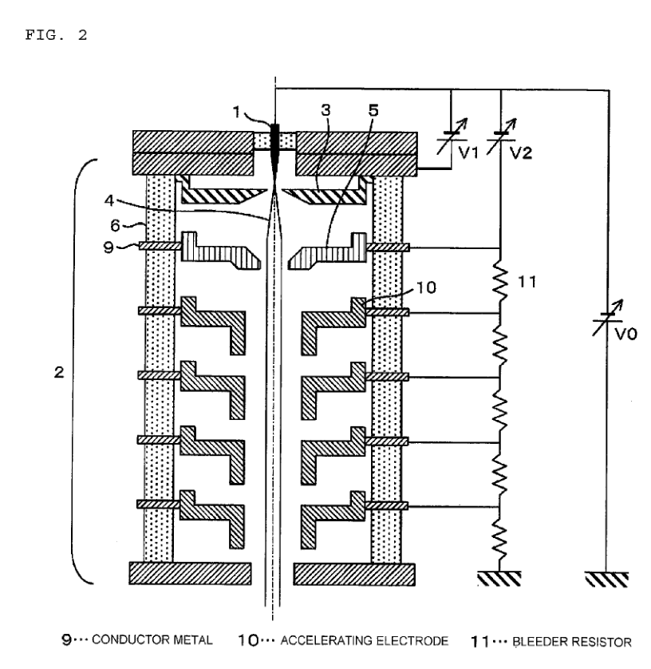
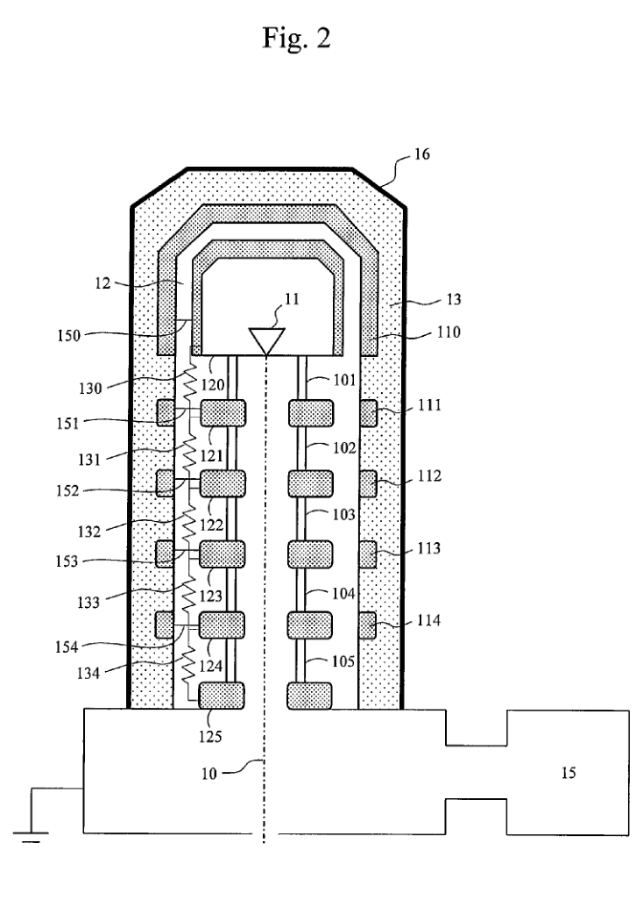

# 电子枪电位关系与专利剖面核查

日期：2026-09-26。范围：当前经典粒子模型、上一轮统一电场诊断及公开专利结构资料。
本轮核对了实际配置和两种电场实现，查看了原始专利 PDF 图页，整理以下电气边界方案。
没有改变运行中的默认模型、发射参数、机械结构或接线；没有进行新的粒子计算。

## 1. 电子能量为什么变化

这里的“能量”是电子动能 K。对于静电真空场，电子电荷为 -e：

\[
K-e\Phi=\mathrm{constant},\qquad
K(z)=K_{\mathrm{emit}}+e[\Phi(z)-\Phi_{\mathrm{tip}}].
\]

电势升高时电子加速，电势降低时电子减速。即使总能量守恒，沿途动能仍然会变化。
相同起点、终点电势之间，较长或较弯的路径本身不会造成额外能量损失，但会改变飞行时间。
静磁场也不对电子做功。该结论不适用于材料非弹性散射或随时间变化的电场。

上一轮改变的是**整个场的边界条件**：把指定电势的数值出口从 450 mm 移到 550 或
650 mm，而粒子观察位置仍固定在 450 mm。结果如下，数据来自本地
`tmp/planar-gun-20260926/comparison.json`，本轮未重算：

| 固定电势边界位置 | 450 mm 处平均动能 | 相对 450 mm 边界的变化 |
| --- | ---: | ---: |
| 450 mm | 300000.300 eV | 0 |
| 550 mm | 295675.494 eV | -4324.806 eV |
| 650 mm | 290482.151 eV | -9518.149 eV |

相应地，450 mm 处平均电势从约 0 V 变为 -4.325 kV、-9.518 kV（以地为参考）。
各组仍满足同势计算的能量守恒；耦合诊断的最大不变量漂移不超过 1.92e-8 eV。
所以这不是多走一段距离造成的能量损失，也不是简单改变电势零点。
**不能通过在出口强制把粒子能量改回 300 keV 来修复边界问题。**

末级金属阳极接地，也不意味着其中心孔中的真空或整个下游截面严格处处为 0 V。
孔口边缘场、周围电极和接地腔体仍共同影响孔内电势。现有机械内壁尚缺明确的电气连接，
因此移动外边界实验尚不能代表同一完整物理电子枪的收敛实验。

## 2. 当前三个部件的实际关系

当前排列为：原始针尖发射 → 提取极 → 静电枪透镜 → 多级加速器 → 枪对中部件和后续镜筒。
这是空间上的排列；电场并不在部件边界处突然结束，三者应参与同一个电势求解。

| 部件 | 主要作用 | 当前机械位置 | 标称设置（按几何诊断解释） |
| --- | --- | --- | --- |
| Extractor / 提取极 | 建立近源提取场，同时产生初始加速和透镜效应 | Z=6–10 mm | 比阴极高 4 kV |
| Electrostatic gun lens / 静电枪透镜 | 通过空间电势分布控制发散、会聚及交叉点；也改变局部动能 | Z=14–22 mm | 比提取极高 1.2 kV |
| Accelerator / 加速器 | 分级承担高压差并加速；孔口边缘场也影响聚焦 | 机械范围 30–370 mm；10 级电极中心 42–362 mm | 阴极至接地末级为 300 kV |

真实场发射中，提取场还影响发射电流。当前这一独立诊断仍使用既有 `gun.emit()`
生成的规定电流、位置、方向和能量，并没有求解提取场与隧穿电流的自洽反馈。
因此不能把本次提取电压扫描说成已验证完整的发射电流响应。

在新几何诊断中，采用同一个接地参考，可写为：

| 电气节点 | 对地电位 | 相对阴极电势增量 |
| --- | ---: | ---: |
| 阴极 | -300 kV | 0 |
| 提取极 | -296 kV | 4 kV |
| 静电枪透镜 | -294.8 kV | 5.2 kV |
| 第一级加速电极 | -266.4 kV | 33.6 kV |
| 末级阳极 | 0 kV | 300 kV |

这些是**金属电极电位**，不等于其孔内电子在同一 Z 位置必然获得的动能。
总加速电压不是 300+4+1.2 kV：提取与调束发生在总的 300 kV 电位差之内。

当前分级公式是 `rise_i = extraction + fraction_i * (HT - extraction)`。
10 级相对阴极电势为：33.6、63.2、92.8、122.4、152.0、181.6、211.2、240.8、
270.4、300.0 kV。提高提取电压并保持其余旋钮不变，会同时抬高枪透镜电位及中间级电位。
例如提取设置 4→4.4 kV 时，枪透镜总增量变为 5.6 kV，而末级仍为 300 kV。
上一轮“透镜 +10%”指 1.2→1.32 kV 设置，总增量实际为 5.2→5.32 kV。

## 3. 默认解析模型与新诊断不是同一种参数解释

默认枪场依然是解析轴向电势及径向展开，并非从上述全部导体表面求解出的场。

| 项目 | 当前默认解析场 | 显式开启的几何诊断 |
| --- | --- | --- |
| 提取 | 规定的平滑轴向升势 | 提取极表面电位 |
| 1.2 kV 枪透镜设置 | 乘 `potential_scale=4.22125`，形成 5.0655 kV 的局部窗口增量 | 按电压参考得到 5.2 kV 对阴极电位，无倍率 |
| 加速电极 | 各级平滑升势叠加 | 各级导体同时约束同一个电势 |
| 300 kV 的约定 | 终端势增量扣除平均初始动能 0.3 eV，使平均末动能约 300 keV | 阴极与接地节点相差 300 kV，到接地处平均动能约 300000.3 eV |

0.3 eV 差异来自定义，不能解释数 keV 的出口敏感性。解析窗口倍率也不是导体电压的
单位换算，不能直接移植到几何求场。两种实现尚未完成统一，不能声称 GUI 已采用新场。

代码依据：`configs/instruments/gun/FEG.toml`；
`src/temsim/optics/electron_gun/electrostatic.py` 中的电压参考与倍率；
`src/temsim/physics/analytic_gun_field.py` 中的解析窗口和加速增量；
`src/temsim/physics/planar_gun_field.py` 中的电极表面电位。

## 4. 已查看的公开专利结构图

### A. 提取、静电控制和多级加速的剖面与接线

[US8803411B2，原始 PDF 第 4 页，Fig. 2](https://patentimages.storage.googleapis.com/b2/de/20/4b372cd1334732/US8803411.pdf#page=4)
给出背景技术中的常规六级结构：1 发射尖端、3 提取极、5 静电控制极、10 加速电极、
11 分压电阻；分压链终点接地。它最适合查看三类部件怎样组合。
图中折返的电极轮廓用于遮挡绝缘体，不是要求电子走折线路径。
[专利正文](https://patents.google.com/patent/US8803411B2/en)

注意：这是该专利介绍的已有结构；其 Fig. 1 的导电绝缘体方案是另一种结构。
此例的分压从控制极之后接向地，V1、V2 均以发射体为参考，和模拟器当前以提取极为分级
起点的公式不同。文献支持“必须明确接线”，并不证明模拟器应直接改用专利的级数和设置。

### B. 完整加速电极堆叠、绝缘管和接地端

[US9548182B2，原始 PDF 第 4 页，Fig. 2](https://patentimages.storage.googleapis.com/13/8f/2a/0e3e6195b4f35a/US9548182.pdf#page=4)
显示阴极端 120、中间电极 121–124、接地阳极 125、绝缘管 101–105、分压电阻
130–134 和外围结构。Fig. 3/4 比较外侧结构对应的等势分布，适合检查场边界处理。
[专利正文](https://patents.google.com/patent/US9548182B2/en)

该图没有完整细画独立提取和静电聚焦电极；外部介质/电极也比当前真空诊断复杂。
不能仅复制最外侧边线并设为接地。文献没有给出适用于本模拟器的无场区长度。

### C. TEM 中的整体位置关系

[US20160013012A1，原始 PDF 第 2 页，Fig. 1](https://patentimages.storage.googleapis.com/9b/06/5c/d0fcad8b6e716e/US20160013012A1.pdf#page=2)
标明发射体 111、提取极 112、静电透镜 113、加速管 114、枪对中线圈 115/116、
固定枪光阑 117。它支持功能排列，是系统示意图，不能用于推算环形电极尺寸或接线。
[专利正文](https://patents.google.com/patent/US20160013012A1/en)

### D. 静电枪透镜的更详细机械剖面

[US5196707A，原始 PDF 第 5 页，Fig. 3b](https://patentimages.storage.googleapis.com/7f/c2/d0/a6b3a74f06eec1/US5196707.pdf#page=5)
给出源、提取极、聚焦极、接地阳极、支撑与馈通的机械剖面；对应 Fig. 3a 是电极局部结构。
适合理解三电极共同聚焦。其工作范围和发射机制示例不同于当前 300 kV 冷场发射设置，
只作结构参考。[专利正文](https://patents.google.com/patent/US5196707)

这些是公开专利中的不同实施例，不是某一商业仪器的已确认内部装配；未按图片比例取尺寸，
未把不同实施例拼成一台实际存在的设备。原始专利名称和编号留在参考文献中，界面继续用
科学/功能名称。图像来源和提取方法见 [参考图说明](../references/gun-electrode-patents/README.md)。

## 5. 下一步电气边界修改方案

这是一项待实现的参考接线方案，不是对未知现有金属自动赋值：

1. **分离机械几何与电气连接。** 对参与求场的表面明确记录电气角色、连接节点、轴向范围
   和依据。节点使用阴极、提取极、聚焦极、加速级、地。未知连接保持未定义；浮置金属需要
   电荷约束，不能当作接地或自动参与当前 Dirichlet 求场。
2. **先定义出口接地结构。** 以现有 370–450 mm 下游真空内壁轮廓为候选，复用其孔径、
   变径与壁厚，显式声明一个“下游内壁接地”的诊断配置。孔径板、真空壁和内部磁性部件
   分别核对；不能把 120 mm 的枪光阑或全部上游衬管接地。
3. **确定分压连接，再统一电势计算。** 当前公式保持为已记录的参考接线，专利中的
   “控制极到地分压”是另一个候选，不混用二者。待接线确定后，所有带电导体共同求场，
   保留提取、加速、聚焦和截断，不添加下游可配置电子源，不靠画图平滑消除弯折。
4. **固定物理结构，只移动数值外边界。** 重做观察位置固定的出口测试，同时报告电势、
   动能、残余轴向场、飞行时间和包络。建议预设边界目标：同一 450 mm 截面平均及最大
   单粒子动能差均小于 1 eV、包络峰值归一差小于 1%，并维持 0.001 eV 能量不变量误差目标；这些是拟定
   验收阈值，本轮没有宣称通过。若出口仍有真实边缘场，应继续计算其作用，而不是人为清零。
5. **缓存完整电气依赖。** 场缓存包含接线、全部相关电位、几何、边界及数值方法；粒子
   断点再绑定所用场。耦合静电问题中，下游电极可能改变上游场，不能仅按组件的 Z 排序
   宣称前段可复用。只有已证明未变的上游场和执行状态才可以恢复。

以上范围继续限于经典粒子。完整曲面阴极、自洽空间电荷和相干波不因本次专利检索自动启用。
本轮交付为核查报告、两张原始专利图页的裁切呈现和下一步实现规格；没有修改求解器或重跑
全项目测试。上一轮的计算及验证范围见
[统一场计算报告](planar-gun-coupled-field-2026-09-26.md)。
