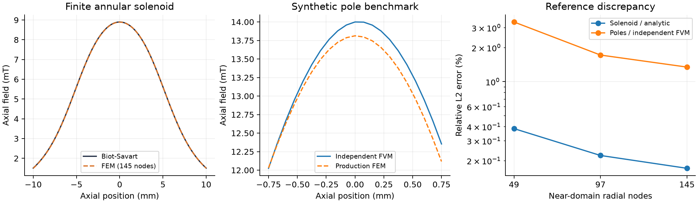

# 开发规范 v1.0 完成与验收报告

2026-09-10，基线提交 `efc648ddbdcfa8d008c26048dde93ef52613fffe`。

WP-00～WP-09 本次实现范围已完成，**AT-01～AT-33 共 33 项工程验收通过**。最终有效结果为 **428 个测试通过，0 个未解决失败，0 个跳过**：其中统一验收 254 个，相关系统扩展回归 174 个，按测试 ID 去重。这不是仓库全部测试，也不等于真实仪器已经标定。

完整的逐项测试、运行来源、测量数组、容差、环境及源码身份见 [development-spec-current.json](development-spec-current.json)。[acceptance_matrix.json](acceptance_matrix.json) 是静态需求索引，其模板状态不能代替执行报告。

## 本次完成的行为

| 工作包 | 完成内容 | 验收 |
| --- | --- | --- |
| WP-00 | 保留未修改基线及已知失败结果；逐项更新风险、来源和模型范围 | 基线与修正结果分别保存 |
| WP-01 | 物镜光阑按实际参考面、偏移及传输作用；物理平面与等效 pupil 策略互斥；每个分支只截断一次 | AT-01～05 PASS |
| WP-02 | 单位波形和绝对电子权重分开；保留光阑及带宽损失；组态做强度平均；物理探测器按顺序接收 | AT-06～10 PASS |
| WP-03 | 显式二维 pupil、独立源位置/方向/能量集合；区分边缘角与电流分位角；保留有名称的原降阶模型 | AT-11～15 PASS |
| WP-04 | A5 进入相位、配置、GUI、拟合及导出；增加独立验证射线、步长/孔径/网格研究和固定硬件 Cc 差分 | AT-16～19 PASS |
| WP-05 | 已知匝数的电流/安匝/百分比校准；保持模型切换前的电气工作点；查询几何作用并拒绝未表达的 CAD 场几何 | AT-20～22 PASS |
| WP-06 | 有限线圈、简化极靴、Si multislice 加密、abTEM 传播核对照，以及完整生产链基准 | AT-23～25、33 PASS |
| WP-07 | 驻留 GPU 传播并分批保存完整衍射概率；有界主存输出、背压、取消、帧校验及断点恢复；明确 GPU 策略 | AT-26～28 PASS |
| WP-08 | 结果说明取自实际执行节点；验证维度分别记录；相关缓存身份失效；锁定环境、隔离安装及 CI 工作流 | AT-29～31 PASS（远程 CI 未执行） |
| WP-09 | 旧 profile 读入并报告迁移；格式 6 保存显式模型；保留强度、极性与样品设置 | AT-32 PASS |

STEM 本轮还消除了退出波的生存概率归一化：样品或带宽已经损失的电子不会重新变成探测信号。原始 4D 概率、期望计数、Poisson 抽样和图像显示缩放分别处理。因此修正后部分绝对强度发生变化是预期结果。

## 实际数值证据

| 算例 | 实测结果 | 判据及范围 |
| --- | --- | --- |
| 有限厚度线圈 FEM 对 Biot–Savart 轴上积分 | 最细网格相对 L2 误差 0.1714%；最大误差 18.18 μT | 相对 L2 <1%，最大误差 <100 μT；100 A-turn 合成线圈，FEM 60 mm 边界与无穷远解析解不同 |
| 简化双极靴 FEM 对独立磁通有限体积 | 相对 L2 误差 1.3464%；最大误差 0.2436 mT | 相对 L2 <3%，最大误差 <2 mT；相同边界、合成常数 μr=50 的实现对照 |
| abTEM 与本项目传播器 | 复波相对 L2 误差 1.35×10⁻¹⁰ | <3×10⁻⁶；相同输入势、对称分步与频带，只验证传播 |
| A5 相位核对照 | 最大复数误差 1.82×10⁻¹² | 与安装的 abTEM C56/phi56 约定对照；不代表厂商符号标定 |
| 实际 CPU/GPU 完整概率帧 | 最大逐像素概率差 2.61×10⁻⁸ | 绝对概率容差 2×10⁻⁷、相对容差 2×10⁻⁴；匹配势、网格与组态 |
| GPU 4D 输出 | 4 帧、2 个组态、2 批传输；CPU 重传播为 false | 保存帧重积分与同次计算探测器结果一致；预计输出工作区 6,223,392 B，低于 64 MiB 预算 |
| 固定控制→场→照明→Si→物镜孔→相机 | 相机条件零损参考概率 0.0003769308574 | 使用生产 `calculate()`；工作点未改变；完整通量账本保存在 JSON 中 |



Si [110] 加密研究分别改变网格、视场、切片、带宽和热振动组态数。该夹具厚度为 **0.4 nm**，并检查高角探测器位于实际可用频带内。逐项保存结果与组态相对标准误差；比较条件为绝对概率下限 5×10⁻⁴、5% 相对项加两次估计标准误差和的 3 倍。这个下限大于部分微弱高角信号，**不能把通过解释为这些信号达到 5% 相对精度**，也不能外推为默认 5 nm 样品的全面收敛。用户样品默认尺寸没有因验收而更改。

CPU 使用 complex128、驻留 GPU 使用 complex64。取消退出波归一化后，未收集余量的检查改为 2×10⁻⁶ 绝对概率预算，约为 16 个 float32 epsilon，用于短 FFT 链中对接近 1 的量相减；逐衍射像素容差不变。前后行为和理由见 [WP05_WP09_IMPLEMENTATION.md](WP05_WP09_IMPLEMENTATION.md)。

## 运行记录与失败处理

首次统一运行得到 247 PASS、6 FAIL；扩展回归得到 166 PASS、8 FAIL。失败均来自测试断言仍写死旧求解器身份或旧 profile 格式。修正两份测试文件，并新增“上一版 static-bh 求解器缓存不可复用”用例后，完整复跑这两份文件得到 **66 PASS**。

最终报告按测试 ID 替换这两份文件的旧证据，保留其他未修改文件的通过证据，合计 254+174=428 PASS。所有运行间生产源码和配置哈希相同，隔离安装的求解器身份也与当前源码一致。JSON 保留初始失败、原始运行退出码、修正前后测试哈希及每条结果的来源；没有把合并报告写成一次新的全量运行。

完整重新执行统一验收：

```powershell
.venv/Scripts/python.exe scripts/validate_development_spec.py --output outputs/spec-acceptance --installed-python outputs/acceptance-install/Scripts/python.exe
```

本次复验命令：

```powershell
.venv/Scripts/python.exe -m pytest tests/test_calculation_manifest_artifacts.py tests/test_reference_sample_profile.py -q --tb=short --junitxml=outputs/spec-acceptance/version-regression.xml
```

隔离 CPU 环境从锁定依赖和 wheel 安装，使用 `python -I` 从源码目录之外导入，完成 Si 小算例与离屏 Model Inspector 打开。已检查 GUI 截图可读性，`pip check` 和差异空白检查通过。

环境：Python 3.12；NumPy 2.4.6；SciPy 1.18.0；abTEM 1.0.10；PySide6 6.8.3。实机 GPU 为 NVIDIA GeForce GTX 1060 3GB，驱动 560.94，CuPy 14.2.0。CPU 隔离环境未安装 CuPy，正确记录 GPU 未执行；实机 GPU 结果另列。

## 界面和迁移

- `Model Inspector → Coil calibration / current…`：输入参考安匝、参考百分比、已知匝数和来源。未知匝数时电流不可用；只有显式选择修改电流才改变工作点。
- `Model Inspector → Coefficients / fit settings…` 与 `Aberration evidence`：编辑 A5 等系数、拟合设置，并查看最近完成计算的证据。
- `Scanning Parameters` 的 4D-STEM 控制：选择 `auto`、`prefer_gpu` 或 `require_gpu`，配置主存输出预算。要求 GPU 时，设备不可用或 GPU 失败不会自动改成 CPU。
- profile 格式升级到 6，旧版本继续可读；有迁移说明。旧求解器结果需要按新身份重算，原始用户文件保留。
- 完成的旧 4D 格式 1 文件继续可读。缺少逐帧完整性校验的旧中断文件不能作为格式 2 检查点继续；多源或非标称能量的 4D 捕获仍明确拒绝。

## 未验证与剩余近似

实际仪器、制造商几何、材料曲线和实验图像的联合标定为 **NOT_RUN**。简化极靴属于指定材料分布与激励的数值问题，不是实际内部结构的恢复证明。

A5 已实现，但 C41/C43/C45/C52/C54 等其他高阶项尚未实现。场支持不完整时继续报告 partial 支持范围。原射线条件化照明模式仍是降阶近似，不能从射线统计唯一恢复任意相位。

任意 CAD 开孔、槽及三维变换不自动进入轴对称磁场求解；严格模式拒绝未表达的几何，或由用户明确选择并记录轴对称尺寸近似。

GitHub 工作流已配置，**远程运行状态为 NOT_RUN**。本报告通过的是本地声明模型与夹具的工程验收；不把这些限制或未运行项转换成物理认证。
